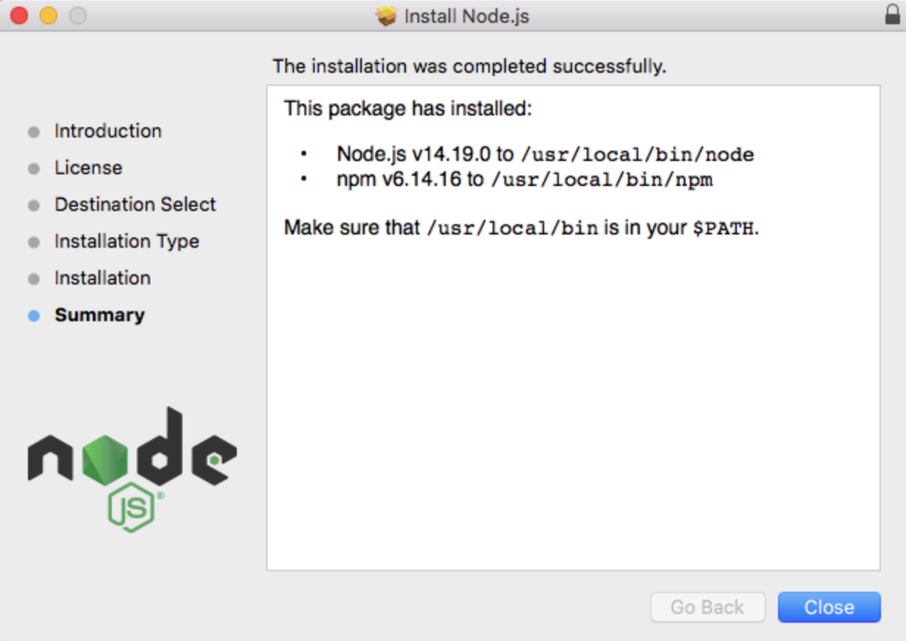

# How to install Node.js

Before programming on Node.js is started, it's required to install Node.js. Node.js can be installed in multiple ways on a computer.
The approach you use depends on the system's existing development environment. There are different package installers for different environments. Our program highlights the most common and convenient ones. Below, we are going to explain the installation process step-by-step.

## Install Node.js on Windows
Step 1: Download Node.js Installer

In a web browser, navigate to "[Download](https://nodejs.org/en/download/)". Click the Windows Installer button to download the latest default version. The Node.js installer includes the NPM package manager.

:::note
There are other versions available. If you have an older system, you may need the 32-bit version. You can also use the top link to switch from the stable LTS version to the current version. If you are new to Node.js or don’t need a specific version, choose LTS.
:::

### Extract Node.js

1. Once the installer finishes downloading, launch it. Open the downloads link in your browser and click the file. Or, browse to the location where you have saved the file and double-click it to launch.
2. The system will ask if you want to run the software – click **Run**.
3. You will be welcomed to the Node.js Setup Wizard – click **Next**.
   
4. On the next screen, review the license agreement. Click **Next** if you agree to the terms and install the software.
   
5. The installer will prompt you for the installation location. Leave the default location, unless you have a specific need to install it somewhere else – then click **Next**.
   
6. The wizard will let you select components to include or remove from the installation. Again, unless you have a specific need, accept the defaults by clicking **Next**.
   
7. Finally, click the **Install** button to run the installer. When it finishes, click **Finish**.
   

## Install Node.js on Mac

To install Node.js on macOS navigate to "[Download](https://nodejs.org/en/download/)".

1. Press on macOS installer link. 
2. Download package (for example - node-v18.12.1.pkg). 
3. When the file finishes downloading, locate it in Finder and double-click on it.
   
4. Go through the entire installation process.
5. After installation completion, this window will show up, Now click on the “close” button.
   

## Alternative installation methods 

Alternative and reliable ways to install Node.js is through a package manager. In this installation approach, every operating system has its specifics.
Package managers are detailed in "[Installing Node.js via Package Manager](https://nodejs.dev/en/download/package-manager/)" official Node.js portal.

## Verifying Node.js Installation
In any case, when Node.js is installed you'll have access to the node executable program in the command line. Follow the below steps to verify the Nodejs installation:

### macOS
Now open the Terminal and write the following command

```jsx
$ node -v
```

If versions for node and npm were both output, then you’re all set.

### Windows
To check that node.js was completely installed on your system or not, you can run the following command in your command prompt or Windows Powershell and test it:

```jsx
$ C:\Users\Admin> node -v
```
If node.js was completely installed on your system, the command prompt will print the version of the node.js installed.
:::note
- You do not need to do anything to the system variables as the windows installer takes care of the system variables itself while installing through the .msi installer;
- If you use any other format for installing node.js on your PC, you should put the system variable path for node.js as follows:

```jsx
PATH : C:\Users\[username]\AppData\Roaming\npm
C:\Program Files\nodejs (Path to the nodejs folder)
```
:::
