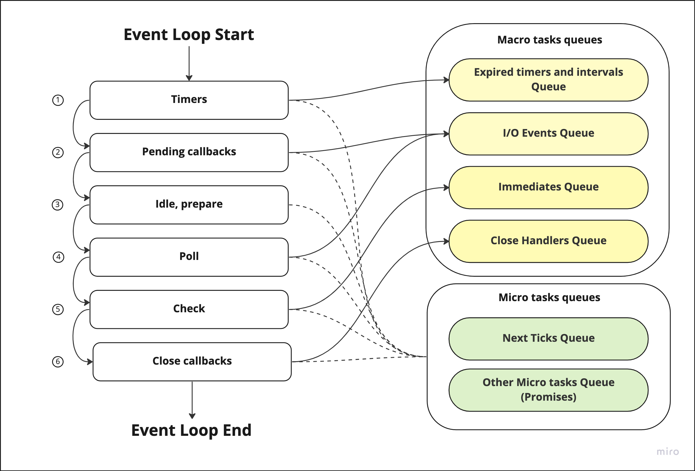

# Node.js Event Loop

Before we start diving deep into Node.js Event Loop, let’s get aligned on what I/O operations are, what blocking and non-blocking I/O means and why Node.js strives to perform non-blocking async operations as much as possible.

## I/O operations

:::tip Definition

**Input / Output operations (I/O)** - are actions performed to transfer data to or from a computer. Those actions can be done either by humans or by programs.

:::

**Examples:**
- file system I/O operations like reading or writing to files
- networking I/O operations like HTTP calls

I/O operations are one of the slowest among fundamental operations on a computer. 

**They can be of 2 types:**
- `Blocking I/O operations` - they will block the further execution until the operation completes. 
- `Non-blocking I/O operations` - the response from system call is returned immediately without the operation being completed. 

Let’s imagine a simple scenario - you have a file with 10 GB data and you want to read it. 

If it is blocking I/O operation, the whole program execution will be blocked. You won't be able to do any further actions until the file is read till the end. If it is non-blocking I/O operation, the file will be read “in background” while you will still be able to do anything you want. When the file is read completely, you will receive a corresponding message.

Node.js allows performing non-blocking I/O operations while Javascript is single threaded. That is achieved by Reactor pattern and Event Loop.

## Reactor Pattern

Reactor Pattern is a high-level overview of how Node.js works under the hood. So let’s start from small and then move to more complicated principles.

There are 3 primary components: `Event Demultiplexer`, `Event Loop` and `Event Queue`.

**The algorithm that stands behind Reactor Pattern:**
1. Event Demultiplexer receives request for I/O operation and delegates this request to appropriate hardware (1-3 on the picture below).
2. Once I/O request is processed (e.g data from a file is ready to be read), Event Demultiplexer adds a callback registered for this particular event to Event Queue (4-5).
3. Event Loop takes those callbacks and executes them sequentially until the Event Queue is empty (6).
4. If there are no events in Event Queue, Event Loop gives control back to Event Demultiplexer.
5. If there are no requests for I/O operations in Event Demultiplexer registered, the application finishes its execution.

## Event Demultiplexer

And now let me shock you a bit 🤫

Event Demultiplexer is not a component that exists in the real world, it’s more like an abstract concept implemented on hardware level on each OS in a different way. Node.js consumes this low-level, non-blocking, asynchronous hardware I/O functionalities.

## Libuv

Imagine yourself as a person who is designing and implementing Node.js platform. Your primary goal is to make Node.js non-blocking and async as much as you can. But the problem is that you have to support quite a huge list of OS. Each of them has its own implementation for processing I/O operations. Some of them might not even have async implementations for specific operations.

So you might want to have some abstraction layer that would allow you to encapsulate complexities around supporting cross-platform I/O and expose a general API for upper layers of Node.js.

No worries! This problem was solved long before you joined Node.js dev team. That is [libuv](https://docs.libuv.org/en/v1.x/design.html).

**Libuv is an open-source C library that provides:**
- Cross-platform interface to non-blocking I/O operations
- Access to OS internals, networking, concurrency
- Event Loop
- Thread pool

As you can see on the picture above, libuv does most of the job for us in terms of non-blocking I/O. We as Node.js developers simply communicate with libuv through Node.js API. 

## Thread pool

Now we know that libuv does all the magic for us. But what should we do if not all OS support non-blocking operations? Well, we have libuv here again 🙂

Thread pool (a part of libuv) was introduced to support I/O operations that cannot be directly addressed by hardware asynchronous I/O utils. They are fs and DNS lookup. 
For example certain systems, such as Linux does not support complete asynchrony for file system access. That affects `dns.lookup()` operation since it tries to access system configuration files. 

However, I/O is not the only type of tasks performed on the thread pool. There are some Node.js crypto functions such as `crypto.pbkdf2`, async versions of `crypto.randomBytes`, `crypto.randomFil`l and async versions of `zlib` functions which run on the libuv thread pool because they are highly CPU intensive. Running them on the thread pool prevents blocking of the event loop.

:::tip NOTE

Thread Pool size can be changed by overriding `UV_THREADPOOL_SIZE` environment variable. The common suggestion is to set it to the number of logical cores your machine is running.

:::

## Event Queue

The Reactor pattern states Event Queue is a data structure where events are enqueued by Event Demultiplexer and then Event Loop takes those events and processes them sequentially until the queue is empty. 

In Node.js world there are 4 main queues (macro tasks) and 2 intermediate ones (micro tasks). 

**Macro tasks queues:**
- Expired timers and intervals Queue — consists of callbacks of expired timers added using `setTimeout()` or interval functions added using `setInterval()`.
- I/O Events Queue — completed I/O events.
- Immediates Queue — callbacks added using `setImmediate()` function
- Close Handlers Queue — any close event handlers.

**Micro tasks queues:**
- Next Ticks Queue — callbacks added using `process.nextTick()` function
- Other Microtasks Queue — includes other micro tasks such as resolved promise callbacks

## Event Loop

Event Loop plays an orchestration role for queues. Its key responsibility is to iterate over a set of queues and execute callbacks registered for those events sequentially. 

**There are 6 Event Loop phases:**
1. Timers — executes callbacks scheduled by `setTimeout()` and `setInterval()` (Expired timers and intervals queue)
2. Pending callbacks — I/O-related callbacks will be executed, delayed to the next loop iteration. For example, if you registered a callback fired after write or read to file has finished, or some network operation is completed, this callback will run in this phase (I/O Events queue).
3. Idle, prepare — used internally by Event Loop for housekeeping activities.
4. Poll — Event Loop looks for new I/O events and does its best to execute their callbacks immediately if possible. If not, it will defer a callback execution and register this as a pending callback (I/O Events queue).
5. Check — `setImmediate()` callbacks are invoked here (Immediates queue).
6. Close callbacks — all close event callbacks are executed here (Close Handlers queue). 

As you can see on the picture below, Event Loop starts from **Timers** phase and checks **Expired timers and intervals queue**. After processing the **Close Handlers Queue**, if there are no items to be processed and there are no pending operations, the loop will exit. 

**The interesting thing is that micro tasks queues have higher priority than macro tasks. They are checked after each phase of the Event Loop.** If there are any items available in the micro tasks queues, the Event Loop will immediately start processing them until they are emptied. Once they are empty, the Event Loop will continue to the next phase.

For example, let’s imagine that you have 2 tasks in I/O Events queue which you are currently processing. Then 3 more tasks are added to `processNextTick()` queue. Once the Event Loop finishes processing 2 tasks from I/O Events queue, it will start processing `processNextTick()` queue before moving to Immediates queue. 

:::tip NOTE

While there are 2 micro tasks queues - next tick and resolved promises, the first one has higher priority and will be processed before promises. If you are overusing the next tick queue, there is a chance to face Event Loop starvation problem. Event Loop will be forced to keep processing the next tick queue infinitely without moving forward.

:::

## Summary

Ohhh... That was quite a complex section, right? 🤯 Let's do some recap on what we've just learnt.

**Note 1.**

There are 2 types of I/O operations - blocking and non-blocking. Node.js tries to use non-blocking operations as much as possible.

**Note 2.**

Reactor Pattern is a high-level overview of how Node.js works under the hood.

There are 3 primary components: `Event Demultiplexer`, `Event Loop` and `Event Queue`.

Event Demultiplexer receives request for I/O operation and delegates this request to appropriate hardware. Once I/O request is processed, Event Demultiplexer adds a callback registered for this particular event to the Event Queue. Event Loop iterates over Event Queue and executes callbacks sequentially until the queue is empty.

**Note 3.**

There is no Event Demultiplexer in real life. Libuv is playing this role. It contains a ​​collection of I/O APIs exposed to the upper layers of Node.js. It also provides the Event Loop and Event Queue.

**Note 4.**

In Node.js there are 4 primary queues (macro tasks) and 2 intermediate queues (micro tasks).

Macro tasks queues: Expired timers and intervals, I/O Events, Immediates, Close Handlers.

Micro tasks queues: Next tick and Resolved promises queue. Next tick queue has higher priority than promises. Micro tasks are executed in between every macro tasks queues.

**Note 5.**

Event Loop plays an orchestration role. Its key responsibility is to iterate over a set of queues and execute callbacks registered for operations.

There are 6 Event Loop phases: Timers, Pending callbacks, Idle/prepare, Poll, Check, Close callbacks. 

**Note 6.**

Event Loop is a single threaded and semi-infinite loop. Non-blocking nature of Node.js is achieved by Event Loop that doesn’t wait until the operation is done. It continues to perform normally. Only when the result of the operation is received, Event Loop starts to execute the callback registered for it.

**Note 7.**

There are some I/O operations that do not have async implementation on OS level (fs and DNS lookup). Thread pool is used to process such operations as well as CPU intensive tasks (crypto, zlib).

## Useful resources

If you want to go even deeper in understanding how Node.js and Event Loop work under the hood, have a look at the following articles:
- [Event Loop and the Big Picture — NodeJS Event Loop Part 1](https://blog.insiderattack.net/event-loop-and-the-big-picture-nodejs-event-loop-part-1-1cb67a182810)
- [Understanding the Node.js event loop phases and how it executes the JavaScript code](https://dev.to/lunaticmonk/understanding-the-node-js-event-loop-phases-and-how-it-executes-the-javascript-code-1j9)
- [Difference between the Event Loop in Browser and Node.js?](https://dev.to/jasmin/difference-between-the-event-loop-in-browser-and-node-js-1113)
- [The Node.js Event Loop, Timers, and process.nextTick()](https://nodejs.org/en/docs/guides/event-loop-timers-and-nexttick/)
