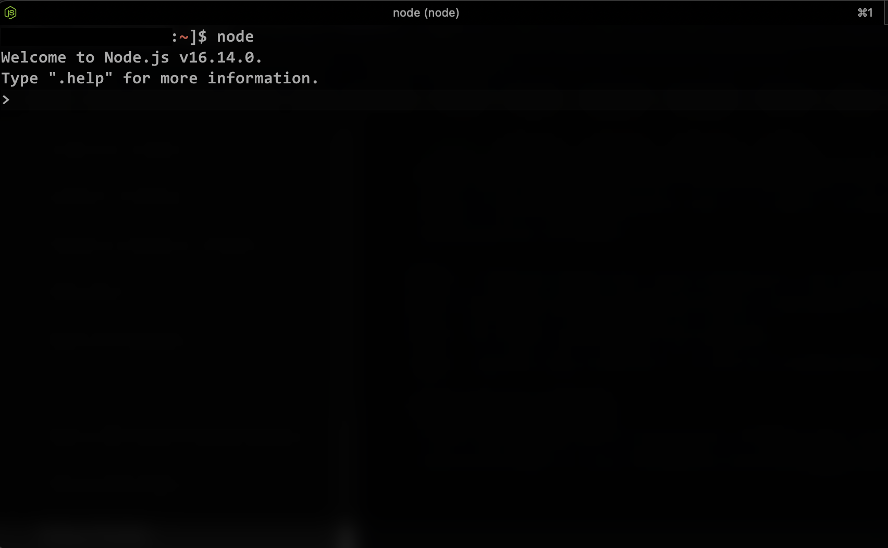
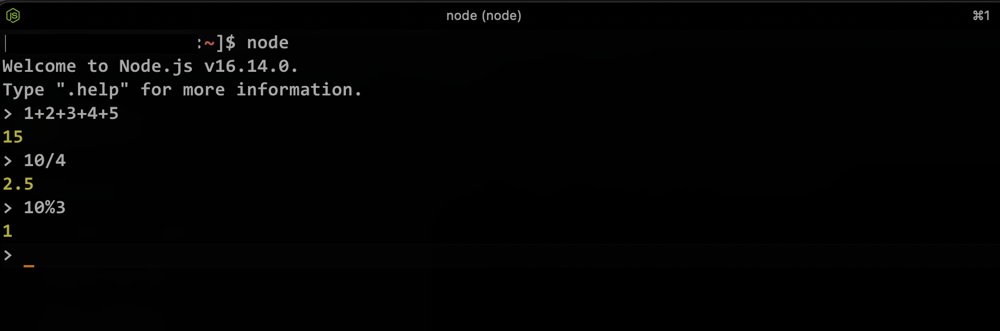

# Node.js REPL

## What is REPL
[REPL](https://nodejs.dev/en/api/v19/repl/) (**R**EAD, **E**VAL, **P**RINT, **L**OOP) is a computer environment similar to Shell (Unix/Linux) and command prompt. Node comes with the REPL environment when it is installed. System interacts with the user through outputs of commands/expressions used. It is useful in writing and debugging the codes. The work of REPL can be understood from its full form:

- **Read** : It reads the inputs from users and parses it into JavaScript data structure. It is then stored to memory.
- **Eval** : The parsed JavaScript data structure is evaluated for the results.
- **Print** : The result is printed after the evaluation.
- **Loop** : Loops the input command. To come out of NODE REPL, press ctrl+c twice

## Getting Started with REPL
To start working with REPL environment of NODE; open up the terminal (in case of UNIX/LINUX) or the Command prompt (in case of Windows) and write node and press ‘enter’ to start the REPL.
If we run the node command without any script to execute or without any arguments, we start a REPL session:

```jsx
$ node
```

If you try it now in your terminal, this is what happens:
```jsx
$ node
>
```
The REPL has started and is demarcated by the ‘>’ symbol. Various operations can be performed on the REPL. Below are some of the examples to get familiar with the REPL environment.

Example:


The command stays in idle mode and waits for us to enter something.

:::note
if you are unsure how to open your terminal, google "How to open terminal on your-operating-system".
:::

The REPL is waiting for us to enter some JavaScript code, to be more precise.

Start simple and enter
```jsx
> console.log('test')
test
undefined
>
```
The first value, test, is the output we told the console to print, then we get undefined which is the return value of running console.log(). Node read this line of code, evaluated it, printed the result, and then went back to waiting for more lines of code. Node will loop through these three steps for every piece of code we execute in the REPL until we exit the session. That is where the REPL got its name.

### Performing Arithmetical operations
Example: Performing Arithmetical operations in REPL



### Comparisons
Node automatically prints the result of any line of JavaScript code without the need to instruct it to do so. For example, type in the following line and press enter:

```jsx
> 3 === '3'
false
>
```

Note the difference in the outputs of the above two lines. The Node REPL printed undefined after executed console.log(), while on the other hand, it just printed the result of 3 === '3'. You need to keep in mind that the former is just a statement in JavaScript, and the latter is an expression.

### Define functions
In some cases, the code you want to test might need multiple lines. For example, say you want to define a function that generates a random number, in the REPL session type in the following line and press enter:

```jsx
function getRandomNumber() {
...
```
The Node REPL is smart enough to determine that you are not done writing your code yet, and it will go into a multi-line mode for you to type in more code. Now finish your function definition and press enter:

```jsx
function getRandomNumber() {
    return Math.random();
}
undefined
>
```

## Commands

The REPL has some special commands, all starting with a dot `.`. They are:

`.help`: shows the dot commands help
`.editor`: enables editor mode, to write multiline JavaScript code with ease. Once you are in this mode, enter ctrl-D to run the code you wrote.
`.break`: when inputting a multi-line expression, entering the .break command will abort further input. Same as pressing ctrl-C.
`.clear`: resets the REPL context to an empty object and clears any multi-line expression currently being input.
`.load`: loads a JavaScript file, relative to the current working directory
`.save`: saves all you entered in the REPL session to a file (specify the filename)
`.exit`: exits the repl (same as pressing ctrl-C two times)

The REPL knows when you are typing a multi-line statement without the need to invoke `.editor`.

For example if you start typing an iteration like this:

```jsx
[1, 2, 3].forEach(num => {
```

and you press `enter`, the REPL will go to a new line that starts with 3 dots, indicating you can now continue to work on that block.

```jsx
... console.log(num)
... })
```

If you type `.break` at the end of a line, the multiline mode will stop and the statement will not be executed.

## Run REPL from JavaScript file

We can import the REPL in a JavaScript file using `repl`.

```jsx
const repl = require('repl');
```

Using the repl variable we can perform various operations. To start the REPL command prompt, type in the following line

```jsx
repl.start();
```

Run the file in the command line.

```jsx
node repl.js
```

```jsx
> const n = 10
```

You can pass a string which shows when the REPL starts. The default is `>` (with a trailing space), but we can define custom prompt.

```jsx
// a Unix style prompt
const local = repl.start('$ ');
```

You can display a message while exiting the REPL

```jsx
local.on('exit', () => {
  console.log('exiting repl');
  process.exit();
});
```

## Tips

### The _ variable

If after some code you type `_`, that is going to print the result of the last operation.

### The Up arrow key
If you press the `up` arrow key, you will get access to the history of the previous lines of code executed in the current, and even previous REPL sessions.
