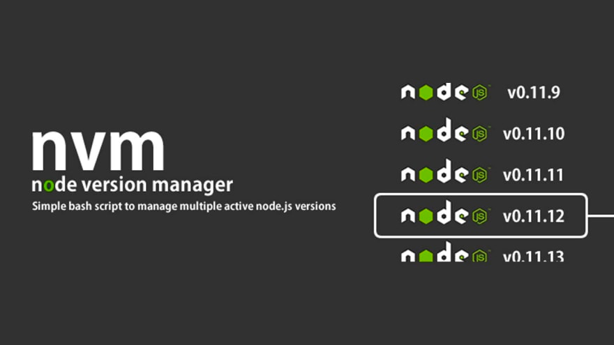

# What is NVM

Using nvm (Node.js Version Manager) makes it easier to install and manage multiple versions of Node.js on a single local environment.



## Install nvm

To install nvm on unix or macOS platform you can use one of the following commands:

```shell
curl -o- https://raw.githubusercontent.com/nvm-sh/nvm/v0.37.2/install.sh | bash
```
or
```shell
wget -qO- https://raw.githubusercontent.com/nvm-sh/nvm/v0.37.2/install.sh | bash
```

To install nvm on Windows platform you need to download [nvm-setup.zip](https://github.com/coreybutler/nvm-windows/releases/download/1.1.9/nvm-setup.zip) and run `nvm-setup.exe` from the archive.

Run the following command to check that nvm was installed successfully:

```shell
nvm -v
```

## Managing multiple Node.js versions

NVM allows you to have multiple Node.js version installed on you platform and switch between them on the fly. To list version that already installed on you machine use:

```shell
nvm list
```

If you need to install version that not in the list you can use the following command:

```shell
nvm install <version> ## 16.17.0
```

After that you can set it as current version by running the command:

```shell
nvm use <version> ## nvm use 16.17.0
```

## Manage project node version

To avoid specifying Node.js version manually every time when we need to change it, we can create `.nvmrc` file in out project:

```text
v16.15.0
```

This will allow you to use `nvm install` command in root of the project to install Node.js version specified in this file.

You can read more about nvm on [github](https://github.com/nvm-sh/nvm) of this project.
