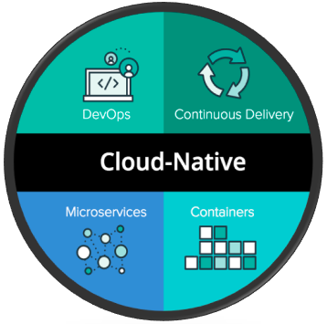
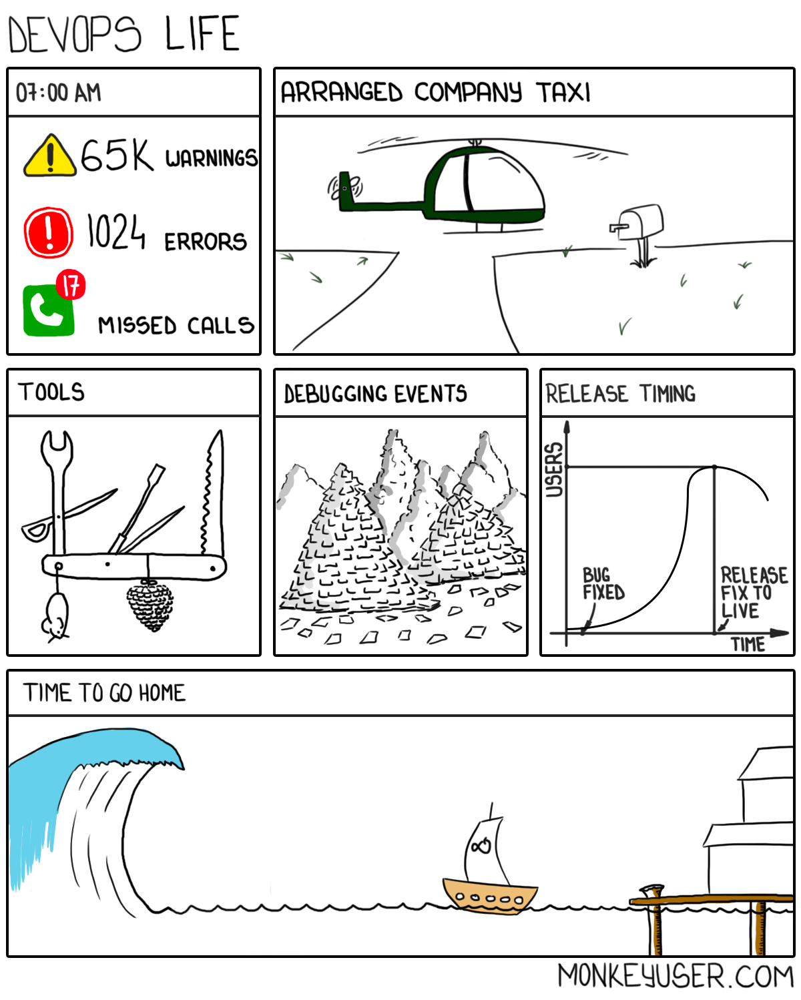

# Cloud Native

[Cloud Native](https://github.com/cncf/landscape#cloud-native-landscape) is an approach to building and running applications that takes full advantage of cloud computing capabilities and leverages cloud-native technologies and practices. It emphasizes scalability, flexibility, and resilience in designing, developing, and deploying applications for cloud environments.

# 
 

[Key characteristics](https://medium.com/velotio-perspectives/cloud-native-applications-the-why-the-what-the-how-9b2d31897496) of a Cloud Native approach include:

**Microservices Architecture**: Applications are built as a collection of small, loosely coupled, and independently deployable services known as microservices. Each microservice focuses on a specific business capability and can be developed, deployed, and scaled independently.

**Containerization**: Applications and their dependencies are packaged into lightweight, isolated containers. Containers provide a consistent and portable runtime environment, allowing applications to run consistently across different platforms and infrastructure.

**Orchestration and Management**: Container orchestration platforms like Kubernetes are used to automate the deployment, scaling, and management of containerized applications. These platforms handle tasks such as scheduling, load balancing, service discovery, and self-healing, ensuring applications are highly available and scalable.

**DevOps Culture and Practices**: Cloud Native embraces DevOps principles, promoting collaboration, automation, and continuous improvement between development and operations teams. This includes practices like `infrastructure as code` (IaC), `continuous integration` and `deployment (CI/CD)`, `automated testing`, and `monitoring`.

**Elasticity and Scalability**: Cloud Native applications are designed to scale horizontally, allowing them to handle increased workloads by adding or removing instances of microservices dynamically. Autoscaling mechanisms automatically adjust resources based on demand to ensure optimal performance and cost-efficiency.

**Resilience and Fault Tolerance**: Cloud Native applications are resilient to failures and can recover quickly. They leverage practices such as fault isolation, graceful degradation, and automated failover to ensure high availability and minimize downtime.

**Observability and Monitoring**: Cloud Native applications incorporate logging, monitoring, and tracing mechanisms to gain visibility into their behavior and performance. This enables proactive monitoring, troubleshooting, and optimization of the application's components and infrastructure.

**Cloud Services and APIs**: Cloud Native applications leverage cloud provider services such as managed databases, storage, messaging queues, and AI/ML services. They also expose APIs and adhere to API-centric design principles to enable interoperability, integration, and extensibility.

The benefits of adopting a Cloud Native approach include improved agility, scalability, efficiency, and resilience in application development and deployment. It allows organizations to harness the full potential of cloud computing, take advantage of cloud-native technologies, and rapidly respond to changing business requirements.

Cloud Native technologies and frameworks commonly used in the ecosystem include `Kubernetes`, `Docker`, `Prometheus`, `Istio`, `Envoy`, and many others. Cloud providers offer managed Kubernetes services (e.g., `Amazon EKS`, `Google Kubernetes Engine`, `Azure Kubernetes Service`) and serverless platforms (e.g., `AWS Lambda`, `AWS Fargate`, `Google Cloud Functions`, `Azure Functions`) that align with Cloud Native principles.
By containerizing your Node.js app and breaking it down into smaller services, you can take advantage of the benefits of Cloud Native architecture, such as scalability, fault tolerance, and high availability.
Additionally, by using infrastructure as code and DevOps practices, you can automate the deployment and management of your Node.js app, reducing the risk of human error and ensuring that your application is always running smoothly.

Embracing Cloud Native principles and practices is essential for organizations seeking to fully exploit the benefits of cloud computing and build scalable, resilient, and agile applications that can thrive in dynamic cloud environments.

## Summary

That is it for this module and for the course itself.
We hope, you had an interesting journey in Node.js world, its main features and capabilities.
You've studied a lot of things so far, and it's time to strengthen your knowledge by practicing on real life tasks and/or mentoring others.
If you don't have an opportunity to apply your expertise on your current project, contact your RM and ask for Node.js opportunities which the company can provide you to keep up developing your full-stack expertise.

:::note
You are still required to do the homework for this module... :)
:::

## What's next

Here are some training programs that you can study to strengthen you Node.js and Cloud expertise:

- [DevOps Fundamentals for JavaScript engineers](https://learn.epam.com/detailsPage?id=1d78e7ab-085d-4867-a050-84520bbd4106)
- [CloudX: AWS Practitioner for JS](https://learn.epam.com/detailsPage?id=b9980780-4cb1-4ef7-9bb7-204b7a087552)
- [CloudX Associate: AWS JavaScript Developer](https://learn.epam.com/detailsPage?id=4f312c1a-ed85-4ef0-bd53-e373fc6c92c3)
- [Cloud Native Developer: 101](https://learn.epam.com/detailsPage?id=e08f2b15-2bba-46ab-990d-55b0ca8b30cd)
- [CloudX Professional: Multicloud](https://learn.epam.com/detailsPage?id=f6dce806-b89d-4245-b997-1a16d5038455)

# 
 

Feel free to study other Node.js-related trainings.

Finally, don't forget to **become a mentor** for the next program run!

**Never give up with your studying!** 

Will see you again within other trainings...

# 
 

