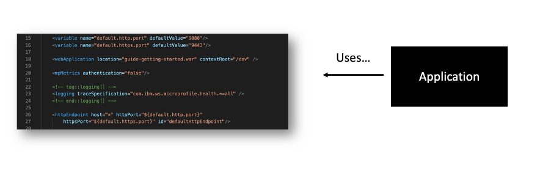

# Overview of The Twelve Factors for Node.js

## The Twelve Factors

**["The Twelve Factors"](https://12factor.net/)** is a methodology for building modern and maintainable applications.
The principles were originally formulated by developers at **Heroku**, a cloud platform as a service (PaaS) provider. 
It aims to help developers build applications in the cloud that are _portable_, _scalable_, and _resilient to changes_.
Following these principles means that you can easily run your app in a variety of environments without additional operational burden.

# 
  

### The Twelve Factors for Node.js

You will be surprised, but you are already following some of these factors. It can be either a part of your project delivery processes with EngX practices in mind, imposed by a framework, or even a requirement from customer. 
Let's find out how the Twelve Factors can be applied in Node.js projects:

1.  **[Codebase](https://12factor.net/codebase)**: A Node.js app should have a **single codebase**, tracked in a **version control system (VCS)** such as Git. 
This ensures that there is a single source of truth for the application's code.
This also gives you an ability to make as many deployments or delivery pipelines as it's needed without worrying about unexpected differences between various sources.
Obviously, this is the simplest factor, which does not require any further explanation.

# 
 

2. **[Dependencies](https://12factor.net/dependencies)**: The dependencies of a Node.js app should be _explicitly declared_ and _isolated_ from the application code.
In Node.js it's achieved by a package manager such as [npm](https://docs.npmjs.com/about-packages-and-modules) or [yarn](https://yarnpkg.com/getting-started/install), which can manage and install dependencies for the application, as well as perform other handy stuff.

We hope that you do understand how Node.js' package management works. Anyway, checkout the docs, which are related to _[package.json](https://docs.npmjs.com/cli/v9/configuring-npm/package-json)_, _[package-lock.json](https://docs.npmjs.com/cli/v9/configuring-npm/package-lock-json)_, and _[npm-shrinkwrap.json](https://docs.npmjs.com/cli/v9/configuring-npm/npm-shrinkwrap-json)_. [This](https://medium.com/@hossam.hilal0/package-json-vs-package-lock-json-vs-npm-shrinkwrap-json-33fcddc1521a) post will help you to recap few important things related to managing app dependencies in different environments.
Otherwise, feel free to move forward to the next factor. 

# 
 

3. **[Config](https://12factor.net/config)**: Configuration settings of your Node.js app (_as you can suspect, all those principles apply to any application back-end, even for serverless_) should be stored in **environment variables**, rather than hardcoded in the application code.
For example, instead of keeping (hard-codding) a database URL in the application code, it should be stored as an environment variable that can be easily changed without modifying the code. 
In Node.js we have a lot of tools like [dotenv](https://www.npmjs.com/package/dotenv/v/14.0.0) or [config](https://www.npmjs.com/package/config) to manage configuration through environment variables.

# 
 

In further sections of this module you will find some code samples of implementation of this principle. Until then, let's explore the other ones.

4. **[Backing services](https://12factor.net/backing-services)**: When you design a new Node.js application, it should **treat all external services** (such as databases, caches, and message brokers) as **attached resources** that can be accessed through a **URL** or other **connection string**.
This ensures that the application is _decoupled_ from the specific implementation details of the services it uses. Again, store connection details in the environment and abstract them in your code using libraries like [pg](https://www.npmjs.com/package/pg) for PostgreSQL, [redis](https://www.npmjs.com/package/redis) for Redis, and [amqplib](https://www.npmjs.com/package/amqplib) for RabbitMQ.
This also relates to external APIs. In this case you need to write your custom code to manage data to and from external APIs pursuing loose coupling between the services. Moreover, in some cases you can extract an independent npm package which will handle all the implementation details and accept a connection string to work with an API.

# 
 

In modern back-end applications (i.e. Node.js) you will likely not to violate this principle as there are a lot of powerful and popular tools (npm packages) that simplify development and speed up delivering business features while implementing this and other factors out of the box.

5. **[Build, release, run](https://12factor.net/build-release-run)**: While building your app you should have a clear separation between the **build**, **release**, and **run** stages of its lifecycle.
There are a lot of build tools such as [Webpack](https://webpack.js.org/), [Babel](https://babeljs.io/), [tslib](https://www.npmjs.com/package/tslib) or [esbuild](https://esbuild.github.io/) to compile the application code, and a deployment tool such as [Docker](https://docs.docker.com/engine/) or [Kubernetes](https://kubernetes.io/docs/home/) to package and deploy the application.
Following this principle also allows you to ensure convenient, automated and predictable way of getting a working and standardized artifact of your app and deploying it without or with a minimal manual intervention in to the process.
It is one of the most important factors that can be implemented properly to avoid issues which always appear when you deploy the app manually.

# 
 

You will study how to dockerize your Node.js app in further sections as weel.

6. **[Processes](https://12factor.net/processes)**: You should design a stateless and scalable Node.js application, so that it can be run on multiple instances to handle incoming requests (in other words your app should be horizontally scalable).
You can achieve it by using a process manager such as [PM2](https://pm2.keymetrics.io/docs/usage/pm2-doc-single-page/) to manage the application instances or Kubernetes for orchestrating services.
In all cases you need some kind of load balancer to distribute traffic across multiple instances within a single compute instance (server or virtual machine) or hosted on different/individual machines. Every instance should independently handle incoming request and do not relay on its internal/cached state.

# 
 

7. **[Port binding](https://12factor.net/port-binding)**: A Node.js application should be bind to a port specified by the environment variable, rather than hard-coding a specific port number in your app.
This allows the application to be run on any given port number without modifying the code. 
To some extent this factor seems very similar to the **Config** factor, but it focuses only on app's port number, as it is important to run your app on a particular or available port to start handling request. If for some reason the port is used, you need to have an ability to change this configuration without doing a code change and additional deployment cycle.

# 
 

Hence, do keep in mind the importance of this tiny configuration value and **never hard-code the port number** for your app.

8. **[Concurrency](https://12factor.net/concurrency)**: You should design your Node.js architecture to handle concurrent requests and avoid blocking operations.
Use asynchronous functions and callbacks, and offload blocking operations to [worker threads](https://nodejs.org/dist/latest-v18.x/docs/api/worker_threads.html) or [child processes](https://nodejs.org/dist/latest-v18.x/docs/api/child_process.html). 
In cloud environments there are many ways of achieving concurrency: running multiple app instances and distributing traffic with a load balancer, using function as a service (FaaS) tools, using decoupled or event-driven architectures and related tools, etc.

# 
 

9. **[Disposability](https://12factor.net/disposability)**: Your Node.js apps should be disposable, so that they can be started and stopped quickly and easily.
You can use a process manager such as PM2 to start and stop application instances. Or you can configure auto-scaling capabilities in a cloud to automatically run and terminate application instances based on app's load. Your app must be ready to start quickly and terminate gracefully without interupting existing connections and breaking apps data.
Hence, it's important to have a **graceful shutdown** implemented in your app. In Node.js you can use libraries like [graceful-fs](https://www.npmjs.com/package/graceful-fs) and/or similar to handle file system operations gracefully.
The implementation of graceful shutdown will also be reviewed in depth soon.

# 
 

If you have requirements to implement a scalable, resilient and fault-tolerant architecture, you have to consider the **Process**, **Concurrency**, **Disposability** factors and well as proper **Config** management.
Eventually, it will enable you to run the app in any cloud environment with ease.

  
What does the <b>"Pets VS Cattle"</b> mean?

  

    

      

        The "Pets vs Cattle" or "Cat vs Cattle" approach is an analogy used in the context of managing server infrastructure, particularly in cloud environments. 
        It highlights the difference between treating servers as "pets" (like cats) versus treating them as "cattle."
      

      

        <b>Pets (Cat)</b>: In traditional server management, servers are often treated as pets.
        This means that each server is unique, receives individual attention, and is manually maintained.
        Similar to how people care for their pet cats, they are given names, specialized configurations, and are often fixed when they encounter issues.
        This approach tends to be more time-consuming, less scalable, and prone to human error.

      

        <b>Cattle</b>: The "cattle" approach treats servers as a herd, where they are seen as interchangeable and expendable resources. 
        Instead of giving them unique names and configurations, servers are assigned identifiers or numbers.
        If a server becomes unhealthy or fails, it is replaced rather than spending time trying to fix it.
        This approach emphasizes automation, scalability, and resilience.
      

    

  

10. **[Dev/prod parity](https://12factor.net/dev-prod-parity)**: You should design a Node.js app to have **parity between the development and production environments**, so that the same codebase can be run in both environments without modification.
This can be achieved by using environment variables to configure the application, and by using a continuous integration and deployment (CI/CD) pipeline to automate the deployment process. This also means that development, staging, and production as similar in terms of hardware configuration.
In a real world it can be quite expensive to have several environments (especially development) running on the hardware which is similar to production. Anyway, it is beneficial to have at least one environment similar to production one.
You can use various configuration management tools like [Ansible](https://www.ansible.com/overview/how-ansible-works), [Chef](https://community.chef.io/), or [Terraform](https://developer.hashicorp.com/terraform/intro) to manage infrastructure in an automated and standardized way.

# 
 

11. **[Logs](https://12factor.net/logs)**: An application should log all its events and errors, so that they can be analyzed and monitored.
A logging framework such as _Winston_ or _Bunyan_ can be used for implementing this factor. To aggregate and analise logs data you should send it to a centralized log management system such as _ELK_ or _Splunk_.
It may be obvious, but it is another important aspect of any modern app.

# 
 

12. **[Admin processes](https://12factor.net/admin-processes)**: In your Node.js appls you should **provide administrative interfaces for tasks** such as _database migrations_ and _system monitoring_.
You can fulfill this factor by exposing administrative endpoints over HTTP or through a command-line interface (using _Node.js REPL_ or _npm scripts_ to run tasks.).

By implementing these principles in your apps or projects, your can design and then build applications that are easier to deploy, monitor, and maintain.
Moreover, it gives you a high level of flexibility to adapt your solutions to changing requirements over time.

## Beyond the 12 factors: 15-factor cloud-native applications

The original 12-factor app methodology acts as fantastic introductory guidelines to building and deploying applications in the cloud.
However, this methodology was created almost a decade ago, and cloud technologies have advanced since their original creation.

To enable our applications to really take advantage of modern cloud infrastructure and tooling - and thrive in the cloud, rather than just survive in the cloud - the original 12 factors were revised, and three additional factors were added.
This all led to the creation of a new **15-factor app** methodology created by [Kevin Hoffman](https://www.oreilly.com/library/view/beyond-the-twelve-factor/9781492042631/)

### The new and revised 15 factors

  
Show me the list!

  

    
This is the Fifteen factors:

    

      <ol>
        <li>One codebase, one application</li>
        <li><b>API first</b></li>
        <li>Dependency management</li>
        <li>Design, build, release, and run</li>
        <li>Configuration, credentials, and code</li>
        <li>Logs</li>
        <li>Disposability</li>
        <li>Backing services</li>
        <li>Environment parity</li>
        <li>Administrative processes</li>
        <li>Port binding</li>
        <li>Stateless processes</li>
        <li>Concurrency</li>
        <li><b>Telemetry</b></li>
        <li><b>Authentication and authorization</b></li>
      </ol>
    

  

## The additional factors and why they are important

This new **15-factor app methodology** is loosely based around the original **Twelve factors** (with additional revisions to each of them), but the most significant difference is the inclusion of three new factors:

- **API first**
- **Telemetry**
- **Authentication and authorization**

Let's review what all of these factors mean in terms of Node.js development.

### API first

This principle was introduced as a factor to place emphasis on the _importance of APIs_ within _Cloud-native application development_.
Applications that are developed for the cloud are usually participants in an ecosystem of distributed services and if APIs are not clearly defined, this can lead to a nightmare of integration failures.
Hence, the importance of this factor in _designing applications that thrive in the cloud_.

# 
 

When implementing the **API-first** principle in Node.js, there are several _key steps_ you can follow:

- **Design the API**: Begin by _designing_ the API endpoints, request/response structures, and overall functionality.
Determine the resources and operations that the API will expose.
Tools like **OpenAPI Specification (OAS)** or **API Blueprint** can be helpful for designing and documenting your API.

- **Build the API contract**: Once the API design is ready, _create_ a contract that defines the expected behavior of the API.
This contract can be in the form of an OpenAPI document, which specifies the _endpoints_, _input parameters_, _response formats_, and other details.

- **Generate server code**: Use tools like **Swagger Codegen** or **OpenAPI Generator** to generate the server-side code scaffolding based on the API contract.
These tools can generate Node.js code that sets up the basic structure of the API, including routing, request handling, and error management.

- **Implement API endpoints**: With the generated code as a starting point, _implement_ the API endpoints by adding the necessary business logic and data access layers.
This involves writing Node.js code to handle incoming requests, process the data, and generate appropriate responses.

- **Validate and test the API**: _Ensure_ that the API implementation adheres to the defined API contract.
Validate the requests and responses against the expected structures and perform thorough testing to ensure the API functions as intended.
Tools like **Jest**, **Mocha**, or **Supertest** can assist with testing the API endpoints in Node.js.

- **Document the API**: Documenting the API is crucial for its effective usage.
_Generate_ API documentation automatically from the API contract or use tools like **Swagger UI** (there are a lot of framework-specific packages, e.g., [nest-swagger](https://docs.nestjs.com/openapi/introduction)) or **Redoc** to create interactive API documentation.
This documentation helps developers understand how to interact with the API and its available endpoints.

- **Enable client development**: Once the API is implemented and documented, clients can start using it to build applications.
Clients can be developed in any programming language or framework that supports making HTTP requests.
By focusing on the API-first principle, you provide a clear and consistent interface for client developers to interact with.

If you follow these steps, you can apply the API-first principle in Node.js and ensure a well-designed, documented, and scalable API for your project.

### Telemetry

**Telemetry** is another important addition.
You may question why telemetry is needed as its own factor in addition to the **Logging** factor, which was already included in the original 12-factor app methodology.
Although logging is an important element to building cloud-native applications, it is generally a tool used during development to diagnose errors and code flows.
Logging is typically oriented around the internal structure of your app, rather than reflecting real-world customer usage.
Telemetry, on the other hand, is focused on data collection once the app is released into the wild.
Telemetry and real-time app monitoring enable developers to monitor their application’s performance, health, and key metrics in this complicated and highly distributed environment.

# 
 

When applied to Node.js applications, the **Telemetry** principle involves the following:

1. **Instrumentation**. Instrumentation is the process of adding code to your Node.js application to collect relevant data.
This can include metrics, logs, and traces. In Node.js, you can use various libraries and tools for instrumentation, such as **Prometheus**, **StatsD**, or the built-in **console** module.

2. **Define metrics**: Identify the metrics that are important for monitoring and understanding your Node.js application.
These metrics can include _CPU usage_, _memory consumption_, _request/response times_, _error rates_, and any other relevant data points.
Determine what information will help you assess the performance, stability, and usage of your application.

3. **Integrate monitoring tools**: Choose and integrate monitoring tools that are compatible with Node.js.
Popular choices include **Prometheus**, **Grafana**, **New Relic**, **Datadog**, or the **Elastic Stack** (**Elasticsearch**, **Logstash**, and **Kibana**).
These tools provide features for _data collection_, _visualization_, _alerting_, and _analysis_.

4. **Collect and store data**: Configure your instrumentation libraries and tools to collect the defined metrics and store the data in a suitable backend, such as a time-series database or log storage.
This allows you to retain historical data and perform analysis over time.

5. **Visualize and analyze data**: Utilize the capabilities of your monitoring tools to visualize and analyze the collected data.
Create dashboards and visualizations that display the metrics in a meaningful way. This helps you gain insights into the performance of your Node.js application, identify trends, and detect anomalies.

6. **Set up alerts**: Define thresholds and rules to trigger alerts when certain metrics exceed predefined thresholds or when specific events occur.
This enables you to proactively respond to critical issues or performance degradation in your Node.js application.

7. **Continuous improvement**: Regularly review and analyze the telemetry data to identify areas for improvement.
Use the insights gained from telemetry to **optimize performanc**e, **identify bottlenecks**, **fix bugs**, and **enhance the user experience**.
Continuously iterate on your Node.js application based on the information gathered through telemetry.

When you implement the **Telemetry** principle, you gain valuable insights into the behavior and performance of your application.
This allows you to make data-driven decisions, improve the overall quality of your application, and provide a better experience for your users.

### Authentication and Authorization

The addition of the **Authentication and authorization** factor adds in an important emphasis on security for cloud-native applications.
Deploying applications in a cloud environment means that applications can be transported across many data centers worldwide, executed within multiple containers, and accessed by an almost unlimited number of clients.
So, it’s vital that security is not an afterthought for cloud-native applications and is a very important factor to consider.

# 
 

 
In previous module you've learnt about authorization in Node.js so that this principle and its importance should be clear for you at this point.

## Summary

You've learnt the 12 Factors in Node.js apps, along with the additional three factors for Cloud-native development.
Each of them in combination with others gives you a solid base for designing and building modern and powerful Node.js apps, that will meet most requirements of cloud-native solutions.
By considering these factors and incorporating them into Node.js applications, developers can create more scalable, maintainable, and robust software systems.
These principles also help in achieving portability, flexibility, scalability, security, and observability, making it easier to deploy and manage Node.js applications in various environments.

In the next sections you will study how to implement some of these factors in Node.js.
