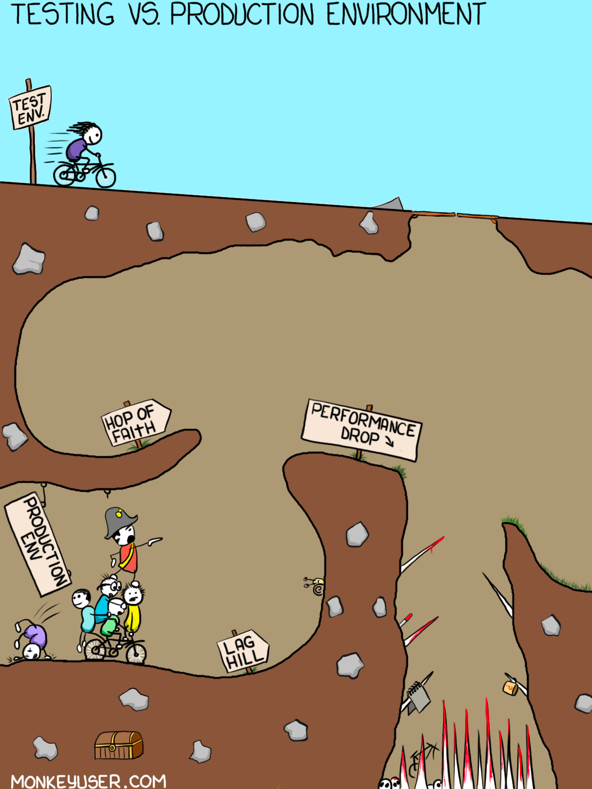

# Configuration management and environments in Node.js

## Configuration management

While discovering all the Twelve factors, you could have noticed that lots of them are somehow related to configuration management. Therefore, it is important to know how to properly configure your app to make it scalable, secure and performant in every environment.

Let's review the ways how you can implement configuration management in Node.js app.

1. **Using environment variables**: [Environment variables](https://superuser.com/questions/284342/what-are-path-and-other-environment-variables-and-how-can-i-set-or-use-them) are a common way to configure Node.js apps (and the preferred way if you need to comply with the Twelve factors).
They can be set using the command line, a `.env` file, or through the hosting environment. 
Through environment variables you can specify different configuration settings, such as database credentials or the API keys needed for third-party services.

Here's an example of how to read environment variables in Node.js:

```js title="app.js"
const PORT = process.env.PORT || 3000; // Set the port to the environment variable PORT, or default to 3000
const DB_HOST = process.env.DB_HOST || 'localhost'; // Set the database host to the environment variable DB_HOST, or default to 'localhost'
```

<details>
<summary>How it works</summary>

The [process](https://nodejs.org/dist/latest-v18.x/docs/api/process.html#processenv) core module of Node.js provides the `env` property which hosts all the environment variables that were set at the moment the process was started.

The below code runs `app.js` and set `PORT` and `DB_HOST`

```bash
PORT=80 DB_HOST=remote.example.com node app.js
```

That will pass the app `PORT` as `80` and the `DB_HOST` as `remote.example.com`. 
This of setting env variables is suitable for testing, however for production, you will probably be configuring some bash scripts to export variables, use CI/CD capabilities and other tools to set necessary variables for your app.

:::note
`process` does not require a "require" statement, it's automatically/globally available.
:::

</details>

2. **Using a configuration file**: Another common way to configure Node.js apps is by using a configuration file, such as a `JSON` or `YAML` file.

Here's an example of how to read a configuration file in Node.js:

```json title="config.json"
{
  "port": 80,
  "db": {
    "host": "example.db.host"
  }
}
```

```js title="app.js"
const fs = require('fs');

// Read the configuration file using fs
const config = JSON.parse(fs.readFileSync('config.json', 'utf8'));

// Or you can import it as a json module:
// const config = require('./config.json');

// Access configuration values
const PORT = config.port || 3000;
const DB_HOST = config.db.host || 'localhost';

```

As you can see this simple approach works fine for small or POC apps.

:::note
If `config.json` file contains some sensitive data, you should consider how you will protect this data and prevent it from being stolen, even if you use a private Git repository.
:::

3. **Using a configuration management tool**: For more complex apps, it may be beneficial to use a configuration management tool, such as [Consul](https://www.npmjs.com/package/consul) or similar.
These tools enable you to store and manage configuration data centrally, and access it from your Node.js app using a client library.

Here's an example of how to use the node-consul library to read configuration data from Consul:

```js
const consul = require('consul');

// Create a Consul client
const client = consul({ host: 'consul' });

// Read the configuration value
client.kv.get('my-app/config/port', (err, result) => {
  if (err) throw err;

  // Access the configuration value
  const PORT = result && result.Value ? parseInt(result.Value, 10) : 3000;
});

```

There are a lot of various config management tools for Cloud environments. 
Some of them are focused on keeping your secrets safe (e.g. [AWS Secrets Manager](https://aws.amazon.com/secrets-manager/), [Google Secrets Manager](https://cloud.google.com/secret-manager), etc.).
Others can be used as a tool of centralised management of variables (e.g. [AWS Systems Manager Parameter Store](https://aws.amazon.com/systems-manager/features/) or [Azure App Configuration](https://azure.microsoft.com/en-us/products/app-configuration/), etc.). 
To choose the right approach and tools you need to investigate app's requirements, tool's/service's capabilities and pricing.

:::danger
**Never commit sensitive data or credentials to VCS.**
:::

As you can see, using environment variables, a configuration file, or a configuration management tool are all viable options for configuring Node.js apps.
The choice of configuration management approach will depend on the complexity of your app and your specific needs, as well as pricing considerations for third-party services.
You can also combine different approaches to meet specific requirements for your app.

<details>
<summary>Here's an example of how to use the <b>dotenv</b> package for configuration management in Node.js:</summary>
<div>
  1. First, install the <em><a href="https://www.npmjs.com/package/dotenv" title="dotenv">dotenv</a></em> package by running the following command in your project directory:<br/>

  ```bash
  npm install dotenv
  ``` 
</div>
<div>
  2. Create a <em>.env</em> file in the root of your project directory and add your environment variables with key-value pairs like this:<br/>

  ```makefile title=".env"
  DB_HOST=localhost
  DB_USER=myuser
  DB_PASS=mypassword
  ``` 
</div>
<div>
  3. In your Node.js application, require the <em>dotenv</em> package at the top of your file:<br/>

  ```js title="config.js"
  require('dotenv').config();
  ```
</div>
<div>
  4. Now you can access your environment variables in your code using the <em>process.env</em> object. For example:<br/>

  ```js title="config.js"
  const dbConfig = {
    host: process.env.DB_HOST,
    user: process.env.DB_USER,
    password: process.env.DB_PASS,
  };
  ```

  You can use these variables to configure your application's behavior based on the environment it's running in. 
  CI/CD tools usually give you a full control over setting environment variables required by your app.
  Therefore, you have a lot of options of how and when to provide necessary configuration data (e.g. when building a Docker image of your app you can [pre-set some env variables](https://docs.docker.com/engine/reference/builder/#env), or when deploying and [running](https://docs.docker.com/engine/reference/commandline/run/#env) the image on some environment).
</div>

:::tip
**It's important to add the `.env` file to your `.gitignore` file to avoid committing sensitive information to your repository. You can dymanically create a `.env` file within CI/CD pipeline**
:::
</details>

## Application environments: development and production 

# <div class="text--center"> </div>

Now you know how to properly configure your app. And there are plenty of various options.
But let's make it clear for you, what makes the difference between `development` and `production` environments in Node.js.
Node.js `development` and `production` environments can differ in a number of ways, including _configuration settings_, _dependencies_, and _performance considerations_.

During development, it is common to use tools like [Nodemon](https://www.npmjs.com/package/nodemon), which automatically restarts the server whenever a file is changed, and debugging tools like [Node Inspector](https://nodejs.org/en/docs/guides/debugging-getting-started), which enables developers to step through code and set breakpoints.
Development environments also often use development-specific dependencies such as testing frameworks, _linting tools_, and *code coverage/testing tool*s, or _bundling tools_.

In contrast, in production, the focus is on _performance_, _scalability_, and _stability_.
Configuration settings such as database credentials and environment variables may differ, and production environments should be optimized for performance, including caching mechanisms like Redis or Memcached.

:::tip
Node.js assumes it's always running in a development environment.
You can signal Node.js that you are running in production by setting the `NODE_ENV=production` environment variable.
:::

This is usually done by executing the command in the shell:

```bash
export NODE_ENV=production
```

You can also apply the environment variable by prepending it to your application initialization command:

```bash
NODE_ENV=production node app.js
```

Or you can set this variable within your CI/CD tool (i.e. in `.env` file).

This environment variable is a convention that is widely used in external libraries as well.

Setting the environment to `production` generally ensures that:

- logging is kept to a minimum, essential level
- more caching levels take place to optimize performance
- minimizes bundled/build assets for projects written with TypeScript or Babel (or similar)

For example Pug, the templating library used by Express, compiles in debug mode if `NODE_ENV` is not set to production.
Express views are compiled in every request in development mode, while in production they are cached.
[There](https://expressjs.com/en/advanced/best-practice-performance.html) are more examples to review.

You can use conditional statements to execute code in different environments:

```js title="config.js"
export const IS_DEV_ENV = process.env.NODE_ENV === 'development';
export const IS_PROD_ENV = process.env.NODE_ENV === 'production';
```

```js title="app.js"
import { IS_DEV_ENV, IS_PROD_ENV } from './config';

if (IS_DEV_ENV) {
  // ...
}

if (IS_PROD_ENV) {
  // ...
}
```

For example, in an Express app, you can use this to set different error handlers per environment:

```js title="app.js"
if (IS_DEV_ENV) {
  app.use(express.errorHandler({ dumpExceptions: true, showStack: true }));
}

if (IS_PROD_ENV) {
  app.use(express.errorHandler());
}
```

Also, you can introduce an additional environment variable (e.g. `NODE_ENV_NAME` or `NODE_ENV_CONFIGURATION`) which will be used to define which configuration set you need to use for a particular environment (if you combine different configuration approaches):

```js title="config.js"
import * as configs from './configs.json'; // all configs in one file

export const envConfig = configs[ NODE_ENV_NAME ] || configs.development; // export the configuration for current environment; by default development
```

[Here](https://docs.nestjs.com/techniques/configuration) you can find how to set up configuration management for your Nest.js app.

To ensure a smooth transition between development and production environments, it is important to have a robust deployment process.
This process should include thorough testing, including integration and load testing, to ensure that the application works as expected in production.
Luckily, testing was covered earlier, and soon we will see how to integrate it in Continuous Integration pipeline.

## Summary

In this part,  you've learnt the ways how you can configure your Node.js app (_through env variables_, _config file_, using a _configuration management tool_, or _mixing different approaches_).
Now you know the differences between `development` and `production` environments, and how to flip the switch and turn app's environment into production mode. Moreover, you know that the `production` app differs from its `development` version in means of performance, logging/debugging, and even bundling.

A proper configuration management implementation helps to fulfill some of **Twelve factors** such as `Configuration`, `Backing services`, `Dev/Prod parity` and `Disposability`.

In the next section we will review the concept of `graceful shutdown` which helps us to achieve a full compliance of `Disposability` factor. 
