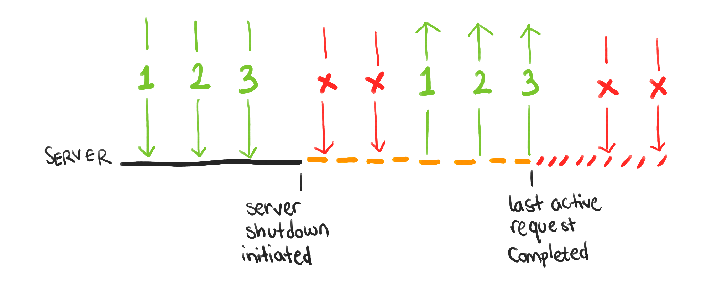

# Graceful shutdown in Node.js

## What graceful shutdown is

**Graceful shutdown** refers to the process of _closing down an application_ in a _controlled_ and _orderly way_, ensuring that _all in-progress operations are completed_, and _no data is lost_.

:::info
Graceful shutdown - When all of your requests to the server have received a response and there is no remaining data processing work to be done.
:::

It is important to have these mechanisms in place. If an application is shut down abruptly, it can leave resources in an _inconsistent state_, such as _open network connections_ (and _unhandled user requests_ consequently), _unfinished database transactions_, or _data in memory_ that _has not been persisted to disk_.
This can lead to data loss (which is not acceptable for production workloads), increased resource usage, and other issues.
The most significant issue of not having graceful shutdown in place is that it makes bad user experience. Hence, it can lead to loss of clients and/or money. (It is also worth considering costs of maintenance to back up the system/app/resources to its consistent state).

With a graceful shutdown, an _application can be notified of the shutdown process_ and _take appropriate steps_ to _gracefully close down_ any in-progress operations, such as closing open database connections or finishing processing pending requests.
Consequently, it _can prevent_ data loss and other issues, and _ensure_ that resources are freed up properly.

Graceful shutdown mechanisms are particularly important in cloud-native environments, where applications are often deployed as containers or run in serverless environments that usually have automated (horizontal) scaling capabilities.
In such environments, applications may be shut down or restarted frequently, so having a robust shutdown mechanism can help to ensure that the application can be safely terminated and/or restarted without any negative impact on the user experience.

## How to implement graceful shutdown in Express app

Here is a simple implementation of graceful shutdown for an Express app:

```js title="app.js"
const express = require('express');

const app = express();
const server = app.listen(process.env.PORT || 3000);

// Graceful shutdown
const connections = [];

server.on('connection', (connection) => {
  // register connections
  connections.push(connection);
  
  // remove/filter closed connections
  connection.on('close', () => {
    connections = connections.filter((currentConnection) => currentConnection !== connection);
  });
});

function shutdown() {
  console.log('Received kill signal, shutting down gracefully');
  
  server.close(() => {
    console.log('Closed out remaining connections');
    process.exit(0);
  });

  setTimeout(() => {
    console.error('Could not close connections in time, forcefully shutting down');
    process.exit(1);
  }, 20000);

  // end current connections
  connections.forEach((connection) => connection.end());
  
  // then destroy connections
  setTimeout(() => {
    connections.forEach((connection) => connection.destroy());
  }, 10000);
}

process.on('SIGTERM', shutdown);
process.on('SIGINT', shutdown);
```

<details>
<summary>What a process signal is</summary>

:::info
A signal is an asynchronous notification sent to a process or to a specific thread to notify an event that occurred.
:::

By emitting the signals Node.js process will receive events.
Each [signal](https://nodejs.org/dist/latest-v18.x/docs/api/process.html#signal-events) has a name(i.e. `SIGINT`, `SIGTERM`, etc.)

`SIGINT` Generated by clicking `<Ctrl>+C` in the terminal.
The `SIGTERM` signal is a generic signal used to cause program termination. Unlike `SIGKILL` these, signals can be blocked, handled, and ignored. It is the standard way to ask a program to terminate politely/gracefully.
The shell command kill generates `SIGTERM` by default.

You can read more about Termination Signals [here](https://www.gnu.org/software/libc/manual/html_node/Termination-Signals.html).

:::note
The `SIGINT` signal from the terminal is supported on all platforms.
:::

</details>

In the example above, we create an Express.js application and start a server listening on port `3000`.
We then implement a graceful shutdown by handling `SIGTERM` and `SIGINT` signals, which are sent when the server process is being terminated (these signals are usually sent by a host operating system).
When a signal is received, we `close` the server and [wait for any open connections](https://nodejs.org/api/http.html#http_server_close_callback) to finish before [exiting](https://nodejs.org/api/process.html#process_process_exit_code) the `process`.

:::tip
The `process.exit()` method instructs Node.js to terminate the process synchronously with an exit status of code. If code is omitted, exit uses either the `success` code `0` or the value of `process.exitCode` if it has been set.

To exit with a `failure` code use `process.exit(1)`.
:::

To achieve this, app listens for new connections and adds them to an array. When a connection is closed, we remove it from the array.
When we receive a shutdown signal, we close the server and wait for any remaining connections to finish by sending an `end()` event to each connection.
We also set a `timeout` to forcefully close any remaining connections after `10 seconds` by calling the `destroy()` method on each connection.


:::tip
It is almost always recommended to close database connection pools as soon as they are no longer required.
:::

This implementation provides a way to gracefully shut down an Express.js application, ensuring that all open connections are closed properly and no data is lost.
It can be customized to handle any additional cleanup or shutdown tasks that your application requires.

[Here](https://expressjs.com/en/advanced/healthcheck-graceful-shutdown.html) you find some examples of using third-party npm packages that you can use to implement graceful shutdown in Express.js app. Feel free to investigate other available options.

## How to implement graceful shutdown in Nest.js app

Below you can find a basic implementation of graceful shutdown for Nest.js app.

```typescript title="app.ts"
import { NestFactory } from '@nestjs/core';
import { AppModule } from './app.module';
import { Logger } from '@nestjs/common';

async function bootstrap() {
  const app = await NestFactory.create(AppModule);

  const logger = new Logger('Shutdown');

  let connections = [];

  // @see: https://docs.nestjs.com/fundamentals/lifecycle-events
  app.enableShutdownHooks();

  app.use((req, res, next) => {
    connections.push(req.connection);
    
    res.on('finish', () => {
      connections = connections.filter((curr) => curr !== req.connection);
    });

    next();
  });

  function handleShutdown(signal) {
    logger.log(`Received ${ signal } signal. Shutting down gracefully.`);

    server.close(() => {
      logger.log('Http server closed.');
      process.exit(0);
    });

    setTimeout(() => {
      logger.error('Could not close connections in time, forcefully shutting down.');
      process.exit(1);
    }, 20000);

    connections.forEach((connection) => connection.end());
    
    setTimeout(() => {
      connections.forEach((connection) => connection.destroy());
    }, 10000);
  }

  process.on('SIGTERM', () => handleShutdown('SIGTERM'));
  process.on('SIGINT', () => handleShutdown('SIGINT'));
}

bootstrap();
```

As you could observe, the implementation is pretty similar to what we did for the Express.js app.
Nest.js' built-in `enableShutdownHooks()` method enables the application to [gracefully shut down a Nest.js app](https://docs.nestjs.com/fundamentals/lifecycle-events#application-shutdown) when a signal is received by calling several [lifecycle hooks](https://docs.nestjs.com/fundamentals/lifecycle-events#lifecycle-events-1).

This code can also be customized to perform any additional cleanup or shutdown tasks.

# <div class="text--center"> </div>

## Summary

Having a proper configuration management ensures fast start up of your app in production.
Implementing graceful shutdown from the other hand makes user experience positive, data consistent, hence, your application is compliant with the Twelve factors.
It also enables your app to run in any cloud environment.

The main steps in implementing graceful shutdown are:
- Handle process kill signal (`SIGINT`, `SIGTERM`, etc.)
- Stop new requests from client
- Close all data process 
- If the app does not exit automatically after performing all the previous steps, we need to exit from the process using `process.exit` function

That's it.

In the next section you will get familiar with another important concept of app's **health check**.
