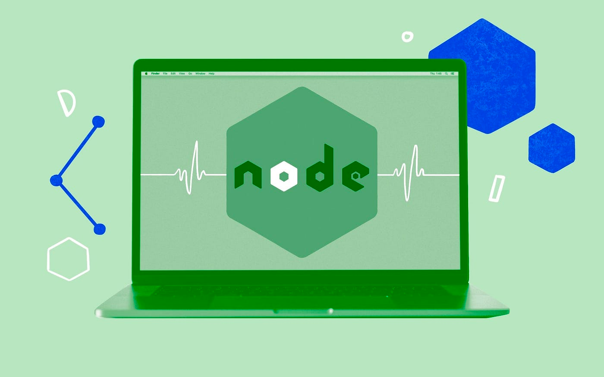

# Healthcheck for Node.js apps

## What is a health check

# <div class="text--center"> </div>

Implementing health checks in a Node.js application is important for _ensuring_ that the _application is functioning properly_ and _able to handle incoming requests_.
Health checks provide a way to monitor the health of your application and quickly detect and respond to issues.

If you deploy your app to a Cloud and use such kind of things as load balancer or autoscaling, it will be required to provide a health check API endpoint, so that the load balancer can recognise whether app's instance is healthy and can handle requests.

You can easily implement a basic health check endpoint in your Node.js app as follows:

```js
const http = require('http');

const server = http.createServer((req, res) => {
  if (req.url === '/health') {
    // Respond with a 200 status code and a simple message
    res.writeHead(200);
    res.end('Healthy');
  } else {
    // Handle other requests as usual
    // ...
  }
});

const PORT = process.env.PORT || 3000;
server.listen(PORT, () => {
  console.log(`Server listening on port ${PORT}`);
});

```

Here, the server responds with a `200` status code and the message `Healthy` when it receives a request to the `/health` endpoint.
This can be used by a monitoring system or a load balancer to periodically check the health of the application.

There are many ways to implement health checks in Node.js, depending on the specifics of your application and the tools you're using.
For example, you might use a health check library like [express-healthcheck](https://www.npmjs.com/package/express-healthcheck) or similar, or integrate your health checks with a monitoring tool like [Prometheus](https://prometheus.io/docs/introduction/overview/) or [DynaTrace](https://www.dynatrace.com/).

### Health check for Express.js apps

Below is the implementation of health check for an Express.js app with a single route at the `/health` endpoint:

```js
const express = require('express');

const app = express();

app.get('/health', (req, res) => {
  res.status(200).json({
    message: 'Application is healthy'
  });
});

// or with the express-healthcheck package:
/*
  app.use('/health', require('express-healthcheck')({
    healthy: function () {
      return { message: 'Application is healthy' };
    }
  }));
*/

app.listen(3000, () => {
  console.log('Server is running on port 3000');
});

```

When the `/health` route is accessed, the server responds with a `200 OK` status code and a simple text message indicating that the server is healthy.

This is a very basic health check implementation, but it can be useful for checking that the server is up and running and can handle requests.
You could implement additional logic to this endpoint to check other components of your application, such as a database connection, external API calls, or CPU and memory usage.

Here's an updated version of the health check endpoint that includes a database connection check using the [mysql2](https://www.npmjs.com/package/mysql2) library:

```js
const express = require('express');
const mysql = require('mysql2');

const port = process.env.PORT || 3000;

const dbConfig = {
  host:  process.env.DB_HOST || 'localhost',
  user:  process.env.DB_USER || 'root',
  password: process.env.DB_PASSWORD,
  database: process.env.DB_NAME || 'mydatabase',
};

const app = express();

const pool = mysql.createPool(dbConfig);

app.get('/health', (req, res) => {
  pool.getConnection((err, connection) => {
    if (err) {
      return res
        .status(500)
        .send('Error connecting to database');
    }

    res.status(200).send('OK');
    connection.release();
  });
});

app.listen(port, () => console.log(`Server listening on port ${ port }`));

```

As you can observe in this example, we first create a connection pool to our MySQL database using the `mysql2` library.
Then we update the `/health` endpoint to check that we can successfully connect to the database. We use the connection pool's `getConnection()` method to request a connection to the database.
If there's an error connecting to the database, we respond with a `500 Internal Server Error` status code. If the connection is successful, we respond with a `200 OK` status code and release the connection back to the pool.

By including additional checks for other components of your application, you can get a more complete picture of the overall health of your system.

### Health check for Nest.js app

Here is a basic implementation of health check for Nest.js application:

```typescript
import { Controller, Get } from '@nestjs/common';

@Controller('health')
export class HealthController {
  @Get()
  healthCheck() {
    return {
      message: 'Application is healthy'
    };
  }
}

```

We create a controller for the `/health` endpoint and define a single `GET` route that returns a JSON response with a message indicating that the application is healthy.

We then need to register this controller with the Nest.js application by adding it to the controllers array in the `AppModule`:

```typescript
import { Module } from '@nestjs/common';

import { HealthController } from './health.controller';

@Module({
  controllers: [ HealthController ]
})
export class AppModule {}

```

This will make the `/health` endpoint available in our Nest.js application.
As usual, we're returning a simple JSON response to indicate that the application is healthy.
However, you can customize the response to include additional information, such as the current version of the application, the status of any external dependencies, or other relevant details.

Keep in mind that there are many ways to implement health checks in Express and Nest.js, depending on your specific needs and the tools you're using.
These examples should provide a starting point for implementing health checks in your own applications.

Here's an example of how you can implement a more advanced health check in Nest.js that includes checking the status of a database connection:

```typescript
import { Controller, Get } from '@nestjs/common';
import { HealthCheck, HealthCheckService, MongooseHealthIndicator } from '@nestjs/terminus';

@Controller('health')
export class HealthController {
  constructor(
    private health: HealthCheckService,
    private db: MongooseHealthIndicator,
  ) {}

  @Get()
  @HealthCheck()
  async check() {
    return this.health.check([
      async () => this.db.pingCheck('database', { timeout: 300 }),
    ]);
  }
}

```

In the code above, we're using the `@nestjs/terminus` library to perform health checks. We inject the `HealthCheckService` and `MongooseHealthIndicator` into our controller's constructor, which allows us to perform health checks on our application and on a database connection using `Mongoose`.

The `@HealthCheck()` decorator on the `check()` method tells Nest.js to perform a health check when the `/health` endpoint is accessed.
We define a single check function that uses the `MongooseHealthIndicator` to ping the database and returns a Promise indicating whether the check was successful or not.

We then call `this.health.check()` and pass in an array of check functions to perform. In this case, we're only performing one check, which is the database ping check.
However, you could add additional operations to this array to perform other health checks on your application.

The `health.check()` function returns a Promise that resolves an object containing the results of each check.
The object will have a status property that indicates the overall status of the health check, as well as any additional properties for each check.

Here's an example response when the health check is successful:

```json
{
  "status": "ok",
  "info": {
    "database": {
      "status": "up"
    }
  }
}
```

And here's an example response when the health check fails:

```json
{
  "status": "error",
  "errors": {
    "database": {
      "status": "down",
      "message": "Database connection timed out after 300ms"
    }
  }
}
```

For more details you can refer to Nest.js' docs [here](https://docs.nestjs.com/recipes/terminus).

## Health check considerations

:::tip
When implementing/adding a health check endpoint for your up consider the following things:

- whether you need to use a third-party package. It can somehow crease a bundle size of your app, so it may be critical for some apps where it really matters.
- how frequently the healthcheck endpoint will be called. You need to configure the optimal health check interval, so that it won't influence on app's performance, especially if you have complex health checks (e.g. checking db connection, cache or other components of your system). In cloud environments, if frequency of checking is too short, your app can be terminated before it serves traffic.
- data the app returns in response to healthcheck should not contain any sensitive information or information about components of your system. Keep it simple and clear. The main reason is to send `200/OK` HTTP status code, other things are rarely useful.
- use consistent naming for your healthcheck endpoints across all microservices.
:::

## Summary

Health check is a very important part for your Node.js application that provides you necessary information about system's health and availability.
For some scenarios you will not be able to deploy your Node.js API to the Cloud if you don't have a health check endpoint. At the same time you need to be sure that your app is up and running in production environment.
Finally, it makes your app one step closer to Cloud Native apps.

In the next section you will learn how to ensure proper logging in your app as well as get familiar with debugging and logging in Node.js.
