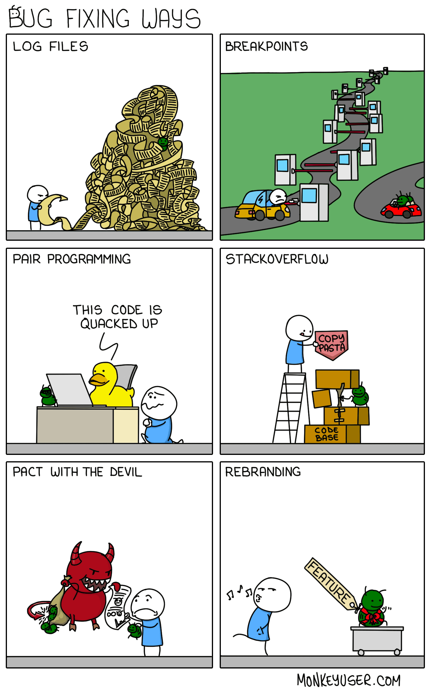
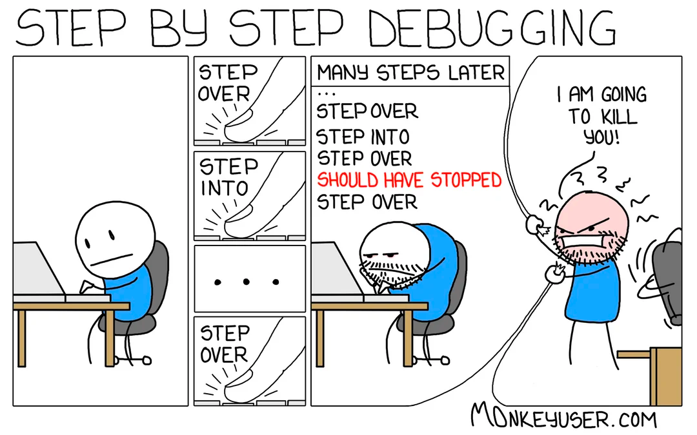
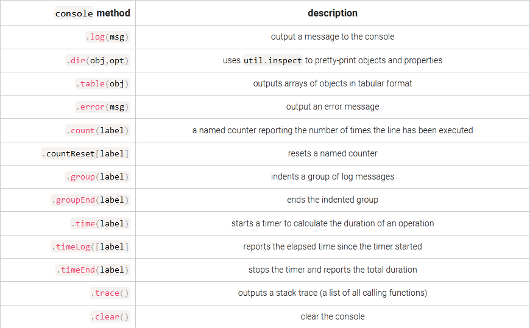
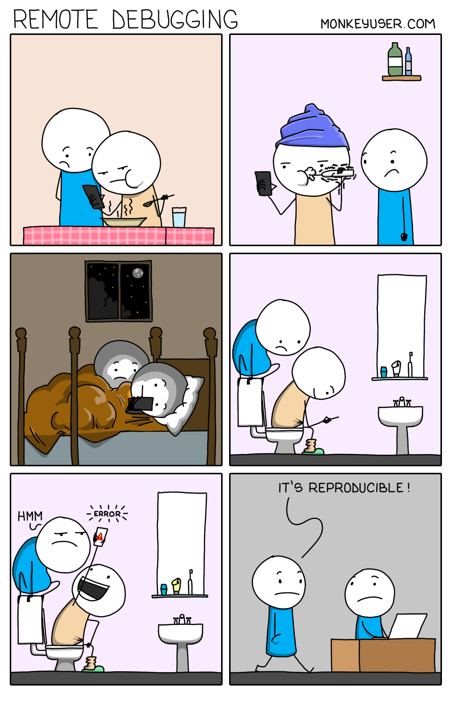
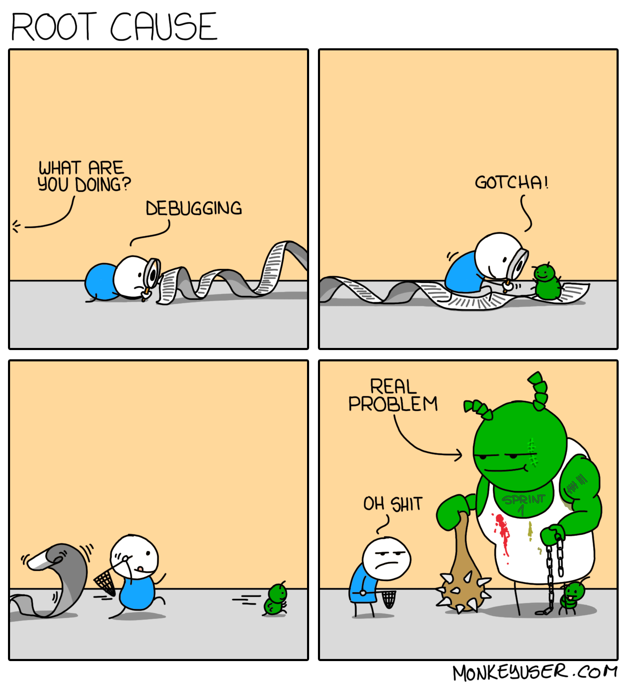

# Logging and debugging in Node.js

# <div class="text--center"> </div>

Software development is complex and, at some point, your Node.js application will fail.
If you’re lucky, your code will crash with an obvious error message. If you’re unlucky, your application will carry on regardless but not generate the results you expect.
If you’re really unlucky, everything will work fine until the first user discovers a catastrophic server-crashing bug.
To fight with bugs in your code you have several Node.js tools in your arsenal. 

We start with investigating [debugging](https://nodejs.org/en/docs/guides/debugging-getting-started) tools and approaches in Node.js.

## Debugging

:::info
Debugging is the process of identifying and fixing errors or issues in your code.
It involves using various tools and techniques to examine the state of your program at runtime and track down the root cause of problems.
:::

# <div class="text--center"> </div>

<details>
  <summary>Terminology</summary>
  <div> 
    <p>Debugging has its own set of obscure jargon, such as the following:</p>
    <ul>
      <li><b>Breakpoint</b> – When a debugger stops a program so that its state may be examined</li>
      <li><b>Debugger</b> – A debugging tool that allows you to see internal variable states by running code line by line</li>
      <li><b>Feature</b> – It's something that every developer says at some time in their career.</li>
      <li><b>Frequency</b> – How frequently or under what circumstances a bug will appear</li>
      <li><b>It doesn’t work</b> – The most common but ineffective bug report</li>
      <li><b>Log point</b> – A debugging instruction that displays the value of a variable at a certain point during execution</li>
      <li><b>Logging</b> – Runtime data is written to the console or a file</li>
      <li><b>Logic error</b> – The program works, but it doesn't do what it's supposed to do</li>
      <li><b>Priority</b> – A bug is assigned to a list of upcoming updates</li>
      <li><b>Race condition</b> – Bugs that are difficult to track are those that are reliant on the sequence or timing of uncontrollable events</li>
      <li><b>Refactoring</b> – Rewriting code to make it easier to read and maintain</li>
      <li><b>Regression</b> – A previously repaired bug reappears, possibly as a result of other updates</li>
      <li><b>Related</b> – A bug that is linked to or comparable to another</li>
      <li><b>Reproduce</b> – The steps that must be taken to cause the error</li>
      <li><b>RTFM error</b> – A bug report disguised as user ignorance, usually followed by a response to "Read the Flipping Manual."</li>
      <li><b>Step into</b> – Step inside the function being called when debugging code line by line</li>
      <li><b>Step out</b> – Complete the current function's execution and return to the calling code when running line by line</li>
      <li><b>Step over</b> – Complete the execution of a command without stepping into a function it calls when running line by line.</li>
      <li><b>Severity</b> – The system's influence as a result of a bug</li>
      <li><b>Stack trace</b> – The list of all methods that were called before the error</li>
      <li><b>Syntax error</b> – Typographical errors, like console.lug()</li>
      <li><b>User error</b> – An error created by a user rather than the application, although depending on that person's seniority, an update may still be required</li>
      <li><b>Watch</b> – A variable to look at while the debugger is running</li>
      <li><b>Watchpoint</b> – When a variable is set to a specified value, the program is stopped, similar to a breakpoint</li>
    </ul>
  </div>
</details>

Bugs can often be prevented before you test your application. Using a good code editor or IDE, setting up a Code linter, keeping your code under a Version Control System, adopting an Issue-tracking System, as well following TDD process are common ways of bugs prevention on every stage of development lifecycle.
Sometimes it is needed to make step away. Take a break, do workout or yoga, brew a fresh cup of coffee or tea, take a short nap. Your brain will find a solution or spot that obvious missing semicolon after refresh.

But let's check Node.js' debugging tools.

### Debugger statement

One of the most common tools for debugging Node.js applications is the built-in `debugger` statement.
This statement allows you to pause the execution of your code at a particular point and examine the current state of your program.

Here's an example of how to use it:

```js title="app.js"
function addNumbers(a, b) {
    debugger;
    return a + b;
}

const result = addNumbers(2, 3);
```

As you can see, we've added a `debugger` statement to the `addNumbers` function. When we run the code, Node.js will pause execution at this point and give us a prompt in the terminal where we can inspect the current values of variables and step through the code line by line.

`debugger` works with many third-party debugging tools and extensions available for Node.js, such as the [Node.js Debugger](https://nodejs.org/api/debugger.html), the [VS Code Debugger Extension](https://code.visualstudio.com/api/extension-guides/debugger-extension), or [Debugger in WebStorm](https://www.jetbrains.com/help/webstorm/running-and-debugging-node-js.html#before_you_start), etc.

### Console methods

Another useful tool for debugging Node.js applications is the [console](https://nodejs.org/api/console.html) object. You can use the `console.log()` method to output information to the console at various points in your code to help you track down errors.
Here's an example:

```js
function addNumbers(a, b) {
    console.log(`Adding ${a} and ${b}...`);

    const result = a + b;

    console.log(`Result: ${result}`);

    return result;
}

const result = addNumbers(2, 3);

console.log(`Final result: ${result}`);

```

In this example, we've added `console.log()` statements to the `addNumbers` function to output information about the calculation being performed.
This can help us to identify any issues with the calculation or unexpected values of variables.

Few developers delve beyond this humble debugging command, but they’re missing out on many more possibilities, including these:

# <div class="text--center"> </div>

Larger objects can be output as a condensed string as follows:

```js
console.log(JSON.stringify(obj));
```

[util.inspect](https://nodejs.org/api/util.html#util_util_inspect_object_options) can also format objects for easier reading, but `console.dir()` does the hard work for you.

### Node.js `util.debuglog`

The Node.js [util](https://nodejs.org/api/util.html) module offers a built-in [debuglog](https://nodejs.org/api/util.html#utildebuglogsection-callback) method which conditionally writes messages to `STDERR`:

```js
const util = require('util');
const debuglog = util.debuglog('myapp');

debuglog('myapp debug message [%d]', 123);
```

When the `NODE_DEBUG` environment variable is set to `myapp` (or a `wildcard` such as `*` or `my*`), messages are displayed in the console:

```shell
NODE_DEBUG=myapp node index.js
MYAPP 9876: myapp debug message [123]
```

Here, `9876` is the Node.js process `ID`.

By default, `util.debuglog` is silent. If you were to run the above script without setting a `NODE_DEBUG` variable, nothing would be output to the console.
This allows you to leave helpful debug logging in your code without cluttering the `console` for regular use.

### Remote debugging or debugging with Chrome

Debugging in production environments can be challenging because you want to avoid causing any disruption or downtime for your users.
However, it's still important to have tools and techniques in place to identify and fix issues that arise in production.

# <div class="text--center"> </div>

One way to do this is to use logging and monitoring tools to collect information about your application's performance and behavior in production.
You can use these tools to track down the root cause of issues and identify any patterns or trends that may be contributing to problems.

Another approach is to use remote debugging tools that allow you to connect to your production environment and inspect the state of your application in real-time.
This can be useful for tracking down specific issues or errors that are difficult to reproduce in a development environment.

To enable remote debugging in Node.js, you can use the `--inspect` flag when starting your application.
This will start the Node.js debugger and allow you to connect to it using a remote debugging client like Chrome DevTools.

Here's an example of how to start a Node.js application with remote debugging enabled:

```bash
$ node --inspect index.js
```

Once your application is running with remote debugging enabled, you can connect to it using the `Chrome DevTools` or another remote debugging client.
You'll need to open the Chrome DevTools and navigate to the `chrome://inspect` URL, then click the `Open dedicated DevTools for Node` link to open the Node.js debugger.

From here, you can inspect the state of your application, set breakpoints, and step through your code just like you would in a local development environment.
This can be a powerful tool for debugging issues that only occur in production.

Alternatively, you can use `--inspect-brk` to set a breakpoint on the first statement so the application is paused immediately.

Some additional details you can find [here](https://nodejs.org/dist/latest-v20.x/docs/api/debugger.html#v8-inspector-integration-for-nodejs).

### Node.js V8 Inspector

Node.js is a wrapper around the V8 JavaScript engine which includes its own inspector and debugging client. To start, use the `inspect` argument (not to be confused with `--inspect`) to start an application:

```shell
node inspect ./index.js
```

The debugger will pause at the first line and display a debug> prompt:

```shell
< Debugger listening on ws://127.0.0.1:9229/6f38abc1-8568-4035-a5d2-dee6cbbf7e44
< For help, see: https://nodejs.org/en/docs/inspector
< Debugger attached.
Break on start in index.js:5
> 5 const port = process.env.PORT || 3000; // default HTTP port 
  6   
  7  // Node.js modules 
debug>
```

You can step through the application by entering:

- `cont` or `c`: continue execution
- `next` or `n`: run the next command
- `step` or `s`: step into a function being called
- `out` or `o`: step out of a function and return to the calling command
- `pause`: pause running code

Other options include:

- watching variable values with `watch('myvar')`
- setting breakpoints with the `setBreakpoint()`/`sb() `command (it is usually easier to insert a `debugger;` statement in your code)
- `restart` a script
- `.exit` the debugger (the initial `.` is required)

If this sounds horribly clunky, it is. Only use the built-in debugging client when there’s absolutely no other option, you’re feeling particularly masochistic, and you’re not using Windows (it’s often problematic).

### The debug module

The [debug](https://www.npmjs.com/package/debug) module in Node.js provides a simple and flexible logging utility that can be used to debug applications. This is a tiny, more advanced third-party alternative to `util.debuglog`.

Here is an example of how to use it:

First, install the debug module using npm:

```bash
npm install debug
```

Next, in your Node.js application, require the `debug` module and create a logger by providing a namespace as a parameter:

```js
const debug = require('debug')('my-app:server');
```

In this example, the namespace is set to `my-app:server`, which can be any string that describes the module or component you are logging for.

Now you can use the logger in your code to output debug messages. For example:

```js
debug('listening on port ' + port);
```

The `debug` function takes a message as a parameter, which can be a string, a number, or any other type that can be coerced into a string.
When you run your Node.js application, you can enable logging by setting the `DEBUG` environment variable to the namespace you provided earlier:

```bash
DEBUG=my-app:* node app.js
```

This will enable all logs with the namespace starting with `my-app:`. You can also specify multiple namespaces by separating them with commas:

```bash
DEBUG=my-app:server,my-app:database node app.js
```

This will enable logs for both the `my-app:server` and `my-app:database` namespaces.

You can also selectively enable and disable logging at runtime by setting the `DEBUG` environment variable to the desired namespaces.
For example, to enable logging for the `my-app:server` namespace only, run:

```bash
DEBUG=my-app:server node app.js
```

This allows you to easily enable and disable different debug namespaces in cloud environments. Don't forget to re-start your instance to receive the most recent changes in environment.

For further investigation and improvement of performance of your app you can dive into [profiling in Node.js](https://nodejs.org/en/docs/guides/simple-profiling) or find a right performance testing tool for your app/project.

At this point we smoothly approached the point, where debugging smothly transitions into logging, which also helps you to troubleshoot the app.

## Logging

:::info
Logging is the process of capturing events, messages, and data that occur during the operation of a software application or system. 
The purpose of logging is to provide a record of what happened in the system for diagnostic, monitoring, and analysis purposes.
:::

Having proper logging in your Node.js application is important for several reasons:

 - **Debugging**: logs can help you diagnose and troubleshoot issues that arise during development and production.
With the right logging data, you can quickly identify the source of a problem and take steps to fix it.

 - **Monitoring**: logs can be used to monitor the health and performance of your application in real-time.
By analyzing your logs, you can detect and address potential issues before they become critical.

 - **Auditing**: logs provide a record of the activity that occurs in your application, which can be useful for compliance and auditing purposes.

### Best practices for logging in Node.js

:::tip
Below you can find some of best practices for logging in Node.js:

- **Use a logging library**: Node.js has several logging libraries available, such as [Winston](https://www.npmjs.com/package/winston) and [Bunyan](https://www.npmjs.com/package/bunyan), which provide features like log levels, log rotation, and formatting, that make them compatible with the Twelve factors.
These libraries are designed to handle the complexities of logging and are much more powerful than simply writing to the console.

- **Use log levels**: Log levels allow you to filter and prioritize your logs based on their severity.
Common log levels include `debug`, `info`, `warn`, `error`, and `fatal`.

- **Use structured logging**: Structured logging allows you to log data in a structured format, such as JSON, which can be easily parsed and analyzed by tools like `Elasticsearch`, `Kibana`, etc.

- **Log relevant data**: Only log data that is relevant to the issue at hand. Avoid logging sensitive information, such as passwords, credentials to third-party services, user data, access tokens and other authorization data, etc.

- **Centralize your logs**: Sending your logs to a centralized logging service like `Loggly`, `Papertrail`, or `Splunk` can make it easier to monitor and analyze your logs.
:::

### How to implement logging in Node.js

Let's review an example of how to implement logging using the `Winston` library in a Node.js application.

First, install Winston using npm:

```shell
npm i winston
```

```js
const winston = require('winston'); // or you can use imports

// Create a logger with two transports: one for console output, and one for file output
// export logger to use it all around the app as a single place for all logging operations
 const logger = winston.createLogger({
  level: 'info',
  format: winston.format.json(),
  transports: [
    new winston.transports.Console(),
    new winston.transports.File({ filename: 'error.log', level: 'error' })
  ]
});

// Log an error message
logger.error('An error occurred', { metadata: 'some additional data' });

// Log an info message
logger.info('Server started on port 3000');

```

Above, we create a logger with two transports: one for `console` output, and other for `file` output.
We set the log level to `info`, which means that only messages with a severity level of `info` or higher will be logged.
We also use a JSON format for our log messages.

To log a message, we call the appropriate method on the `logger` object (e.g. `logger.error()` or `logger.info()`) and pass in the message as a string, as well as any additional metadata that we want to include.
The logger will automatically include the date and time of the log message.

By default, Winston logs to the `console`, but we've also added a file transport that will log any messages with a severity level of `error` or higher to a file called `error.log`.
This allows us to capture and analyze errors that occur in our application.

Bellow you can find another example of how to implement logging using the `Bunyan` library:

First, install Bunyan using npm:

```bash
npm i bunyan
```

Then, in your application code, create a `logger` object using the Bunyan library:

```js
const bunyan = require('bunyan'); // or import the package

const logger = bunyan.createLogger({
    name: 'my-app',
    level: 'info'
});

```

Here we've created a logger object with the name `my-app` and a logging level of `info`.
You can configure the logging level to be more or less verbose, depending on your needs.

To log messages using the logger, call the appropriate logging method (e.g. `debug()`, `info()`, `warn()`, `error()`, etc.):

```js
logger.info('Application started.');

// ...

logger.warn('Something unexpected happened.');

```

As you could observe, the most commonly used loggers share the same API. So you can consider creating your own facade, which will encapsulate a logging library and allow you to swap it if needed.

When you run your application, the log messages will be output to the `console` or to a `file`, depending on your configuration.

You can also add additional context to your log messages by including extra data in each logging call:

```js
logger.info({ user: 'john@example.com' }, 'User logged in successfully.');

```

In this example, we're including the email address of the user who logged in as extra data in the log message.

Bunyan also supports a variety of other features, such as logging to different destinations (e.g. `console`, `file`, `syslog`, etc.), log rotation, and log filtering.

:::warning
You should never log any sensitive data in your app (user passwords, access tokens, third-party credentials, etc.). You should also carefully log user's personal data which can be also sensitive. Keep it in mind.
:::

### Logging requests data

Logging API requests data in Node.js is important for debugging and monitoring purposes in all development and production environments.
If you don't use third-party monitoring and observability tools like DynaTrace, you need to implement your custom solution.
Luckily, it is a very simple thing in Node.js.

Here's an example of how to log requests data using the [morgan](https://www.npmjs.com/package/morgan) middleware in an Express application:

```js
const express = require('express');
const morgan = require('morgan');

const app = express();

// log requests using the morgan middleware
app.use(morgan('combined'));

// handle requests
app.get('/', (req, res) => {
  res.send('Hello World!');
});

// start the server
app.listen(3000, () => {
  console.log('Server listening on port 3000');
});

```

Here, we're using the `morgan` middleware to log requests data in the `combined` format.
The combined format includes information about the client `IP address`, `HTTP method`, `request URL`, `response status`, and `response time`.

When a request is made to the server, morgan will log information about the request to the console. Here's an example of what the output might look like:

```
::1 - - [01/Jan/2022:00:00:00 +0000] "GET / HTTP/1.1" 200 12 "-" "Mozilla/5.0 (Windows NT 10.0; Win64; x64) AppleWebKit/537.36 (KHTML, like Gecko) Chrome/96.0.4664.110 Safari/537.36" "-"
```

This log entry includes information about the client IP address `(::1)` which means a `localhost`, the HTTP method (`GET`), the request URL (`/`), the response status (`200`), the response size (`12`), and the user agent (`Mozilla/5.0...`).

By logging requests data in this way, you can easily track down issues and debug your application's behavior.
Just be sure to use caution when logging sensitive information like request headers or payloads, as this information could be used to compromise the security of your application.

Feel free to create your own middleware which will log requests data using your logging solution.

If you configure properly logging in your app, then you should investigate other third-party logging and monitoring solutions like DynaTrace, Splunk, CloudWatch, Elastic Stack, etc.

## Summary

# <div class="text--center"> </div>

Logging and debugging are two different concepts, although they are often used together to help developers troubleshoot issues in their applications.

**Logging** is the practice of recording information about an application's behavior to a persistent location, such as a file, database, or log management system.
This information can include error messages, warnings, and informational messages that can be used to help diagnose issues and monitor the health of the application.

**Debugging**, on the other hand, is the process of identifying and fixing errors and other issues in an application.
Debugging is typically done by stepping through code in a debugger or using other tools to identify issues in the application's behavior.

While logging is focused on recording information about an application's behavior for later analysis, debugging is focused on identifying and fixing issues in real-time.

When you're implementing debugging in production environments, it's important to take caution to avoid causing any disruptions to your users.
Be sure to test your debugging tools and techniques thoroughly in a staging or testing environment before deploying them to production, and always monitor your application closely to ensure that it's performing as expected.

Here are some best practices which you can follow while implementing logging and debugging in your Node.js application:

- Use a consistent logging format and level across your application
- Include context-specific information in your log messages, such as the current user or request ID
- Use a logging library like `Bunyan` or `Winston` to manage your log output and configuration
- Avoid using `console.log()` statements in production code
- Ensure that your logging and/or debugging configuration can be easily modified or disabled as needed
- Extend your custom logging solution by using third-party solutions to visualise, analyse and act timely based on information from logs 

By following these best practices, you can make logging and debugging of your Node.js applications easier and more effective, as well as ready for running your app in any Cloud environment.

Now we're ready to move further and discover how to prepare our Node.js application for deployment in any Cloud environment using Docker.
