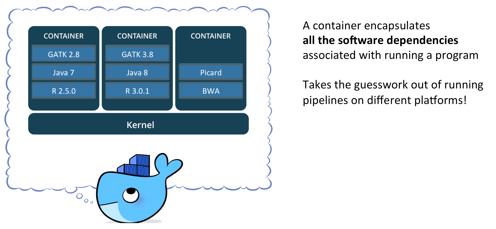
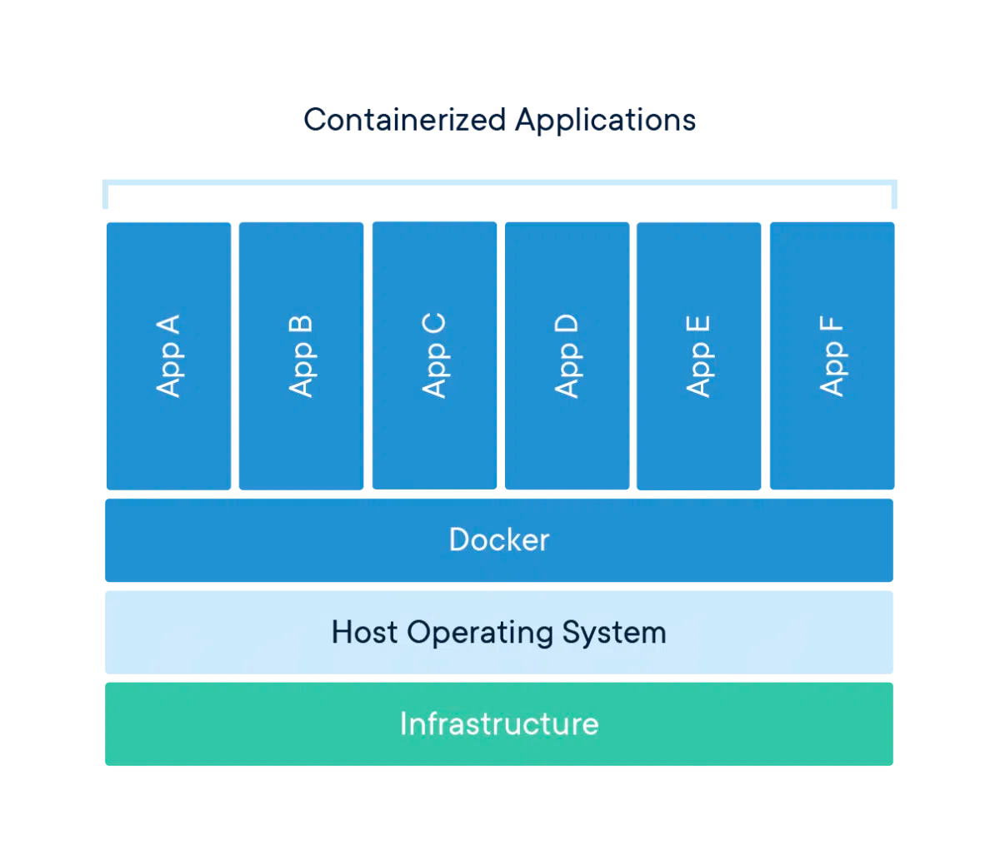
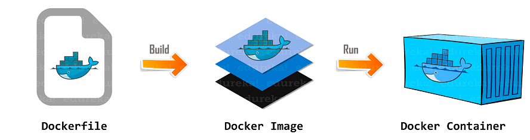
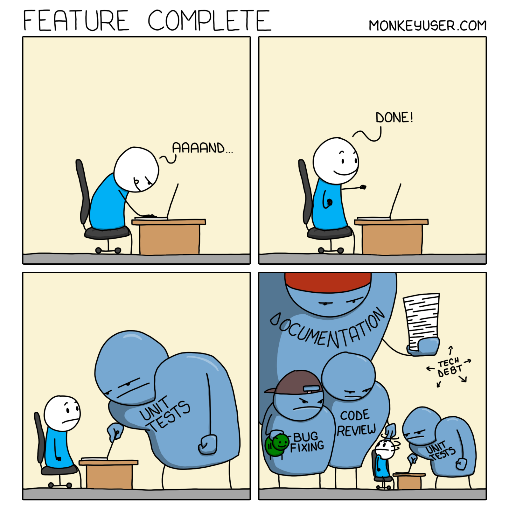

# Docker and Node.js

# <div class="text--center"> </div>

## What is Docker

:::info
[Docker](https://docs.docker.com/engine/) is a containerization platform that allows developers to package and deploy applications in a consistent and reliable way, regardless of the underlying infrastructure.
Docker uses a technology called [containers](https://www.docker.com/resources/what-container/), which are isolated environments that can run an application and all of its dependencies, libraries, and configuration files.
:::

<details>
  <summary>What Docker container is</summary>
  <p>A <b>container</b> is similar to a virtual machine (VM) and can be used to <b>contain and execute</b> all the software required to run a particular program or set of programs.
    The container includes an operating system (typically some flavor of Linux), plus any required software installed on top of the OS.
    It can be run as a self-contained virtual environment, making it easier to reproduce the same application/softaware on any infrastructure that supports running the container without having to go through the pain of identifying and installing all the software dependencies on your own laptop, cluster, or cloud environment.
  </p>

# <div class="text--center"> </div>

</details>

The key benefit of Docker is that it provides a way to create a consistent environment for an application to run in.
This means that developers can create a Docker image that includes all dependencies and configuration needed for an application to run.
Once this [image](https://docs.docker.com/build/building/packaging/) is created, it can be shared and run on any system that supports Docker, ensuring that the application runs the same way on every system.

# <div class="text--center"> </div>

Docker images are created using a [Dockerfile](https://docs.docker.com/engine/reference/builder/), which is a text file that describes the steps needed to build the image.
The Dockerfile includes instructions for installing dependencies, configuring the environment, and copying the application code into the container.
Once the Dockerfile is created, it can be used to build a Docker image using the `Docker CLI`.

# <div class="text--center"> </div>

Docker images can be shared and stored in a centralized registry, such as `Docker Hub`.
This makes it easy for developers to share and collaborate on images, and for operations teams to deploy and manage them in production environments.

Another key benefit of Docker is that it allows for easy scaling of applications.
Multiple instances of the same Docker container can be created and load-balanced, allowing for high availability and improved performance.

Overall, Docker provides a powerful and flexible platform for containerizing and deploying applications, improving consistency, reliability, and scalability.
It makes your Node.js application another step closer to Cloud Native apps.

To get started with Docker you need to install it (and we assume that you do/did set up docker on your local machine).
You can use the original Docker and it Docker Desktop, or you have other free options like [Podman](https://podman.io/) and [Podman Compose](https://github.com/containers/podman-compose), or [Containerd](https://containerd.io/) and [nerdctl](https://github.com/containerd/nerdctl) (Docker-compatible CLI for containerd).

### Docker commands

In this section we provide you some very basic Docker commands you should know.

:::tip
You can try Docker within a [playground environment](https://labs.play-with-docker.com/). 
:::

Feel free to use the following cheatsheets whenever you need it:
- [Official CLI Cheat Sheet](https://docs.docker.com/get-started/docker_cheatsheet.pdf)
- [Docker CLI](https://devhints.io/docker)
- [Dockerfile](https://devhints.io/dockerfile)
- [Docker Compose](https://devhints.io/docker-compose)

<details>
<summary>Basic Docker commands</summary>

Below there are some basic Docker commands that you can use to manage your containers and images.
There are many more advanced commands and options available, so it's always a good idea to refer to the [Docker documentation](https://docs.docker.com/engine/reference/commandline/docker/) for more information.

- [Run](https://docs.docker.com/engine/reference/commandline/run/) a container from an image

```bash
docker run <image-name>
```

This command will run a new container based on the specified image. For example, to run a container based on the official Node.js image:

```bash
docker run node
```

- Run a container in the background

```bash
docker run -d <image-name>
```

This command will run the container in detached mode, so it will run in the background without blocking the terminal.
For example, to run a container based on the official MySQL image in detached mode:

```bash
docker run -d mysql
```

- Run a container and map a port

```bash
docker run -p <host-port>:<container-port> <image-name>
```

This command will map a port on the host machine to a port on the container. For example, to run a container based on the official nginx image and map port 80 on the host to port 80 on the container:

```bash
docker run -p 80:80 nginx
```

- Run a container and map a volume

```bash
docker run -v <host-path>:<container-path> <image-name>
```

This command will map a directory on the host machine to a directory on the container. For example, to run a container based on the official WordPress image and map the wp-content directory on the host to the wp-content directory on the container:

```bash
docker run -v /path/to/wp-content:/var/www/html/wp-content wordpress
```

- [List](https://docs.docker.com/engine/reference/commandline/ps/) running containers

```bash
docker ps
```

This command will list all running containers on the host machine.

- List all containers

```bash
docker ps -a
```

This command will list all containers on the host machine, including stopped containers.

- [Stop](https://docs.docker.com/engine/reference/commandline/stop/) a container

```bash
docker stop <container-id>
```

This command will stop a running container. For example, to stop a container with the ID "abc123":

```bash
docker stop abc123
```

- [Start](https://docs.docker.com/engine/reference/commandline/start/) a stopped container

```bash
docker start <container-id>
```

This command will start a stopped container. For example, to start a container with the ID "abc123":

```bash
docker start abc123
```

- [Remove](https://docs.docker.com/engine/reference/commandline/rm/) a stopped container

```bash
docker rm <container-id>
```

This command will remove a stopped container. For example, to remove a container with the ID "abc123":

```bash
docker rm abc123
```

- Force remove a running container

```bash
docker rm -f <container-id>
```

This command will forcibly remove a running container. Use with caution, as any data inside the container will be lost. For example, to remove a container with the ID "abc123":

```bash
docker rm -f abc123
```

- [View logs](https://docs.docker.com/engine/reference/commandline/logs/) for a container

```bash
docker logs <container-id>
```

This command will display the logs for a running container. For example, to view the logs for a container with the ID "abc123":

```bash
docker logs abc123
```

- [List](https://docs.docker.com/engine/reference/commandline/image/) all images

```bash
docker images
```

This command will list all images on the host machine.

- [Build](https://docs.docker.com/engine/reference/commandline/build/) an image from a Dockerfile

```bash
docker build [OPTIONS] PATH | URL | -
```

This command will build a container image based specified `PATH` where Dockerfile and your app's assets are located:

```bash
docker build .
```

You can specify a [file](https://docs.docker.com/engine/reference/commandline/build/#file) name of your Docker file:

```bash
docker build -f dockerfiles/Dockerfile.prod .
```

Also, you can specify one or more [tags](https://docs.docker.com/engine/reference/commandline/build/#tag) for your image:

```bash
docker build -f dockerfiles/Dockerfile.prod -t production .
```

- [Remove](https://docs.docker.com/engine/reference/commandline/rmi/) an image

```bash
docker rmi <image-id>
```

This command will remove an image. For example, to remove an image with the ID "def456":

```bash
docker rmi def456
```

</details>

## How to dockerize a Node.js app

Docker is a great way to provide consistent development environments.
It allows developers to run each app or microservice, even UI in a container.

[Dockerizing](https://nodejs.org/en/docs/guides/nodejs-docker-webapp) a Node.js app involves creating a Docker image that contains your Node.js application and its dependencies.

Here are the basic steps to start [dockerizing](https://www.docker.com/blog/how-to-setup-your-local-node-js-development-environment-using-docker/) a Node.js app:

1. **Create** a `Dockerfile` in the root directory of your Node.js application.
2. In the `Dockerfile` you:
  - **Specify the base image** for your application. You can use an official Node.js image from Docker Hub or create your own base image if you have specific requirements.
  - **Set the working directory** for the application using the WORKDIR command.
  - **Copy** the `package.json` and `package-lock.json` files to the container using the COPY command.
  - **Run** `npm install` to install the dependencies.
  - **Copy** the rest of the application files to the container using the `COPY` command.
  - **Expose the port** that your application will be listening on using the `EXPOSE` command.
  - **Set the startup command** for the container using the `CMD` command.
3. Build the image based on content of Dockerfile.
4. Test if the image works by running a container.

### Dockerfile

So you must create a `Dockerfile` in the app's directory and add all necessary commands to prepare and run the app.
An example of `Dockerfile` for a Node.js application can be as follows:

```dockerfile title="Dockerfile"
# Use an official Node.js runtime as a parent image
FROM node:18

# Set the working directory
WORKDIR /app

# Copy package.json and package-lock.json to the container
COPY package*.json ./

# Install dependencies
RUN npm install

# Copy the rest of the application code to the container
COPY . .

# Expose port 3000
EXPOSE 3000

# Start the app
CMD [ "npm", "start" ]
```

This is a very basic Dockerfile to use with Node.js.
This `Dockerfile` specifies that the image should be based on the official `Node.js 18` image, sets the working directory to `/app`, copies the `package.json` and `package-lock.json` files to the container, installs the dependencies, copies the rest of the application code to the container, exposes port `3000`, and starts the application.

To [build](https://docs.docker.com/language/nodejs/build-images/) the Docker image, run the following command in the same directory as the `Dockerfile`:

```bash
docker build -t my-node-app .
```

This will create a Docker image with the tag `my-node-app`.

Now that you have our image built, you can run a container from it using the `docker run` command:

```bash
docker run -p 3000:3000 my-node-app
```

This command will run a container from the `my-node-app` image and map port `3000` in the container to port `3000` on the host machine.

### Docker best practises

:::tip
[Here](https://docs.docker.com/develop/security-best-practices/) are some [best practices](https://docs.docker.com/develop/develop-images/dockerfile_best-practices/) that you can apply while you're using Docker for yor app:

- **Keep the image size small**: minimize the image size as much as possible (prefer alpine [images](https://hub.docker.com/_/node) over full-sized if possible). Use multi-stage builds and avoid unnecessary dependencies.

- **Use a `.dockerignore` file**: similar to a `.gitignore`, it specifies files and directories to exclude when building the Docker image (e.g. tests files, coverage report, node_modules, etc.).
This helps to reduce the size of the image and improve build times.

- **Use environment variables for configuration**: store application configuration as environment variables in the Docker image. This makes it easier to configure the application when deploying it to different environments.

- **Use a non-root user**: avoid running the application as root in the container. Create a non-root user and use that to run the application.

- **Use a health check**: define a health check in the Dockerfile to monitor the application's health. This helps to detect if the application is running and healthy and can automatically restart the container if needed.

- **Use Docker Compose for multi-container apps**: if your application has multiple services, use Docker Compose to define and run them together.

- **Remove unnecessary dependencies and files**: remove any unnecessary dependencies or files that are not required by the application to reduce the size of the Docker image.

- **Use versioned tags**: tag Docker images with version numbers to easily identify and manage different versions of the application.

- **Use a container registry**: store and manage Docker images in a container registry like Docker Hub or Amazon ECR.

- **Test the Docker image**: test the Docker image thoroughly to ensure that it works as expected and doesn't have any security vulnerabilities.
:::

Here's an example `Dockerfile` that follows some of these best practices:

```dockerfile title="Dockerfile"
# Use a lightweight base image
FROM node:18-alpine

# Set the working directory
WORKDIR /app

# Copy the package.json and package-lock.json files
COPY package*.json ./

# Install dependencies and clean npm's cache
RUN npm install --production && \
    npm cache clean --force

# Copy the application code
COPY . .

# Set the non-root user to run the application
USER node

# Expose the port that the application runs on
EXPOSE 3000

# Define a health check
HEALTHCHECK --interval=30s --timeout=5s --start-period=5s --retries=3 CMD curl --fail http://localhost:3000/health || exit 1

# Start the application
CMD [ "npm", "start" ]

```

This `Dockerfile` uses the official `Node.js 18 Alpine` image as the base image and sets the working directory to `/app`.
It installs the production dependencies and copies the application code. 
Then is sets the non-root user to `node` to run the application and exposes port `3000`.
It also defines a health check that pings (with `curl`) the `/health` endpoint every `30 seconds`.
Finally, the `npm start` command starts the app.

If you develop so-called multi-tier architecture containing e.g. API-backend, data layer (DB), cache layer, web client, you need to use some orchestration tools for your local and even testing environment.
And here, Docker Compose comes to rescue.

## Docker Compose overview

[Docker Compose](https://docs.docker.com/compose/) is a tool that allows you to define and run multi-container Docker applications.
With Docker Compose, you can define a multi-container application as a set of services in a YAML file, which can then be run with a single command.
At some point Docker Compose brought to live [Compose specification](https://compose-spec.io/) ([compose-spec on Git](https://github.com/compose-spec/compose-spec)), that established a standard for the definition of multi-container platform-agnostic applications.

Although you can use Docker compose to run all the services within a single production environment, it's often used for development purposes as an orchestrator, which simplifies operational burden when you set up a new development environment.

### Docker Compose for Node.js

Here's how you can use Docker Compose to run a Node.js app.

First, you need to define a service in a `docker-compose.yml` file in app's directory as follows:

```yaml title="docker-compose.yml"
version: '3' # use the latest version
services:
  app:
    build: .
    ports:
      - '3000:3000'
    environment:
      NODE_ENV: 'production'

```

Here, we define a single service called `app`, which is built from the `Dockerfile` in the current directory (`.`).
We map port `3000` on the container to port `3000` on the host machine so that we can access the app in a web browser.
We also set the `NODE_ENV` environment variable to production.

Then, build and run the service with `docker-compose`:

```bash
docker-compose up --build
```

This command will build the Docker image for the app and start the app service based on content from compose definition.

To access the app, open the `http://localhost:3000` URL in your browser.

Docker Compose allows you to define and manage multiple services in a single file, which makes it easier to set up complex multi-tier applications.
You can also use Docker Compose to manage the environment variables, networking, and storage for your services.

Here's how you can define multiple layers in your `docker-compose.yml` file:

```yaml title="docker-compose.yml"
version: "3.9"
services:
  app:
    container_name: my_app
    build:
      context: .
      dockerfile: Dockerfile
      args:
        NODE_ENV: production
    restart: always
    ports:
      - "3000:3000"
    environment:
      NODE_ENV: production
      MONGO_URI: mongodb://mongo/my_db
      REDIS_URL: redis://redis:6379
    depends_on:
      - mongo
      - redis
    networks:
      - my_network
  mongo:
    container_name: mongo
    image: mongo:latest
    restart: always
    volumes:
      - ./data/mongo:/data/db
    networks:
      - my_network
  redis:
    container_name: redis
    image: redis:latest
    restart: always
    volumes:
      - ./data/redis:/data
    networks:
      - my_network
networks:
  my_network:

```

As you could observe, we have three services/layers: `app`, `mongo`, and `redis`.

The `app` layer is built from a `Dockerfile` in the current directory (`.`) and given the container name `my_app`.
It is set to always restart and mapped to port `3000` on the host machine.
Environment variables are also set for the app, including the `NODE_ENV`, `MONGO_URI`, and `REDIS_URL`.
This service depends on the `mongo` and `redis` services, and is connected to the `my_network` network.

The `mongo` service uses the official `mongo` image. It is given the container name `mongo`, and also is set to always restart.
A volume is also mounted to persist the data in the `./data/mongo` directory. It is also connected to the same network.

The `redis` layer uses the official `redis` image, and has pretty similar setup as the `mongo` service has.

Finally, we define a `my_network` network that all services are connected to.

Similarly to the previous example, this `docker-compose.yml` file can be used to start all three services together using the `docker-compose up` command.

As you can see it is pretty simple tool to use, but be ready to face some challenges when you first time start using it.

When you set up your development environment, complete all the required features, dockerize the app, you need to move forward and deploy your application. In the past years and for some reason nowadays, you can deploy it right from your local machine using CLI tools and/or shell scripts.
But that's not a case if you want to deploy your app to production and implement some common requirements to modern apps like scalability, fault-tolerance, etc.
So you need to find some additional tools that will help you with production deployment.
And the first thing you should consider at this point is using a container registry.

## Docker container registries

Docker container registry is a central place to store and manage Docker images. As you already know, images are the packaged versions of applications and their dependencies.
These registries can be public, private or hosted on-premises. So you dockerize and build an image of your Node.js application, check if it works, and then publish this image to a registry. Now you image is available over the internet. You can pull it and run in on any docker environment.

Some of the most popular public (at the same time private) Docker registries are `Docker Hub`, `Google Container Registry`, and `Amazon Elastic Container Registry`.
These registries allow users to store and distribute their Docker images to other users or to run them in a cloud-based environment.

Private Docker registries can also be created and hosted on-premises using software such as `Docker Registry` or `Portus`.
Private registries provide an additional layer of security by restricting access to images, ensuring that only authorized users can access them.

To use a Docker registry, you need to push your Docker images to the registry, and then pull them down to run them on your local or cloud-based environment.

To start using a Docker registry you need to perform the following basic steps:

1. **Create** a Docker image of your application using a `Dockerfile` and `docker build` command.
2. **Tag** the image with the registry URL, repository, and version number.
3. **Log in** to the registry using `docker login` command, providing the registry credentials.
4. **Push** the image to the registry using `docker push` command.
5. **Pull** the image from the registry using `docker pull` command.
6. Run the image using `docker run` command.

Here's an example of pushing and pulling a Docker image to and from `Docker Hub`:

```bash
# Login to Docker Hub
docker login

# Build Docker image
docker build -t myimage:v1 .

# Tag the image
docker tag myimage:v1 myregistry.com/myimage:v1

# Push the image to Docker Hub
docker push myregistry.com/myimage:v1

# Pull the image from Docker Hub
docker pull myregistry.com/myimage:v1

# Run the image
docker run myregistry.com/myimage:v1

```

## Summary

# <div class="text--center"> </div>

`Docker` is a platform that allows developers to package and deploy applications in containers.
Containers are lightweight and portable, making them ideal for running applications in a variety of environments.

`Dockerfile` is a text file that contains a set of instructions for building a Docker image.
It defines the base image, sets up any necessary dependencies, and configures the environment for the application.

`Docker Compose` is a tool that allows you to define and run multi-container Docker applications.
With Docker Compose, you can define the services that make up your application, their dependencies, and how they communicate with each other, all in a single YAML file.

By using a `Docker registry`, you can easily manage your Docker images and share them with others, making it a useful tool for deploying and scaling applications.

Together, `Docker`, `Dockerfile`, `Docker Compose`, and `Docker registries` provide a powerful platform for building, deploying, and managing containerized applications.
By using these tools, you can simplify the process of building and deploying your applications, making it easier to scale and manage them over time.

Finally, using containerization tools is one of the main requirements for Cloud Native apps. 

In the next section you will study the basic concepts of CI/CD pipelines and how Docker can be integrated in it.
