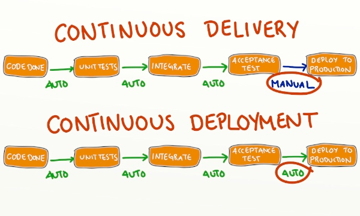

# CI/CD

As a backend or full-stack JavaScript developer you've studied a lot of things about Node.js application backend. You walked through lots of modules and topics. Hopefully, you have some understanding and hands on skills of building Node.js app using various concepts and tools.
And all the previous topics were mostly focused on development phase of any software lifecycle. At this point you may ask - "What's next?". 
And here you need to recap some previous topics testing and Docker, then review your app structure and npm scripts. All these things will come handy for automating deployment and building CI/CD pipeline.

So, what is CI/CD?

## Definitions

:::info
- **CI/CD** stands for **Continuous Integration** and **Continuous Delivery/Deployment**.
It is a set of practices and tools used by software development teams to automate the process of **building**, **testing**, and **deploying** software applications.

- **Continuous Integration (CI)** is the practice of frequently merging code changes into a shared repository and then building and testing the application automatically.
This helps to ensure that any code changes do not break the application and keeps identifying issues early in the development cycle.

- **Continuous Delivery (CD)** is the practice of automating the deployment of the application to various environments such as `development`, `staging`, and `production`.
This ensures that the application can be released to `production` at any time with minimal manual intervention.

- **Continuous Deployment (CD)** is the practice of automatically deploying the application to `production` after it has passed through the testing and approval process.
This makes the application to be always up-to-date and available to users.
:::

At a high level every CI/CD pipeline will look like:

# 
 

As you could observe CI/CD matches software development life cycle (SDLC). It also starts from planning and loops over all its stages right after successful deployment.
So, when you start you project, you should plan its CI/CD pipelines as well.

From project to project, from one platform to another CI/CD pipeline can have different stages, their order, and even complexity. But in most cases your CI/CD pipeline will include the following stages:
- **Source code** - a GitHub/GitLab/Bitbucket repository, a zip file, or even Amazon S3 bucket can be a source of your app's code
- **Code quality** or **Test** - it can include running tests (unit, functional), linting, performing static code analysis, checking dependencies, etc. All quality checks are usually performed over the source code. Within this stage you can perform a test build for apps written in TypeScript or other compiled languages. In some platforms, this stage should be performed after the Build stage. For Node.js apps we can test it without creating a final build.
- **Build** - this stages varies in depend on way you deploy the app. For container-based deployment ath this stage Docker image is build and published to container registry. For other deployment types you need to prepare (build) ready-to-execute application or even executable itself (`.exe` or `.jar` files).
- **Deploy** or **Release** - here you use the artifact from the previous step and make it running instead of the current version of your app. Obviously, deployment ways vary from project to project. Here you should know about different deployment strategies and when to apply them. In a while we will review various deployment strategies. At this stage you can also run database migrations, or you can do it within the build stage.
- **Monitoring and Validation/Verification** - this stage can be a part of your automated pipeline, or you can perform some checks manually. At this stage you can configure running some integration or end-to-end test. The main purpose of this part is to ensure, that everything works as expected after the app is deployed. Monitoring tools and techniques are employed to identify and address any issues or anomalies that may arise during the deployment.
- **Rollback and Recovery** - In the event of any critical issues or failures during the deployment, a rollback plan is established to revert to the previous stable version of the application. This plan ensures that the system can be quickly recovered and restored to a known working state.

# 
 

As you can assume, CI/CD helps to reduce risks of introducing bugs and errors into the codebase, improves code quality, and increases the speed of delivery.
It also helps to ensure that the application is always up-to-date and available to end users.

There are many CI/CD tools available in the market, including `Jenkins`, `GitLab CI`, `Travis CI`, `CircleCI`, and many others.
These tools provide a wide range of features and integrations, including automated testing, deployment, and monitoring.

## Continuous integration (CI)

We've just learnt, that CI is about automation. Continuous Integration processes/jobs are executed as soon as app's code is pushed to a destination branch (VCS).
The goal of CI is to catch errors and bugs as early as possible in the development process, reducing the time and cost of fixing issues later on.

There are several CI tools and platforms that can be used for Node.js apps, including:

  - **Jenkins**: an open-source automation server that allows developers to integrate code changes, build and test their code, and deploy their applications to production.

  - **Travis CI**: a cloud-based CI platform that supports Node.js and other programming languages. It integrates with popular code hosting services like GitHub and Bitbucket.

  - **CircleCI**: another cloud-based CI platform that supports Node.js and other languages. It provides a range of features, including parallelism, caching, and easy integration with other tools.

  - **GitLab CI/CD**: a built-in CI/CD platform that is part of the GitLab software development lifecycle (SDLC) platform. It supports Node.js and other programming languages, and provides an integrated code review process.

  - **AWS CodePipeline**: a fully managed CI/CD service provided by Amazon Web Services (AWS). It supports Node.js and other programming languages, and integrates with other AWS services like AWS CodeBuild and AWS CodeDeploy.

These tools typically work by monitoring a code repository for changes, automatically triggering a build and test process, and providing feedback on the results.
Developers can use the feedback to fix issues and improve their code, ensuring that the application is always in a state that is ready for deployment.

Every CI platform allows developers to perform necessary operations over the source code. However, there are a lot of differences between each platform, so that there are several factors to consider while choosing the right CI provider.
Here are some important aspects:

**Supported Platforms and Technologies:** Check if the CI platform supports the programming languages, frameworks, and platforms you are using for your project. It should have built-in support or be easily customizable for your specific tech stack.

**Scalability and Performance:** Consider the scalability of the CI platform. It should be able to handle your project's size and growth. Evaluate the performance of the platform, especially if you have large codebases or require fast build and test times.

**Integration with Version Control:** Verify that the CI platform integrates smoothly with your preferred version control system (e.g., Git, Bitbucket). It should support automatic triggering of builds and tests upon code commits or even pull requests.

**Build Configuration Flexibility:** Assess the flexibility and ease of defining build configurations. The CI platform should allow you to configure custom build steps, specify dependencies, manage environment variables, and easily replicate your local development environment.

**Test Execution and Reporting:** Check if the CI platform supports running various types of tests (unit, integration, end-to-end) and provides clear and detailed test reports. It should allow easy integration with popular testing frameworks and tools.

**Plugin Ecosystem and Extensibility:** Consider the availability and variety of plugins or extensions that the CI platform offers. This allows you to extend its functionality and integrate with third-party tools, such as code quality analyzers, deployment tools, or notification services.

**Security and Access Control:** Evaluate the security features provided by the CI platform. It should support access control mechanisms to manage user permissions, ensure secure communication with version control systems, and handle sensitive information like credentials and API keys.

**Community and Support:** Research the community around the CI platform and evaluate the availability of documentation, forums, tutorials, and user support. A strong community ensures better adoption, continuous improvement, and timely issue resolution.

**Cost and Licensing:** Consider the cost and licensing model of the CI platform. Some platforms offer free tiers or open-source versions, while others are commercially licensed. Evaluate if the pricing aligns with your project's budget and requirements.

**Usability and User Interface:** Lastly, assess the platform's usability and user interface. It should have an intuitive and easy-to-use interface, as well as provide clear visibility into build and test results, logs, and notifications.

By considering these factors, you can make a weighted decision and choose a CI platform that best suits your project's needs and aligns with your development workflows.

### Node.js automation tools

There are several tools available for automating development workflows in Node.js. Here are some of such tools:
  
  - **Nodemon** - automatically restarts the Node.js application whenever a file changes. 
  This is particularly useful during development, as it saves time and effort.
  Alternatively you can use `pm2` as a universal tool for running your app in development and production environments. 

  - **Make**, **Grunt**, or **Gulp** - task runners that can handle automation of common and repetitive development tasks such as linting, building, compressing files, testing your project, preparing necessary assets before app's deployment, etc.
  These tools simplify the development workflow and ensure consistency every time you run tasks.

  - **Webpack** - a module bundler that compiles multiple modules into a single file. 
  It helps to reduce the size of the application, making it faster to load and improving performance. 
  There are few alternatives to Webpack. **esbuild** may be an option for you.

  - **Jest** - a testing framework that simplifies writing and running tests. 
  It automates the testing process, making it easier to identify and fix issues.
  As you know, there are a lot of alternatives and additional packages to Jest (e.g. [supertest](https://www.npmjs.com/package/supertest) for testing API endpoints). Feel free to choose a proper option for you.

  - **ESLint** - a code analysis tool that checks for common coding errors and enforces coding standards. 
  It helps to ensure consistency and maintainability of the codebase.

  - **Husky** - a Git hook manager that enables running custom scripts at specific points in the Git workflow.
  It can be used to run pre-commit hooks, ensuring code quality and consistency. Usually you will set up the following hooks: `commit-msg` to run [commitlint](https://commitlint.js.org/#/) and validate a commit message; `pre-commit` to run linter; `pre-push` for running unit tests; other hooks based on team conventions and needs. As you can notice, with git hooks you run the same code quality tools as CI pipeline runs. It's important to run all code quality checks and fix problems at early stages. It also saves money on compute resources and time respectively. Eventually, we can state, that CI begins at your local environment.

  - **Prettier** - a code formatter that automatically formats code according to predefined rules.
  It helps to ensure consistent coding style and readability.

  - **[npm audit](https://docs.npmjs.com/cli/v9/commands/npm-audit)** - nowadays it is very important to scan your project for vulnerabilities and act in timely manner to mitigate security risks. Alternatively you can use **[Snyk](https://snyk.io/product/snyk-code/)** is you want some additional capabilities and cool features.

  - **[SonarQube](https://www.sonarsource.com/products/sonarqube/downloads/)** and other static SaaS/PaaS providers. It can work independently, but it really shines if combine with other tools like ESLint, Jest. It can consume eslint configuration as well as test coverage report generated by Jest. Then it generates code quality reports and gives a nice visualisation of it. The cool thin about SonarQube is that you can run your own custom server/instance (locally or in Cloud) from [docker image](https://hub.docker.com/_/sonarqube/).

These tools can be combined to create a robust and automated development workflow, improving the quality and efficiency of the development process. Also, such tools give developers a solid foundation for establishing CI pipelines for any app and its environments.

# 
 

## Continuous delivery (CD)

When CI is completed, it generates all necessary artifacts (code quality reports, executables, configuration files, etc.) to be used for deployment/release processes. Consequently, CI is always a part of whole Continuous Delivery/Deployment pipeline, at the same time CD is always extension of CI. 

As you already know, **Continuous Delivery (CD)** is an approach to software development in which teams produce software in short cycles, ensuring that the software can be reliably released at any time.
CD focuses on automating the software delivery process, from building and testing to deployment and release. This means that on top of automated testing, you have an automated release process, and you can deploy your application any time by clicking a button.

In the context of Node.js apps, CD tools and approaches typically include the following:

  - **Infrastructure as code (IaC)**: CD requires a reliable and repeatable infrastructure setup. IaC tools like `Terraform`, `CloudFormation`, or `Pulumi` can be used to define the infrastructure resources needed for the application deployment, such as virtual machines, databases, or load balancers.

  - **Continuous integration (CI)** that is already covered above

  - **Deployment automation**: Deployment automation tools like `AWS CodeDeploy`, `Azure DevOps`, or `Google Cloud Build` can be used to automate the deployment of the Node.js application to the target environment, such as a production server or a container orchestrator like `Kubernetes`. Using containerization technologies like `Docker` or `Kubernetes` can simplify the deployment process by creating a consistent environment for the application to run on, regardless of the underlying infrastructure.

  - **Continuous monitoring**: CD also requires continuous monitoring of the application and infrastructure to detect issues and failures. Tools like `New Relic`, `Datadog`, `DynaTrace`, or `AppDynamics` can be used to monitor the application performance, logs, and metrics.

  - **Rollback and rollback testing:** CD also requires a reliable rollback mechanism in case of deployment failures. Tools like `Canary` or `Blue/Green` deployment can be used to test the application in a production-like environment before deploying the changes to the production environment.

Overall, the goal of CD is to make software delivery faster and more reliable by automating the entire software delivery process, from code changes to production release.
In theory, with continuous delivery, you can decide to release daily, weekly, fortnightly, or whatever suits your business requirements. However, if you truly want to get the benefits of continuous delivery, you should deploy to production as early as possible to make sure that you release small batches that are easy to troubleshoot in case of a problem.

## Continuous deployment (CD)

Hopefully, we know what is CI and what is Continuous delivery (CD). Now it's time to clarify how it differs from Continuous deployment (the other CD), which is a bit more advanced concept. 

**Continuous Deployment (CD)** is the process of automatically deploying code changes to production once they have passed all the required testing and quality checks in the Continuous Integration (CI) process.
That means, that all changes are deployed to production environment without any manual intervention. No manual approval or reviews. If CI successfully runs all quality checks, your app is deployed to a destination (production) environment. From that perspective Continuous deployment goes one step further than continuous delivery.

# 
 

Continuous deployment is an excellent way to accelerate the feedback loop with your customers and take pressure off the team as there isn't a "release day" anymore. Developers can focus on building software, and they see their work go live minutes after they've finished working on it.

## What are the benefits of each practice?

You've learnt the difference between Continuous integration, Continuous delivery, and Continuous deployment. But we haven't yet looked into the reasons why you would adopt them.
There's an obvious cost to implementing each practice, but it's largely outweighed by their benefits.

  
Continuous integration

    

      <h3>What you need (cost)</h3>
      <ul>
        <li>Your will need to write automated tests for each new feature, improvement or bug fix.</li>
        <li>You need a continuous integration server or platform that can monitor the main repository and run the tests automatically for every new commits pushed.</li>
        <li>Developers need to merge their changes as often as possible, at least once a day.</li>
      </ul>
    

    

      <h3>What you gain (benefits)</h3>
      <ul>
        <li>Early detection of regressions and reduced production bugs due to automated tests catching issues.</li>
        <li>Smooth release building process as integration problems are addressed early on.</li>
        <li>Reduced context switching for developers who are promptly alerted when they break the build, enabling them to fix it before moving to other tasks.</li>
        <li>Drastically reduced testing costs as the CI server can run numerous tests within seconds.</li>
        <li>Increased focus of the QA team on enhancing the quality culture rather than spending excessive time on testing.</li>
      </ul>
    

  
Continuous delivery

    

      <h3>What you need (cost)</h3>
      <ul>
        <li>You need a strong foundation in continuous integration and your test suite needs to cover enough of your codebase.</li>
        <li>Deployments need to be automated. The trigger is still manual but once a deployment is started there shouldn't be a need for human intervention.</li>
        <li>Your team will most likely need to embrace feature flags so that incomplete features do not affect customers in production.</li>
      </ul>
    

    

      <h3>What you gain (benefits)</h3>
      <ul>
        <li>Simplified software deployments with a strong foundation in continuous integration and extensive test coverage.</li>
        <li>Frequent releases leading to accelerated feedback loop with customers.</li>
        <li>Reduced pressure for small changes, promoting faster iterations.</li>
        <li>Elimination of days spent preparing for releases, resulting in time savings for the team.</li>
      </ul>
    

  
Continuous deployment

    

      <h3>What you need (cost)</h3>
      <ul>
        <li>You need a strong foundation in continuous integration and your test suite needs to cover enough of your codebase.</li>
        <li>Deployments need to be automated. The trigger is still manual but once a deployment is started there shouldn't be a need for human intervention.</li>
        <li>Your team will most likely need to embrace feature flags so that incomplete features do not affect customers in production.</li>
      </ul>
    

    

      <h3>What you gain (benefits)</h3>
      <ul>
        <li>Faster development cycles without pausing for releases as deployments are triggered automatically for every change.</li>
        <li>Reduced risk and easier issue resolution with small batches of changes being deployed.</li>
        <li>Continuous stream of improvements for customers, leading to a steady increase in quality over time.</li>
        <li>Improved coordination with other departments (support, marketing, PR) through the use of feature flags for significant releases.</li>
        <li>Efficient documentation process to keep up with the pace of deployments.</li>
      </ul>
    

By adopting these practices, organizations  can reap the benefits of improved code quality, faster release cycles, reduced risks, and enhanced collaboration between teams, ultimately leading to better customer satisfaction and business outcomes.

## (Continuous) Deployment strategies

:::info
A deployment strategy (or release management strategy) is a predefined plan or approach for releasing and deploying software changes or updates to a target environment, such as a production server or cloud infrastructure. It outlines the steps, processes, and considerations involved in transitioning a new version of an application from a development or staging environment to the live production environment.
:::

Deployment strategies are designed to ensure smooth, reliable, and controlled releases while minimizing downtime, risks, and disruptions to end-users. They provide guidelines for managing the transition of software changes, including code updates, configuration modifications, database migrations, and other related tasks.
Usually release management strategy includes such key elements of SDLC as relase planning, env setup, building and packaging, etc. But here we are focusing on how the version of your app will replace the previous one.

Here are the most commonly used deployment strategies:

- **Blue-Green Deployment**: [Blue-green deployment](https://martinfowler.com/bliki/BlueGreenDeployment.html) is a release management strategy that involves maintaining two identical production environments, referred to as "blue" and "green." The blue environment represents the live/production environment, while the green environment is a clone where you deploy and test new changes. The deployment process involves routing production traffic to either the blue or green environment. With blue-green deployments, you can perform zero-downtime releases by switching traffic from the blue to the green environment once the new changes are tested and verified. This approach provides a quick rollback option if issues arise during deployment.

# 
 

:::note
[Here](https://nodramadevops.com/2019/04/origin-story-the-blue-green-deployment-method/) you can read about the story behind the Blue-Green deployment method.
:::

- **Canary Deployment**: Canary deployment is a technique where you release new changes to a subset (a small percentage) of users or servers while leaving the remaining users or servers on the stable version. This allows you to test the new changes in a controlled manner, gather feedback, and monitor for any issues or anomalies. If the canary users or servers experience positive results, you gradually increase the deployment to a larger audience. Canary deployments help to mitigate risks by limiting the impact of potential issues and allow for seamless rollbacks if problems arise.

# 
 

  
What does the Canary mean?

The word `Canary` references to the `Canary in the Coal Mine`. The long story short, times ago, real canaries (birds) were used as detectors in coal mines to detect some toxic gases before they hurt humans.
[Here](https://www.smithsonianmag.com/smart-news/story-real-canary-coal-mine-180961570/) you can find some details.

# 
 

- **Rolling Deployment**: Rolling deployment is a strategy where you gradually deploy new changes to your production environment in a sequential manner, typically one server or a subset of servers at a time. The process involves taking a subset of servers out of rotation, deploying the changes to those servers, and then reintroducing them back into the production pool. This approach allows for a controlled deployment process and provides the ability to monitor the impact of changes at each step. Rolling deployments minimize downtime and ensure continuous availability during the deployment process.

# 
 

# 
 

- **Serverless Deployment**: Serverless deployment refers to a cloud computing model where developers can build and deploy applications without provisioning or managing servers or backend infrastructure. In serverless architectures, applications are divided into smaller, independent functions (serverless functions) that are executed in response to specific events or triggers. Function as a service (FaaS) platforms like `AWS Lambda`, `Azure Functions`, and `Google Cloud Functions` are commonly used for serverless deployments. With serverless deployment, you don't need to provision or manage servers, and you only pay for the actual execution time of the functions. It offers auto-scaling, reduced operational overhead, and cost optimization.

# 
 

:::tip
**Serverless does not mean `no servers`**

The name notwithstanding, there are most definitely servers in serverless computing. `Serverless` describes the developer’s experience with those servers—they are invisible to the developer, who doesn't see them, manage them, or interact with them in any way.

# 
 

:::

These deployment strategies provide flexibility, scalability, and improved release management options. The choice of deployment strategy depends on factors such as the nature of your application, release requirements, infrastructure setup, and the desired level of control and risk mitigation.

## Summary

**Continuous Integration** and **Continuous Delivery/Deployment** (CI/CD) are software development practices which focus on automating and streamlining the processes of building, testing, and deploying Node.js applications. It promotes collaboration, efficiency, and faster delivery of software changes while ensuring code quality and reliability.

In CI/CD, developers integrate their code changes into a shared repository frequently, typically multiple times a day. This triggers automated build processes that compile/transpile the code, resolve dependencies, and generate deployable artifacts. Automated tests, including unit tests, integration tests, and other types of tests, are executed to validate the code changes and ensure they meet quality standards.

Once the code changes pass the automated tests, the CI/CD pipeline proceeds to deploy the application to the target environment. This can involve different deployment strategies such as `blue-green deployment`, `canary deployment`, or `rolling deployment`, depending on the project's requirements and architecture.

# 
 

Implementing CI/CD for your project provides numerous benefits:

- **Faster Time to Market**: By automating processes and minimizing manual interventions, CI/CD enables rapid iterations, allowing developers to release new features and updates more frequently. This helps businesses stay competitive and respond to customer needs more quickly.

- **Improved Code Quality**: With automated testing at each step of the CI/CD pipeline, code quality issues and regressions are detected early, preventing them from reaching production. This leads to more stable and reliable applications.

- **Reduced Risks and Rollbacks**: CI/CD practices make it easier to identify and fix issues early in the development cycle. If a problem arises during deployment, rollbacks can be performed quickly and efficiently, minimizing downtime and impact on users.

- **Streamlined Collaboration:** CI/CD encourages collaboration among team members by providing a centralized and automated workflow. Developers can work in parallel, merge code changes frequently, and address conflicts early, resulting in smoother collaboration and improved team productivity.

- **Scalability and Flexibility**: With CI/CD, scaling up applications becomes more manageable as automated processes handle build, testing, and deployment tasks. The ability to easily replicate and deploy to multiple environments allows for greater flexibility in supporting development, staging, and production environments.

- **Continuous Feedback and Monitoring**: CI/CD pipelines integrate feedback mechanisms, such as code analysis, test reports, and monitoring tools. This enables teams to gain insights into application performance, identify bottlenecks, and make data-driven decisions for further improvements.

Implementing CI/CD for Node.js involves selecting appropriate tools, configuring build pipelines, integrating version control systems, and setting up automated testing and deployment processes. Popular CI/CD tools for Node.js include Jenkins, Travis CI, CircleCI, GitLab CI/CD, AWS CodeBuild, AWS CodePipeline, Azure DevOps, etc. These tools provide automated testing, building, packaging, and deployment of the application to production.

By adopting CI/CD, development teams can achieve faster, more efficient software delivery, enhanced code quality, and improved collaboration, ultimately leading to better software products and customer satisfaction.

# 
 

