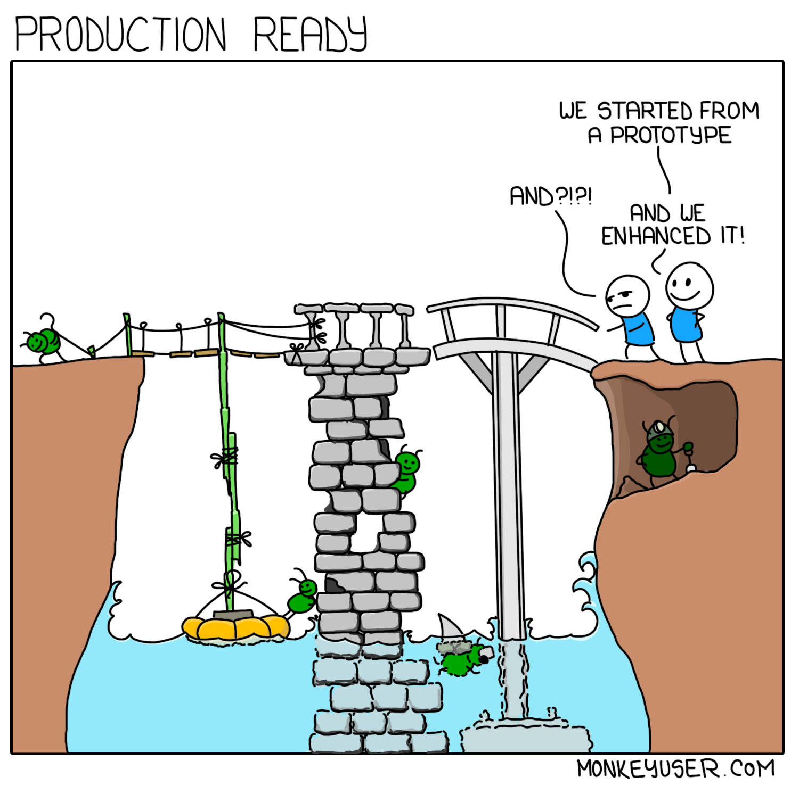
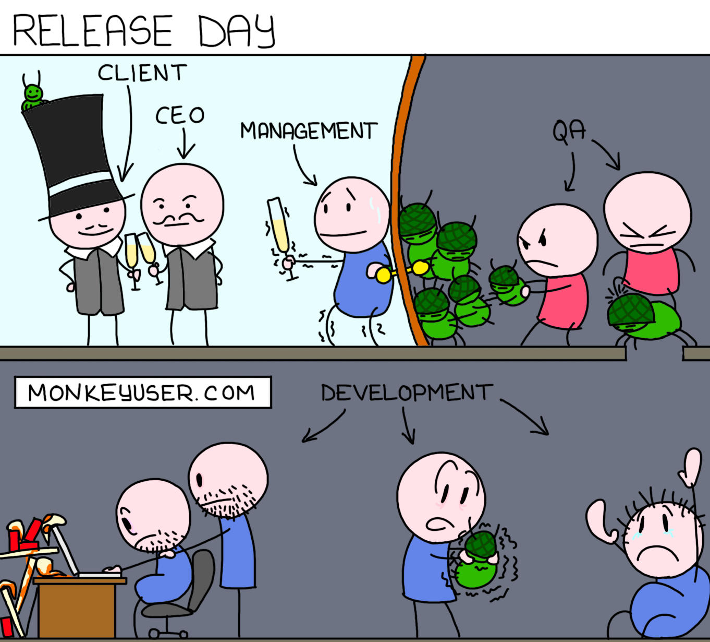

# Deployment options for Node.js

# 
 

In the context of back-end development (i.e. Node.js), deployment refers to the process of making your Node.js application available for use in a production environment.

There are several deployment types commonly used with Node.js applications:

**Self-hosted deployment**: In this type of deployment, you set up and manage your own infrastructure to host and run your Node.js application. This could involve provisioning servers, configuring networking, managing security, and handling scalability. Self-hosted deployments provide a high level of control but require more maintenance and operational expertise.

**Platform as a Service (PaaS) deployment:** PaaS platforms, such as Heroku, Google App Engine, or Microsoft Azure App Service, provide a managed environment for deploying and running Node.js applications. They abstract away infrastructure concerns, allowing developers to focus on application code. PaaS platforms handle scalability, load balancing, and other operational aspects, making deployment easier and more streamlined.

**Containerization deployment**: Containerization technologies like Docker enable packaging an application and its dependencies into a lightweight, isolated container. Containers can be deployed on various container orchestration platforms like Kubernetes or Docker Swarm. Containerization provides consistency across different environments, simplifies deployment, and enables efficient scaling and management of Node.js applications.

**Serverless deployment**: Serverless architectures, using platforms like AWS Lambda, Azure Functions, or Google Cloud Functions, allow you to deploy individual functions or code snippets that run on-demand, without the need to provision and manage servers. Serverless deployments are event-driven and scale automatically, providing cost-efficiency and minimizing operational overhead.

Implementing deployment in Node.js involves a few key steps:

**Package Management**: Use a package manager like npm or Yarn to manage dependencies and create a package.json file that lists your application's dependencies and scripts.

**Configuration**: Externalize configuration settings (e.g., database connection strings, API keys) using environment variables. Tools like dotenv can simplify managing environment-specific configurations.

**Build Process**: If needed, configure a build process to compile/transpile code, bundle assets, or perform other pre-deployment tasks. Tools like Babel or webpack are commonly used for this purpose.

**Deployment Script**: Create a deployment script or configuration file that defines how your application should be deployed. This may involve specifying the target environment, dependencies, startup commands, and other relevant settings.

**Monitoring and Logging**: Set up monitoring and logging mechanisms to track the health and performance of your deployed application. Services like New Relic, Datadog, or logging libraries such as Winston or Bunyan can be used for this purpose.

**Continuous Integration/Deployment (CI/CD)**: Implement CI/CD pipelines to automate the process of building, testing, and deploying your Node.js application. Tools like Jenkins, CircleCI, or GitLab CI/CD can be utilized to automate these workflows.

As you can see, deployment itself is referencing the Twelve factors, which were covered at the beginning of this module. Therefore, adhering to the Twelve-Factor App principles when deploying a Node.js app helps to ensure a clean, scalable, and maintainable architecture. It promotes best practices for configuration, scalability, portability, and resilience, allowing the application to seamlessly run in cloud-native environments.

Remember that the choice of deployment type depends on various factors such as scalability requirements, operational complexity, team expertise, and budget. It's important to evaluate these factors and select the deployment approach that best aligns with your project's needs and goals.

(Un)Fortunately, in scope of this course we will not guide you on how to deploy your awesome Node.js application. Moreover, there a too many deployment options available, that makes it almost impossible to cover all of them. Anyway, you can learn few deployment options in AWS on this [training](https://learn.epam.com/detailsPage?id=4f312c1a-ed85-4ef0-bd53-e373fc6c92c3). Or you can try some platform as a service (PaaS) tools like [Heroku](https://www.heroku.com/), [ElasticBeanstalk](https://aws.amazon.com/elasticbeanstalk/getting-started/) or even [AWS Copilot](https://aws.amazon.com/containers/copilot/) for container-based apps.

# 
 

