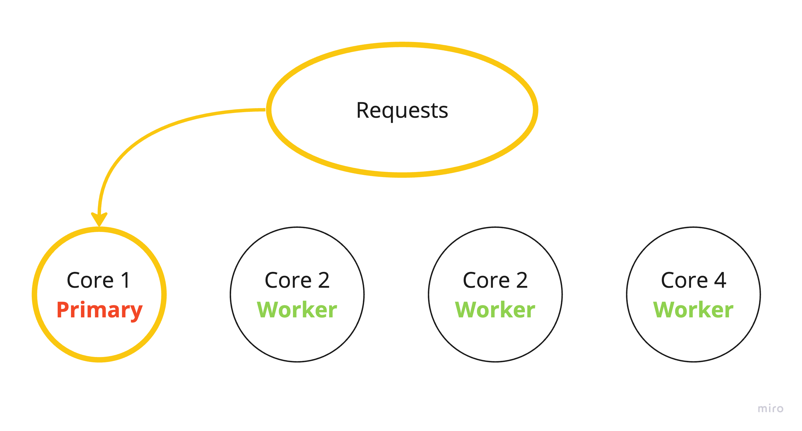
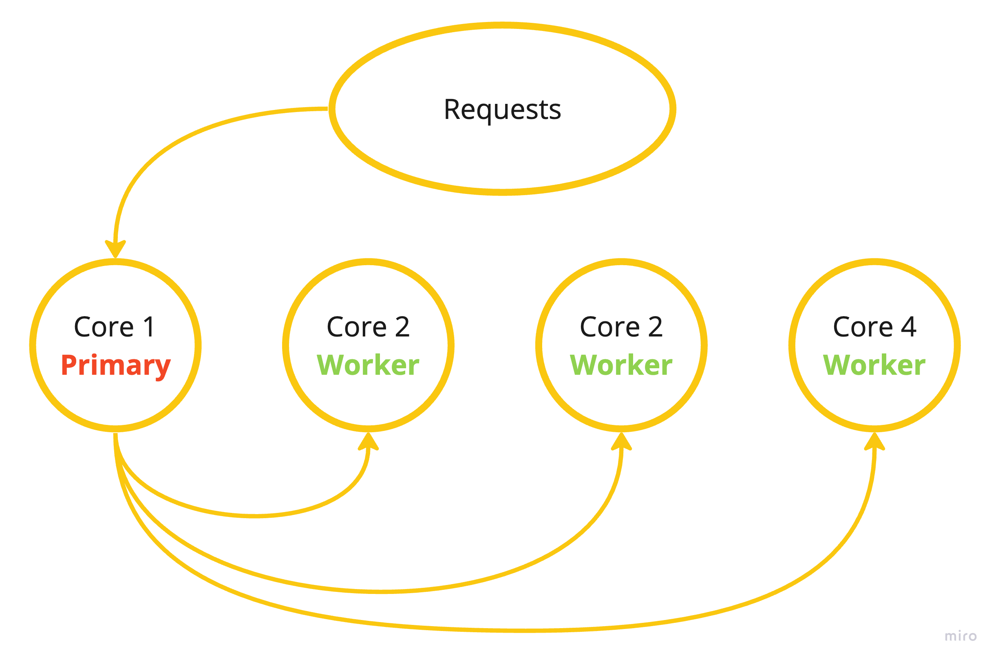

# Cluster

Node.js provides a module named [Cluster](https://nodejs.org/api/cluster.html) for dividing a single process into several sub-processes, called workers. Therefore, through a Cluster module, complex processes can be divided into smaller, simpler processes, significantly speeding up the applications in Node.

The syntax for including the cluster module in your application is the following:

```js
const cluster = require('cluster');
```

## Why use a Cluster?

By nature, Node.js is a single-threaded language. It means that when you tell Node.js to read a file from the file system, it handles each of those instructions one at time, in a linear fashion.

If your computer has an 8-core processor and 64GB of ram, any Node.js code you run on that computer will run in a single thread or core.

When you're building a web application, this can cause headaches. As your application grows in popularity (or complexity) and needs to handle more requests and additional work, if you're only relying on a single thread to handle that work, you're going to run into bottlenecks—dropped requests, unresponsive servers, or interruptions to work that was already running on the server.

Fortunately, Node.js has a workaround for this: the `cluster` module.

Without Node.js Cluster all requests are forwarded to a single processor core, as illustrated on the image below:



The `cluster` module helps us to take advantage of the full processing power of a computer (server) by spreading out the workload of our Node.js application. For example, if we have an 8-core processor, instead of our work being isolated to just one core, we can spread it out to all eight cores.



Using `cluster`, our first core becomes the `primary` and all of the additional cores become `workers`. When a request comes into our application, the primary process performs a round-robin style check asking *"which worker can handle this request right now?"*. The first worker that meets the requirements gets the request. Rinse and repeat.

## Setting up an example server

To get started and give us some context, we're going to set up a small server that responds with the number of incoming requests that the worker process handled.

### Try it out

Create an `app.js` file and copy the content below:

```js title="app.js"
const cluster = require('cluster');
const http = require('http');
const os = require('os');

const port = 6006;

const requestHandler = (request, response) => {
  response.writeHead(200);
  if (request.url === '/error') {
    throw new Error('Oh no!'); // Uncaught exception
  } else {
    response.end(`<h1 style="text-align:center;margin-top:40px;">It runs &#128640;</h1>`);
    process.send({ cmd: 'notifyRequest' }); // Notify primary about the request
  }
};

const server = http.createServer(requestHandler);

console.log(`✅ ${cluster.isPrimary ? 'I am Primary' : `I am worker, my id is ${cluster.worker.id}`}`);

// Check is cluster primary or not
if (cluster.isPrimary) {
  const cpuCount = os.cpus().length; // CPU core's amount

  for (let i = 0; i < cpuCount; i++) {
    cluster.fork(); // Forks worker for each CPU core
  }

  cluster.on('fork', (worker) => {
    console.log(`Worker #${worker.id} is online 👍`);
  });

  cluster.on('listening', (worker, address) => {
    console.log(`The worker #${worker.id} is now connected to port #${JSON.stringify(address.port)}`);
    // Worker is waiting for Primary message
    worker.on('message', messageHandler);
  });

  cluster.on('disconnect', (worker) => {
    console.log(`The worker #${worker.id} has disconnected 🥲`);
  });

  cluster.on('exit', (worker) => {
    console.log(`Worker ${worker.id} is dead 😵`);
    cluster.fork(); // Create another worker instead of dead one
  });

  let numRequests = 0; // Number of incoming requests

  function messageHandler(message) {
    if (message.cmd && message.cmd === 'notifyRequest') {
      numRequests += 1;
      console.log(`Requests received: ${numRequests}`);
    }
  }
} else {
  server.listen(port + cluster.worker.id, (error) => {
    if (error) {
      return console.log(`Server error ${error}`);
    }

    console.log(`Server running 🚀 at http://localhost:${port + cluster.worker.id}/`);
  });

  process.on('uncaughtException', (error) => {
    console.error(`${(new Date).toUTCString()} uncaught exception: ${error.message}`);
    console.error(error.stack);
    process.exit(1);
  });
}
```
Then go to the file root and run `node app.js`. Check out the output in the console:

```jsx title="node app.js" showLineNumbers
✅ I am Primary
Worker #1 is online 👍
Worker #2 is online 👍
Worker #3 is online 👍
✅ I am worker, my id is 1
✅ I am worker, my id is 2
✅ I am worker, my id is 3
Server running 🚀 at http://localhost:6007/
The worker #1 is now connected to port #6007
Server running 🚀 at http://localhost:6008/
The worker #2 is now connected to port #6008
Server running 🚀 at http://localhost:6009/
The worker #3 is now connected to port #6009
```

*I scaled the CPU amount down to 3 for convenience to show it on the screenshot.*

Then, you can go to one of the running servers, e.g [http://localhost:6007/](http://localhost:6007/), and you will see an incoming message in the console:

```jsx title="node app.js" showLineNumbers
Requests received: 1
Requests received: 2
```

We got 2 requests because the browser always makes an additional request to `favicon.ico` file.

### Explanation

Now, let's have a closer look at what is going on in the aforementioned code.

We started with the creation of a server, where `requestHandler` will handle any incoming request by returning a simple HTML page. There we also notify primary about a request, but it will be explained later.

```js
const requestHandler = (request, response) => {
  response.writeHead(200);
  if (request.url === '/error') {
    throw new Error('Oh no!'); // Uncaught exception
  } else {
    response.end(`<h1 style="text-align:center;margin-top:40px;">It runs &#128640;</h1>`);
    process.send({ cmd: 'notifyRequest' }); // Notify primary about the request
  }
};

const server = http.createServer(requestHandler);
```

If you try to add `/error` at the end of any working server URL, it will cause an error at the worker. Then a new worker will be created instead.

For example, I attended to [http://localhost:6007/error](http://localhost:6007/error), then the server `6007` was disconnected, and a brand-new server with the next free port `6011` was established.

```jsx title="node app.js" showLineNumbers
Tue, 19 Sep 2023 13:47:19 GMT uncaught exception: Oh no!
Error: Oh no!
    at Server.requestHandler (/Users/app.js:10:11)
    at Server.emit (node:events:513:28)
    at parserOnIncoming (node:_http_server:980:12)
    at HTTPParser.parserOnHeadersComplete (node:_http_common:128:17)
The worker #1 has disconnected 🥲
Worker 1 is dead 😵
Worker #4 is online 👍
✅ I am worker, my id is 4
Server running 🚀 at http://localhost:6010/
The worker #4 is now connected to port #6010
```

The next thing is to check if the running process is the primary instance of our application, or, not one of the workers that we'll create next. If it is the primary instance, we create a worker instance with `cluster.fork()`. This forks the running primary process, returning a new child or worker instance. In other words, we create a clone of our app for each CPU core on the computer.

```js
if (cluster.isPrimary) {
  const cpuCount = os.cpus().length; // CPU core's amount

  for (let i = 0; i < cpuCount; i++) {
    cluster.fork(); // Forks worker for each CPU core
  }
}
```

:::note
You can find more useful cluster methods [here](https://www.w3schools.com/nodejs/ref_cluster.asp).
:::

Further, we add handlers for worker's events:

- `fork` event works each time when a new worker is created via `fork`:

  ```js
  cluster.on('fork', (worker) => {
    console.log(`Worker #${worker.id} is online 👍`);
  });
  ```

- Event `listening` runs when the worker has connected to the server and is ready to accept requests. This is a perfect place for adding a handler for a worker. 

  Do you remember, there was mentioned this line `process.send({ cmd: 'notifyRequest' });` above? `process.send()` is a way to send a message from a worker instance back to the primary instance. Why is that important? Because worker processes are forks of the main process, we want to treat them like they're children of the primary process. If something happens inside of a worker relative to the health or status of the Cluster, it's helpful to have a way to notify the primary process. 
  
  Primary handles a message in `messageHandler` in `message` event as all workers can only send messages to primary but not other workers. In the current example, `messageHandler` counts a sum of the incoming requests and logs it.

  ```js
  cluster.on('listening', (worker, address) => {
    console.log(`The worker #${worker.id} is now connected to port #${JSON.stringify(address.port)}`);
    // Worker is waiting for Primary message
    worker.on('message', messageHandler);
  });
  ```

- Event `disconnect` occurs when the worker disconnects, e.g when the server is down.

  ```js
  cluster.on('disconnect', (worker) => {
    console.log(`The worker #${worker.id} has disconnected 🥲`);
  });
  ```

- `exit` goes right after `disconnect` when the worker is completely dead. There we setup a new `worker` via `cluster.fork()` method. It means we maintain the max number of running processes available to us based on our CPU.

  ```js
  cluster.on('exit', (worker) => {
    console.log(`Worker ${worker.id} is dead 😵`);
    cluster.fork(); // Create another worker instead of dead one
  });
  ```

`else` block includes server setup for each worker. We need to do this because we only want our worker generation to take place inside of the primary process, not any of the worker processes (otherwise we'd have an infinite loop of process creation that our computer wouldn't be thrilled about).

Finally, a handler of `uncaughtException` was added for an uncaught JavaScript exception that bubbles all the way back to the event loop. `process.exit(1)` exits the process with uncaught fatal exception. Find more about process events and exit codes [here](https://www.tutorialspoint.com/nodejs/nodejs_process.htm).

```js
process.on('uncaughtException', (error) => {
  console.error(`${(new Date).toUTCString()} uncaught exception: ${error.message}`);
  console.error(error.stack);
  process.exit(1);
});
```
