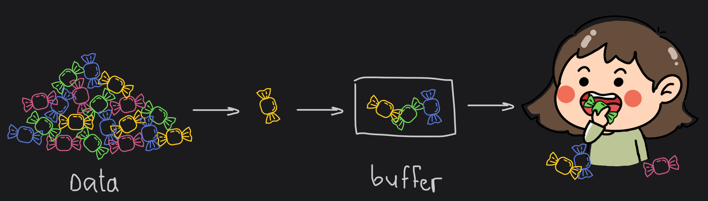

# Buffer
Before delving into the buffers, let's figure out why they are needed.

## Why buffers?

Let's imagine you have a candy mountain nearby the house, and the chore is to move it into the house. You cannot relocate such amount of candies at once. But you can bring it by little portions, and while you will be doing this, someone inside the house will be able to eat them.



The same thing about video. When you want to watch a video on YouTube, you don't need to wait until the whole video will be loaded. It will be downloaded in advance because a browser uses a buffer for that.

Before buffers were introduced, there was no easy way of dealing with [TCP](https://www.khanacademy.org/computing/computers-and-internet/xcae6f4a7ff015e7d:the-internet/xcae6f4a7ff015e7d:transporting-packets/a/transmission-control-protocol--tcp) stream and performing a read-write operation on the file system, where is required to deal with pure binary data.
You would have to resort to primitives such as strings, which are slower and have no specialized tools to handle binaries. Buffers were created to provide a proper set of APIs to manipulate bits and bytes in an easy and performant way.

## What is buffer?

[**Buffer**](https://nodejs.org/api/buffer.html#buffer) is a special type of object that can store raw binary data. 
A buffer represents a chunk of memory - typically RAM - allocated in your computer. Once set, the size of a buffer cannot be changed.

A buffer stores bytes. A byte is a sequence of eight bits. Bits are the most basic unit of storage on your computer, they can hold the value of either 0 or 1.

:::note
Node.js exposes the Buffer class in the global scope, **you don't need to import or require it like other modules**. With this API, you get a series of functions and abstractions to manipulate raw binaries.
:::

A buffer in Node.js looks like this:

```jsx
<Buffer 68 65 6C 6C 6F>
```

In this example, you can see 5 pairs of letters and numbers. Each pair represents a byte stored in the buffer. The total size of this particular buffer is 5.

You might be asking yourself: "if these are bits and bytes, where are the 0s and 1s?"

That's because Node.js displays bytes using the **hexadecimal** system. This way, every byte can be represented using just two digits - a pair of numbers and letters from 0-9 and "a" to "f".

## Working with buffer

Buffer and array have some similarities, but the difference is array can be any type, and it can be resizable. Buffers only deal with binary data, and it can not be resizable. 

Let's see some of the things we can do with buffers.

| Method                                                                                                    | Description                                           |
| --------------------------------------------------------------------------------------------------------- |-------------------------------------------------------|
| [Buffer.alloc(size)](/docs/standard-library/buffer#creating-a-buffer)                                     | It creates a buffer and allocates size to it.         |
| [Buffer.from(initialization)](/docs/standard-library/buffer#creating-a-buffer)                            | It initializes the buffer with given data.            |
| [toString()](/docs/standard-library/buffer#reading-a-buffer)                                              | It reads data from the buffer and returned it.        |
| [Buffer.write(data)](/docs/standard-library/buffer#writing-to-buffer)                                     | It writes the data to the buffer.                     |
| [Buffer.slice(start, end=buffer.length)](/docs/standard-library/buffer#slicing-and-concatenating-buffers) | It returns the subsection of data stored in a buffer. |
| [Buffer.concat([buffer,buffer])](/docs/standard-library/buffer#slicing-and-concatenating-buffers)         | It concatenates two buffers.                          |
| Buffer.isBuffer(object)                                                                                   | It checks whether the object is a buffer or not.      |
| Buffer.length                                                                                             | It returns the length of the buffer.                  |
| [Buffer.copy(buffer,subsection size)](/docs/standard-library/buffer#coping-a-buffer)                     | It copies data from one buffer to another.            |

### Creating a buffer

`Buffer.from()` accepts a string, an array, an ArrayBuffer, or another buffer instance. Depending on which params you pass, Buffer.from() will create a buffer in a slightly different way.

When passing a string, a new buffer object will be created containing that string. By default, it will parse your input using **utf-8 **as the enconding (see [here](https://nodejs.org/api/buffer.html#buffer_buffers_and_character_encodings) all enconding types supported):


```js title="app.js"
// Creates a new buffer with the string 'chihuahua', encoded with default 'utf-8'.
const buffer = Buffer.from("chihuahua");

console.log(buffer); // <Buffer 43 68 69 68 75 61 68 75 61>
```

The `Buffer.alloc()` method is useful when you want to create empty buffers, without necessarily filling them with data. By default, it accepts a number and returns a buffer of that given size filled with 0s:

```js title="app.js"
Buffer.alloc(6); // --> <Buffer 00 00 00 00 00 00>
```

You can later on fill the buffer with any data you want:

```js title="app.js"
// Creates a buffer of size 1 filled with 0s (<Buffer 00>)
const buffer = Buffer.alloc(1);

// Fill the first (and only) position with content
buffer[0] = 0x78 // 0x78 is the letter "x"
```

### Reading a buffer

Once you created a buffer, you can read it using `toString()` method:

```js title="app.js"
const buffer = Buffer.from("chihuahua");

console.log(buffer.toString()); // chihuahua
```

### Writing to buffer

The way to write data into buffers is using `Buffer.write()`. By default, it will write a string encoded in utf-8 with no offset. It returns a number, which is the number of bytes that were written in the buffer:

```js title="app.js"
const buffer = Buffer.alloc(9);

buffer.write("chihuahua"); // returns 9 (number of bytes written)
```

If you write more bytes than the buffer supports, your data will be truncated to fit the buffer:

```js title="app.js"
buffer.write("hey chihuahua"); // returns 9 (number of bytes written)

console.log(buffer.toString()); // 'hey chihu'
```

:::note
Keep in mind that not all characters occupy a single byte in the buffer
:::

E.g copyright symbol © occupies two bytes, emoji symbol occupies four bytes. Let's look at the example below:

```js title="app.js"
const buffer = Buffer.alloc(4); // The hamburger symbol occupies 4 bytes

buffer.write("🍔"); // returns 4

// If the buffer is too small to store the character, it will not write it.
const tinyBuffer = Buffer.alloc(1);

tinyBuffer.write("🍔"); // returns 0 (nothing was written)

console.log(tinyBuffer); // <Buffer 00> (empty buffer)
```

Another way to write into buffers is through an array-like syntax, where you add bytes to a specific position of the buffer:

```js title="app.js"
const buffer = Buffer.alloc(5);

buffer[0] = 0x68; // 0x68 is the letter "h"
buffer[1] = 0x65; // 0x65 is the letter "e"
buffer[2] = 0x6c; // 0x6c is the letter "l"
buffer[3] = 0x6c; // 0x6c is the letter "l"
buffer[4] = 0x6f; // 0x6f is the letter "o"

console.log(buffer.toString()); // 'hello'
```

It's important to notice that any data with more than 1 byte needs to be broken down and set on each position of the buffer:

```js title="app.js"
const buffer = Buffer.alloc(5);

// Warning: if you try setting a character with more than 2 bytes
// to a single position, it will fail:
buffer[0] = 0xf09f8d94; // 0xf09f8d94 is the symbol '🍔'   

console.log(buffer.toString()); // '�'

// But if you write each byte separately...
buffer[0] = 0xf0;
buffer[1] = 0x9f;
buffer[2] = 0x8d;
buffer[3] = 0x94;

console.log(buffer.toString()); // 🍔
```

### Iterating over a buffer

You can use modern JavaScript constructs to iterate over a buffer the same way you would with an array. For example, with `for-of`:

```js title="app.js"
const buffer = Buffer.from("🍔");

for (const byte of buffer) {
  // `.toString(16)` returns the content in hexadecimal format.
  console.log(byte.toString(16));
}

// Prints:
// --> f0
// --> 9f
// --> 8d
// --> 94
```

Other iterator helpers such as `.entries()`, `.values()` and `.keys()` are also available for buffers. For example, using `.entries()`:

```js title="app.js"
const buffer = Buffer.from("hello!");
const copyBuffer = Buffer.alloc(buffer.length); // creating an empty copyBuffer with the same length as buffer

for (const [index, byte] of buffer.entries()) {
  copyBuffer[index] = byte; // copying each buffer byte to copyBuffer
}

console.log(copyBuffer.toString()); // 'hello!'
```

### Slicing and concatenating buffers
`Buffer.slice()`I is generally the same as that of Array.prototype.slice, but with one very important difference: the slice is not a new buffer and merely references a subset of the memory space. Modifying the slice will also modify the original buffer! For example:

`Buffer.concat()` works the same as in arrays.

```js title="app.js"
// Slicing a buffer
const buffer1 = Buffer.from('Pugs are cute');
const buffer2 = buffer1.slice(0, 4);
console.log(buffer2.toString()); // Pugs
 
// Concatenating two buffers
const buffer3 = Buffer.from(' are funny');
const buffer4 = Buffer.concat([buffer2, buffer3]);
console.log(buffer4.toString()); // Pugs are funny
```

### Copying a buffer

`Buffer.copy()` allows one to copy the contents from one buffer to another. The first argument is the target buffer on which to copy the contents of buffer, and the rest of the arguments allow for copying only a subsection of the source buffer to somewhere in the middle of the target buffer. For example:

```js title="app.js"
const buffer1 = Buffer.alloc(50)
const buffer2 = Buffer.from("inside the 🍔", "utf-8")

buffer1.write("Try to put 🍟 in every meal", "utf-8");
buffer2.copy(buffer1, 16)

console.log(buffer1.toString("utf-8")) // Try to put 🍟 inside the 🍔
```
