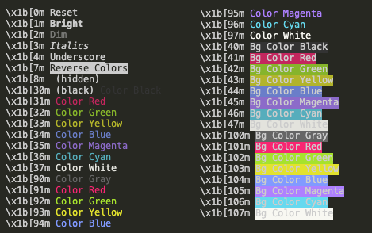

# Console

Node.js provides a console module which provides tons of very useful ways to interact with the command line.

## Basic Output

The most basic and most used method is console.log(), which prints the string you pass to it to the console. You can pass multiple variables to `console.log`, for example:

```js
const name = 'Bruce';
const surname = 'Wayne';

console.log(name, surname); // Bruce Wayne
```

And Node.js will print both.

We can also format pretty phrases by passing variables and a format specifier.

```js
console.log('My %s has %d ears', 'cat', 2); // My cat has 2 ears
```

- `%s` format a variable as a string
- `%d` format a variable as a number
- `%i` format a variable as its integer part only
- `%o` format a variable as an object

## Clear the console

`console.clear()` clears the console (the behavior might depend on the console used).

```js
console.clear();
```

## Counting elements
`console.count()` counts the number of times a string is printed, and print the count next to it:

```js
const oranges = ['orange', 'orange'];
const apples = ['just one apple'];

oranges.forEach(fruit => {
  console.count(fruit);
});

apples.forEach(fruit => {
  console.count(fruit);
});
```

The output:

```
orange: 1
orange: 2
just one apple: 1
```
## Print the stack trace

There might be cases where it's useful to print the call stack trace of a function, maybe to answer the question how did you reach that part of the code?
You can do so using `console.trace()`:

```js
const function2 = () => console.trace();
const function1 = () => function2();

function1();
```

## Using groups in the console

You can use nested groups to help organize your output by visually combining related material. To create a new nested block, call `console.group()`. The `console.groupCollapsed()` method is similar but creates the new block collapsed, requiring the use of a disclosure button to open it for reading.

To exit the current group, call `console.groupEnd()`. For example, given this code:

```js
console.log("This is the outer level");
console.group("First group");
console.log("In the first group");
console.groupEnd("Second group");
```

## Calculate the time spent

You can easily calculate how much time a function takes to run, using `time()` and `timeEnd()`. A label is passed as an argument, which is the name to give the new timer. This will identify the timer; use the same name when calling `console.timeEnd()` to stop the timer and get the time output to the console.

```js
const doSomething = () => console.log('test');

const measureDoingSomething = () => {
  console.time('doSomething()');
  // do something, and measure the time it takes
  doSomething();
  console.timeEnd('doSomething()');
};

measureDoingSomething();
```

The output:

```
test
doSomething(): 0.065673828125 ms
```

## Using table

`console.table` prints the input passed to it formatted as a table, then logs the input object after the table representation.

It can handle both arrays and objects.

```js
const authorsAndBooks = [
  ['Tolkien', 'Lord of The Rings'],
  ['Rutger', 'Utopia For Realists'], 
  ['Sinek', 'Leaders Eat Last'],
  ['Eyal', 'Habit'],
];

console.table(authorsAndBooks);
```

```js
const inventory = { apples: 200, mangoes: 50, avocados: 300, kiwis: 50 };

console.table(inventory);
```

## Print errors and warnings

All of the previous methods print their logs to a standard output stream (stdout). Alternatively, there is a standard error (stderr).


Standard error stream (stderr) is independent from standard output (stdout). `console.error` and `console.warn` are used to print to standard error.

`console.error` writes an error message to the console:

```
console.error('error');
```

`console.warn` method writes a warning to the console:
```
console.warn('warn');
```

By the way, you can switch output to the needed stream. Find more information [here](https://linuxroutes.com/what-is-linux-standard-input-output-error-and-how-to-redirect-stdout-and-stderr-to-file-in-linux/).

## Style the output

You can style the browser output of your message by using `%c` directive to apply a CSS style to console output.

```js
console.log("This is %cMy stylish message", "color: lime; font-style: italic; background-color: deeppink;padding: 2px");
```

Sadly, the same thing doesn’t work for Node.js, exactly. Since node is running in a terminal, it’s not running in a browser that understands CSS. Instead, we can change the colors of the text through some odd-looking characters: `\x1b[31m` makes the text red.

```js
console.log('\x1b[31mAnd now I\'m red!')
```

:::note
The styles are being applied to the terminal window, so anything after it, printed by your `console.log` or another library or app, will remain with that style. In order to reset it, we use `\x1b[0m`.
:::

Here’s a slightly cleaner list of what’s possible:



Alternatively, you could use some library such as [Chalk](https://www.npmjs.com/package/chalk).
