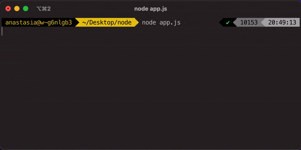

# Errors

An [Error](https://nodejs.org/api/errors.html) in Node.js is any instance of the Error object. Common examples include built-in error classes, such as:
- **ReferenceError** - when a reference made to a variable/item is broken, which means the variable/item doesn’t exist.
- **RangeError** - when a number is outside an allowable range of values.
- **TypeError** - when an operation is performed on a wrong data type
- **URIError** - indicates that one of the global URI handling functions was used in an incompatible way with its definition.
- **EvalError** - is used to identify errors when using the global eval() function.
- **SyntaxError** - when we type code that the JS engine can’t understand.

User-defined errors can also be created by extending the Error object. When creating errors in this manner, you should pass a message string that describes the error. This message can be accessed through the message property on the object. The Error object also contains a name and a stack property that indicate the name of the error.

```js
const error = new Error("I am a teapot!");

error.code = 418;

console.log(error.name); // Error
console.log(error.message); // I am a teapot!
console.log(error.stack);
/* Error: I am a teapot!
    at Object.<anonymous> (/Users/anastasia/Desktop/node/app.js:1:15)
    <truncated for brevity>
    at node:internal/main/run_main_module:17:47 */
```

If you want to add more information to the Error object, you can always add properties, just as with any other JavaScript object:

```js
const error = new Error("I am a teapot!");

error.code = 418;

console.log(error.code); // 418
```

Once you have an Error object, you can pass it to a function or return it from a function. You can also `throw` it, which causes the Error object to become an exception. Once you throw an error, it bubbles up the stack until it is caught somewhere. If you fail to catch it, it becomes an `uncaught exception`, which may cause your application to crash!

## Why Do You Need Error Handling

Error handling is a way to find bugs and solve them as quickly as humanly possible and helps execution to resume when interrupted. It centralizes all errors and lets you enable alerting and notifications so you know when and how your code breaks.

## Types of Errors

It is beneficial to distinguish between the different types of errors that can occur in a Node.js application. Generally, errors can be siloed into two main categories: programmer mistakes and operational problems.

### Operational Errors

Operational errors are mostly expected errors that can occur in the course of application execution. These errors are expected in the Node.js runtime and should be dealt with in a proper way. This does not mean the application itself has bugs. It means they need to be handled properly. Some examples of operational errors in Node.js include the following:

- failed to connect to server
- a database connection is lost
- invalid user input
- system is out of memory

### Programmer errors
Programmer errors are mistakes in the logic or syntax of the program that can only be corrected by changing the source code. These types of errors cannot be handled because, by definition, they are bugs in the program. Some examples of programmer errors include:

- syntax errors, such as failing to close a curly brace
- bad parameters when calling a function
- reference errors when you misspell a variable, function, or property name
- unresolved promise
- failing to handle an operational error


## How to deliver errors

The appropriate way to deliver errors from a JavaScript function varies depending on whether the function performs a synchronous or asynchronous operation. In this section, I'll detail four common patterns for delivering errors from a function in a Node.js application.

### Throw exception

When you throw an error it unwinds the entire function call stack ignoring any functions you have on the stack. It gets delivered synchronously, in the same context where the function was called. So in such case the error becomes an exception and needs to be caught somewhere up the stack using a `try/catch block`. For example:

```js
function square(num) {
  if (typeof num !== 'number') {
    throw new TypeError(`Expected number but got: ${typeof num}`);
  }

  return num * num;
}

try {
  square('8');
} catch (err) {
  console.log(err.message); // Expected number but got: string
}
```

If the error is allowed to bubble up the stack without being caught, it becomes an `uncaughtException`, which causes the application to exit prematurely. It can be handled with [Process](https://nodejs.org/api/process.html) module's method:

```js
process.on('uncaughtException', (reason, promise) => {
  // handle the error
});
```

### Use Callback

Callbacks are the most basic way of delivering an error asynchronously. The usual pattern is that the callback is invoked as `callback(err, result)`, where only one of `err` and `result` is non-null, depending on whether the operation succeeded or failed.

:::note
The first parameter in the callback is always the error: `callback(err, result)`.
:::

The callback function is passed as a parameter to the calling function, which you later invoke when the asynchronous function completes executing.

If you want to use this error-first callback pattern in your own async functions, all you need to do is accept a function as the last argument and call it in the manner shown below:

```js
function square(num, callback) {
  if (typeof callback !== 'function') {
    throw new TypeError(`Callback must be a function. Got: ${typeof callback}`);
  }

  // simulate async operation
  setTimeout(() => {
    if (typeof num !== 'number') {
      // if an error occurs, it is passed as the first argument to the callback
      // highlight-next-line
      callback(new TypeError(`Expected number but got: ${typeof num}`));
      return;
    }

    const result = num * num;
    // callback is invoked after the operation completes with the result
    // highlight-next-line
    callback(null, result);
  }, 100);
}
```

Any caller of this square function would need to pass a callback function to access its result or error. 

```js
square('8', (err, result) => {
  if (err) {
    console.error(err)
    return
  }

  console.log(result);
});
```

:::note
Note that a runtime exception will occur if the callback argument is not a function.
:::

### Use Promise

Promises have replaced callbacks as the new and improved way of writing asynchronous code.

This pattern has become the new norm since Node.js version 8 included async/await out of the box. Asynchronous code can be written to look like synchronous code. Catch errors can be done by using try-catch.

```js
function square(num) {
  return new Promise((resolve, reject) => {
    setTimeout(() => {
      if (typeof num !== 'number') {
        reject(new TypeError(`Expected number but got: ${typeof num}`));
      }

      const result = num * num;
      resolve(result);
    }, 100);
  });
}

square('8')
  .then((result) => console.log(result))
  .catch((err) => console.error(err));
```

If a promise was rejected, but the rejection was not caught, then `unhandledRejection` error is emitted. This error can be handled with [Process](https://nodejs.org/api/process.html) module's method:

```js
process.on('unhandledRejection', (reason, promise) => {
  // handle the error
});
```

### Use EventEmitter

In some cases, you can’t rely on promise rejection or callbacks. What if you’re reading files from a stream. Or, fetching rows from a database and reading them as they arrive. A use case I see on a daily basis is streaming log lines and handling them as they’re coming in.

In this case for dealing with long-running asynchronous operations, instead of returning a Promise, your function would return an [EventEmitter](https://nodejs.org/api/events.html#events_class_eventemitter) and `emit` row events for each result, an `end` event when all results have been reported, and an `error` event if any error is encountered. An example of this code is shown below:

```js
const { EventEmitter } = require('events');

function emitCount() {
  const emitter = new EventEmitter();

  let count = 0;
  // Async operation
  const interval = setInterval(() => {
    count++;
    if (count % 4 == 0) {
      emitter.emit(
        'error',
        new Error(`Something went wrong on count: ${count}`)
      );
      return;
    }
    emitter.emit('success', count);

    if (count === 10) {
      clearInterval(interval);
      emitter.emit('end');
    }
  }, 1000);

  return emitter;
}
```

The `emitCount()` function returns a new event emitter that reports both success and failure events in the asynchronous operation. The function increments the count variable and emits a success event every second and an error event if count is divisible by 4. When count reaches 10, an `end` event is emitted. This pattern allows the streaming of results as they arrive instead of waiting until the entire operation is completed.

Here's how you can listen and react to each of the events emitted from the `emitCount()` function:

```js
const counter = emitCount();

counter.on('success', (count) => {
  console.log(`Count is: ${count}`);
});

counter.on('error', (err) => {
  console.error(err.message);
});

counter.on('end', () => {
  console.info('Counter has ended');
});

```



As you can see from the image above, the callback function for each event listener is executed independently as soon as the event is emitted. The error event is a special case in Node.js because, if there is no listener for it, the Node.js process will crash.

## Throw, Callback, Promises, or EventEmitter: Which Pattern Is the Best?

For operational errors, you should use Promise rejections or a try-catch block with async/await. You want to handle these errors asynchronously. It works well and is widely used.

If you have a more complicated case like I explained above, you should use an event emitter instead.

You want to explicitly throw errors if unwinding the whole call stack is needed. This can mean when handling programmer errors and you want the app to restart.