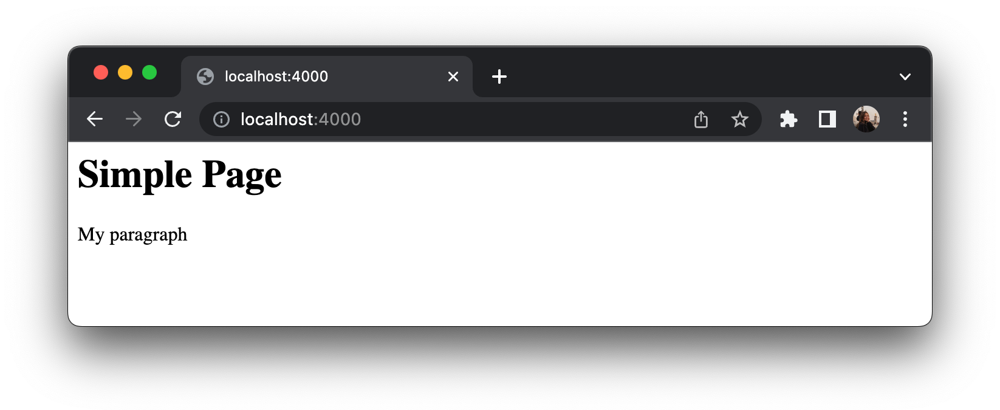

# File System

The Node.js [FS](https://nodejs.org/api/fs.html) module allows you to work with the file system on your computer. To include the File System module, use the `require()` method:

```js
const fs = require('fs');
```


Common use for the File System module:

- Read files
- Create files
- Update files
- Delete files
- Rename files

## Read Files

The `fs.readFile()` method is used to read files on your computer.

Assume we have the following HTML file (located in the same folder as `app.js`):

```html title="page.html"
<html>
<body>
<h1>Simple page</h1>
<p>My paragraph</p>
</body>
</html>
```

Create the `app.js` file that reads the HTML file, and return the content:

```js title="app.js"
const http = require('http');
const fs = require('fs');

const port = 4000;

const server = http.createServer((req, res) => {
  fs.readFile('page.html', (err, data) => {
    res.writeHead(200, {'Content-Type': 'text/html'});
    res.write(data);

    return res.end();
  });
});

server.listen(port, () => {
  console.log(`Server running 🚀 at https://localhost:${port}/`);
});
```

Then, run `node app.js`, go to [https://localhost:4000/](https://localhost:4000/), and you will able to see the screen as one below:



## Create Files

The File System module has methods for creating new files:

- `fs.appendFile()`
- `fs.writeFile()`
- `fs.open()`

### fs.appendFile()

The `fs.appendFile()` method appends specified content to a file. If the file does not exist, the file will be created:

```js title="app.js"
fs.appendFile('mushroomList.txt', 'Champignon', (err) => {
  if (err) throw err;
  console.log('Saved!');
});
```

Therefore, `mushroomList.txt` file will be created with the content `Champignon`.

### fs.writeFile()

The `fs.writeFile()` method replaces the specified file and content if it exists. If the file does not exist, a new file, containing the specified content, will be created.

```js title="app.js"
const fs = require('fs');

fs.writeFile('mushroomList.txt', 'Champignon', (err) => {
  if (err) throw err;
  console.log('Saved!');
});
```

### fs.open()

While `fs.readFile()` is only for reading the file and similarly `fs.writeFile()` is only for writing to a file (find more flag descriptions [here](https://www.geeksforgeeks.org/node-js-fs-open-method/)), whereas `fs.open()` method does several operations on a file (e.g. you can open file to read and write using `w+` flag).

The `fs.open()` method takes a "flag" as the second argument, if the flag is `w` for "writing", the specified file is opened for writing. If the file does not exist, an empty file is created:

```js title="app.js"
const fs = require('fs');

fs.open('mushroomList.txt', 'r', (err, f) => {
  console.log('Saved!');
});
```

In the example, the file is opened and the flag is set to read mode. After opening of file function is called to read the contents of file and store in memory. As there are no errors ‘saved’ is printed.

## Update Files

The File System module has methods for updating files:

- `fs.appendFile()`
- `fs.writeFile()`

### fs.appendFile()

In previous examples we have created `mushroomList.txt` file with `Champignon` content. Let's try to update file and add `, Shiitake`.
```js title="app.js"
const fs = require('fs');

fs.appendFile('mushroomList.txt', ', Shiitake', (err) => {
  if (err) throw err;
  console.log('Updated!');
});
```

After running that code the content of `mushroomList.txt` file will be changed to `Champignon, Shiitake`

### fs.writeFile()

The `fs.writeFile()` method replaces the specified file and content:

```js title="app.js"
const fs = require('fs');

fs.writeFile('mushroomList.txt', 'Enoki, Chanterelle', (err) => {
  if (err) throw err;
  console.log('Replaced!');
});
```

Afterward, the content will be `Enoki, Chanterelle`.

## Delete Files

To delete a file with the File System module, use the `fs.unlink()` method.

The code below will remove the `mushroomList.txt` file:

```js title="app.js"
const fs = require('fs');

fs.unlink('mushroomList.txt', (err) => {
  if (err) throw err;
  console.log('File deleted!');
});
```

## Rename Files

Use `fs.rename()` method for renaming a file.

Let's look at the example:

```js title="app.js"
const fs = require('fs');

fs.rename('mushroomList.txt', 'fungusList.txt', (err) => {
  if (err) throw err;
  console.log('File Renamed!');
});
```

## The *Sync function

All the functions above have synchronous blocking versions that will wait until the operation will be finished. E.g. `readFileSync()` is synchronous and blocks execution until finished.

```js
const fs = require('fs');

const data = fs.readFileSync('page.html');
```

Whereas `readFile()` is asynchronous and returns data immediately while they function in the background. When the reading finishes, the passed callback function will get called.
