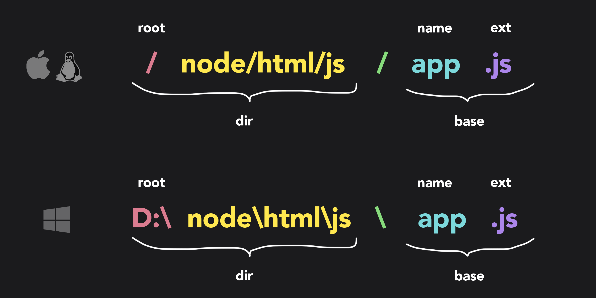

import Tabs from '@theme/Tabs';
import TabItem from '@theme/TabItem';

# Path

The [Path](https://nodejs.org/api/path.html) module provides a way of working with directories and file paths.

Use `require()` to include the module:

```js
const path = require('path');
```

The `path` module has many useful properties and methods to access and manipulate paths in the file system:

| Method                                                 | Description                                                                                           |
| ------------------------------------------------------ | ----------------------------------------------------------------------------------------------------- |
| [basename()](/docs/standard-library/path#basename)     | Returns the last part of a path                                                                       |
| delimiter                                              | Returns the delimiter specified for the platform (`;` (semicolon) for Windows, `:` (colon) for POSIX) |
| [dirname()](/docs/standard-library/path#dirname)       | Returns the directories of a path                                                                     |
| [extname()](/docs/standard-library/path#extname)       | Returns the file extension of a path                                                                  |
| [format()](/docs/standard-library/path#format)         | Formats a path object into a path string                                                              |
| [isAbsolute()](/docs/standard-library/path#isabsolute) | Returns true if a path is an absolute path, otherwise false                                           |
| [join()](/docs/standard-library/path#join)             | Joins the specified paths into one                                                                    |
| [normalize()](/docs/standard-library/path#normalize)   | Normalizes the specified path                                                                         |
| [parse()](/docs/standard-library/path#parse)           | Formats a path string into a path object                                                              |
| posix                                                  | Returns an object containing POSIX specific properties and methods                                    |
| [relative()](/docs/standard-library/path#relative)     | Returns the relative path from one specified path to another specified path                           |
| [resolve()](/docs/standard-library/path#resolve)       | Resolves the specified paths into an absolute path                                                    |
| sep                                                    | Returns the segment separator specified for the platform                                              |
| win32                                                  | Returns an object containing Windows specific properties and methods                                  |

## basename()

The `path.basename(path[, ext])` returns the last portion of a specified path. For example:

```js title="app.js"
const path = require('path');

const result = path.basename('public/page.html');
console.log(result); // page.html
```

The `ext` parameter filters out the extension from the path:

```js title="app.js"
const path = require('path');

const result = path.basename('public/page.html', '.html');
console.log(result); // page
```

## dirname()

The `path.dirname(path)` method returns the directory name of a specified path. For example:

```js title="app.js"
const path = require('path');

const result = path.dirname('public/page.html');
console.log(result); // public
```

## extname()

The `path.extname(path)` returns extension of the path. For example:

```js title="app.js"
const path = require('path');

console.log(path.extname('index.html')); // .html
console.log(path.extname('app.js')); // .js
console.log(path.extname('node.js.md')); // .md
```

## format()

The `path.format(pathObj)` method returns a path string from a specified path object.

```js title="app.js"
const path = require('path');

const pathToFile = path.format({
  dir: 'src/helpers',
  base: 'index.js'
});

console.log(pathToFile); // src/helpers/index.js (on macOs/linux)
```

## isAbsolute()

The `path.isAbsolute(path)` returns true if a specified path is an absolute path.

<Tabs
    defaultValue="mac"
    values={[
        {label: 'macOs/linux', value: 'mac'},
        {label: 'windows', value: 'win'},
    ]}>
<TabItem value="mac">

```js title="app.js"
let result = path.isAbsolute('/node/js/');
console.log(result); // true

result = path.isAbsolute('/node/..');
console.log(result); // true

result = path.isAbsolute('node/');
console.log(result); // false

result = path.isAbsolute('.');
console.log(result); // false
```

</TabItem>
<TabItem value="win">

```js title="app.js"
let result = path.isAbsolute('C:\\node.js\\');
console.log(result); // true

result = path.isAbsolute('C:/node.js/');
console.log(result); // true

result = path.isAbsolute('/node.js');
console.log(result); // true

result = path.isAbsolute('home/');
console.log(result); // false

result = path.isAbsolute('.');
console.log(result); // false
```

</TabItem>
</Tabs>

## join()

The `path.join(path)` method does two things:

- Join a sequence of path segments using the platform-specific separator as a [delimiter](https://www.w3schools.com/nodejs/met_path_delimeter.asp)
- Normalize the resulting path and return it.

For example:

```js title="app.js"
const path = require('path');

const pathToDir = path.join('/home', 'js', 'dist', 'app.js');
console.log(pathToDir); // /home/js/dist/app.js (on macOs/linux)
```

## parse()

The `path.parse(…paths)` method returns an object whose properties represent the path elements. The returned object has the following properties:

- **root**: the root
- **dir**: the directory path from the root
- **base**: the file name + extension
- **name**: the file name
- **ext**: the extension



<Tabs
    defaultValue="mac"
    values={[
        {label: 'macOs/linux', value: 'mac'},
        {label: 'windows', value: 'win'},
    ]}>
<TabItem value="mac">

```js title="app.js"
const path = require('path');

const pathObj = path.parse('/nodejs/html/js/app.js');
console.log(pathObj);
```

</TabItem>
<TabItem value="win">

```js title="app.js"
const path = require('path');

const pathObj = path.parse('d:/nodejs/html/js/app.js');
console.log(pathObj);
```

</TabItem>
</Tabs>

The output:

<Tabs
    defaultValue="mac"
    values={[
        {label: 'macOs/linux', value: 'mac'},
        {label: 'windows', value: 'win'},
    ]}>
<TabItem value="mac">

```js
{
    root: '/',
    dir: '/nodejs/html/js',
    base: 'app.js',
    ext: '.js',
    name: 'app'
}
```

</TabItem>
<TabItem value="win">

```js
{
    root: 'd:/',
    dir: 'd:/nodejs/html/js/',
    base: 'app.js',
    ext: '.js',
    name: 'app'
}
```

</TabItem>
</Tabs>


## normalize()

The `path.normalize(path)` method normalizes a specified path. It also resolves the `..` and `.` segments.

<Tabs
    defaultValue="mac"
    values={[
        {label: 'macOs/linux', value: 'mac'},
        {label: 'windows', value: 'win'},
    ]}>
<TabItem value="mac">

```js title="app.js"
const path = require('path');

const pathToDir = path.normalize('/nodejs/html//js/app.js');
console.log(pathToDir); // /nodejs/html/js/app.js
```

</TabItem>
<TabItem value="win">

```js title="app.js"
const path = require('path');

const pathToDir = path.normalize('C:\\node.js/module/js//dist');
console.log(pathToDir); // C:\node.js\module\js\dist
```

</TabItem>
</Tabs>

## relative()

The `path.relative(from, to)` accepts two arguments and returns the relative path between them based on the current working directory.

```js title="app.js"
const path = require('path');

const relativePath = path.relative('/home/user/config/','/home/user/js/')
console.log(relativePath); // js (on macOs/linux)
```

## resolve()

The `path.resolve(…paths)` method accepts a sequence of paths or path segments and resolves it into an absolute path. The path.resolve() method prepends each subsequent path from right to left until it completes constructing an absolute path.

If you don’t pass any argument into the `path.resolve()` method, it will return the current working directory.

```js title="app.js"
const path = require('path');

console.log("Current working directory:", __dirname);
console.log(path.resolve()); // /Users/john/Desktop/node
```

In this example above, the `path.resolve()` method returns a path that is the same as the current working directory.

Let's see other examples (macOS/linux):

```js title="app.js"
const path = require('path');

// Resolve 2 segments with the current directory 
path1 = path.resolve("html", "index.html");
console.log(path1) // /Users/john/Desktop/node/html/index.html

// Resolve 3 segments with the current directory 
path2 = path.resolve("html", "js", "app.js");
console.log(path2) // /Users/john/Desktop/node/html/js/app.js

// Treat of the first segment as root and ignore 
// the current working directory 
path3 = path.resolve("/home/html", "about.html");
console.log(path3); // /home/html/about.html
```
