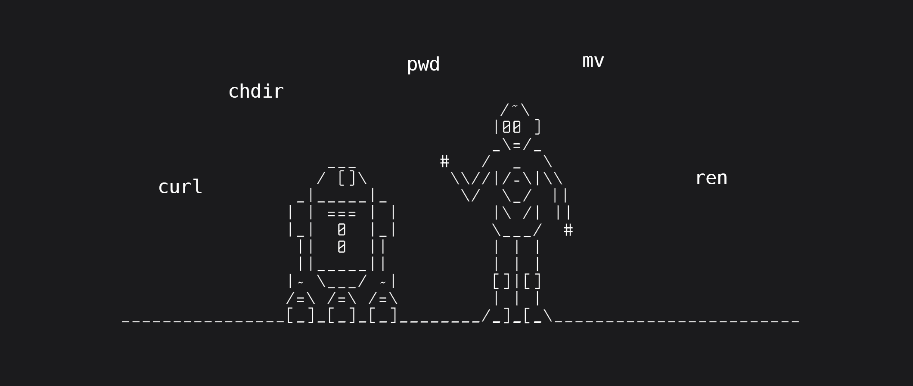

import Tabs from '@theme/Tabs';
import TabItem from '@theme/TabItem';

# Child Process

The [child_process](https://nodejs.org/api/child_process.html) module enables us to access Operating System functionalities by running any system command inside a child process. 
Hence, everything you can launch in `shell` you can run in a child process.



There are 4 means of creating a child process:

- [exec()](/docs/standard-library/child_process#exec)
- [execFile()](/docs/standard-library/child_process#execfile)
- [spawn()](/docs/standard-library/child_process#spawn)
- [fork()](/docs/standard-library/child_process#fork)

Let's see the differences between these four functions and when to use each.

## exec()

This method will spawn a subshell and execute the command in that shell and buffer generated data. It is useful when you want to invoke a command, and you only care about the final result, not about accessing the data from a child’s `stdio` streams as they come.

Let's consider an example of getting the current node.js version:

```js
const childProcess = require('child_process');

const execProcess = (command) => {
  childProcess.exec(command, (error, stdout, stderr) => {
    console.log(`stdout: ${stdout}`);
    console.log(`stderr: ${stderr}`);

    if (error !== null) {
      console.log(`error: ${error}`);
    }
  });
}

execProcess('node -v');
```

The output is the following:

```
stdout: v16.14.0

stderr:
```

The method `exec()` accepts the following arguments:
- `command`, that will be run, with space-separated arguments
- `options` (optional)
- `callback` (optional), which is called with the output when the process terminates.
  - `error` - error in JavaScript
  - `stdout` - the standard output stream, which is a source of output from the program
  - `stderr` - the standard error stream, which is used for error messages and diagnostics issued by the program

## execFile()

If you need to execute a file without using a shell, the `execFile()` function is what you need. It behaves exactly like the `exec()` function but does not use a shell, which makes it a bit more efficient.

In the example below, the main difference with `exec` is in the passed arguments:
- `command` - the name or path of the executable file to run
- `args` - list of string arguments
- `options`
- `callback`

```js
const childProcess = require('child_process');

const execFile = (command, args) => {
  childProcess.execFile(command, args, (error, stdout, stderr) => {

    console.log(`stdout: ${stdout}`);
    console.log(`stderr: ${stderr}`);

    if (error !== null) {
      console.log(`error: ${error}`);
    }
  });
}

execFile('node', ['-v']);
```

The output is below:

```
stdout: v16.14.0

stderr:
```

## spawn()

The `spawn()` method returns data via the stream API. Therefore, to get the output of the child process, we need to listen for stream events. This method is generally used when the process returns large amount of data.

Let's look at the example:

```js
const childProcess = require('child_process');

const spawnProcess = (command, args) => {
  const process = childProcess.spawn(command, args);
  let fullData = '';
  let dataChunks = 0;

  process.stderr.on('data', (data) => {
    console.log(`stderr: ${data}`);
  });

  process.stdout.on('data', (data) => {
    fullData += data;
    dataChunks += 1;
    console.log(`stdout: ${data}`);
  });

  // end of data stream, there we can output the data
  process.stdout.on('end', () => {
    console.log(`end: ${fullData}`);
    console.log(`chunks: ${dataChunks}`);
  });

  // event when process is finished
  // there we can get to know with what code it was ended (0 - success, 1 - error)
  process.on('close', (code) => {
    console.log(`child process exited with code ${code}`);
  });
}

spawnProcess('node', ['-v']);
```

The output:

```
stdout: v16.14.0

end: v16.14.0

chunks: 1
child process exited with code 0
```

The other events that we can register handlers for with the `ChildProcess` instances are:

- `disconnect` event is emitted when the parent process manually calls the `child.disconnect` function.
- `error` event is emitted if the process could not be spawned or killed.
- `close` event is emitted when the stdio streams of a child process get closed.
- `message` event is the most important one. It’s emitted when the child process uses the process.send() function to send messages. This is how parent/child processes can communicate with each other. We’ll see an example of this below.

Basically, the example explains how to use it, but it doesn't expose its potential. Imagine we need to get html response from the long Wikipedia page [List of 2022 albums](https://en.wikipedia.org/wiki/List_of_2022_albums). Let's try to use `execProcess()` for it from the example with `exec` that was mentioned above.

```js
execProcess('curl https://en.wikipedia.org/wiki/List_of_2022_albums');
```

With `exec` the child process will try to output the whole page, but eventually, it will be halted with an error:

```js
error: RangeError [ERR_CHILD_PROCESS_STDIO_MAXBUFFER]: stdout maxBuffer length exceeded
```

To the point, `execFile` will not nail this case either.

So, what can we do in a such case? Of course, we could raise `maxBuffer` value in `options`, but it is not the best solution, and we will not be able to avoid the app freezing.

But if we try to use `spawn` method for it, then we get the whole page. Try to run:

```js
spawnProcess('curl', ['https://en.wikipedia.org/wiki/List_of_2022_albums']);
```

The output:

```
< html code from that page >
chunks: 177
child process exited with code 0
```

I counted chunks in that example to emphasize how big the data was.

## fork()

The `fork()` method is a special case of `spawn()` where the parent and the child process can communicate with each other via `send()` (but child processes cannot communicate with each other).

Let's try it out. Create 2 files in the same root named `app.js` and `child.js` and insert the according code below:

<Tabs
  defaultValue="app"
  values={[
      {label: 'app.js', value: 'app'},
      {label: 'child.js', value: 'child'},
  ]}>
<TabItem value="app">

```js
const { fork } = require('child_process');

const child = fork('./child.js');

child.on('message', (message) => {
  console.log('Parent process received:', message);
});

child.send({ hello: 'from parent process' });

child.on('close', (code) => {
  console.log(`child process exited with code ${code}`);
});
```

</TabItem>
<TabItem value="child">

```js
process.on('message', (message) => {
  console.log('Child process received:', message);
});

process.send({ hello: 'from child process' });
```

</TabItem>
</Tabs>

The output:

```
Child process received: { hello: 'from parent process' }
Parent process received: { hello: 'from child process' }
```

The first argument passed to the `fork` is a path to a Node module to execute. Like `spawn` the `fork` returns a `ChildProcess` object, the major difference is [IPC channel](https://en.wikipedia.org/wiki/Inter-process_communication):

- the child process has a `child.send(message)` function
- the script being invoked by `fork` can listen for process `on('message')` events.

## The *Sync function

The functions `spawn`, `exec`, and `execFile` from the `child_process` module also have synchronous blocking versions that will wait until the child process exits.

```js
const { 
  spawnSync, 
  execSync, 
  execFileSync,
} = require('child_process');
```

:::note
Those synchronous versions are potentially useful when trying to simplify scripting tasks or any startup processing tasks, but they should be avoided otherwise.
:::

## Nuance for Windows

On Windows, some files cannot be executed on their own, like `.bat` or `.cmd` files. Those files cannot be executed with `execFile` and either `exec` or `spawn` with shell set to true is required to execute them.

```js
const { spawn } = require('child_process');

// highlight-next-line
const child = spawn('dir', ['D:\Test'], { shell: true });

child.stdout.on('data', (data) => {
  console.log(`stdout: ${data}`);
});
  
child.stderr.on('data', (data) => {
  console.error(`stderr: ${data}`);
});
  
child.on('close', (code) => {
  console.log(`child process exited with code ${code}`);
});
```

## How to decide which method to use?

| Method        | Using case   |
| ------------- | ------------ |
| `exec()`      | Method should be used when we need to utilize shell functionality such as pipe, redirects, backgrounding, and so on. |
| `execFile()`  | Method is used when we just need to execute an application and get the output. For example, we can use `execFile` to run an image-processing application like [ImageMagick](https://imagemagick.org/index.php) to convert an image from PNG to JPG format and we only care if it succeeds or not. `execFile` should not be used when the external application produces a large amount of data and we need to consume that data in real-time manner. |
| `spawn()`     | As spawn returns a stream-based object, it’s great for handling applications that produce large amounts of data or for working with data as it reads in. As it’s stream-based, all stream benefits apply as well: <br/> 👉 Low memory footprint <br/> 👉 Automatically handle back-pressure <br/> 👉 Lazily produce or consume data in buffered chunks <br/> 👉 Evented and non-blocking <br/> 👉 Buffers allow you to work around the V8 heap memory limit |
| `fork()`      | Since Node's main process is single-threaded, long-running tasks like computation will tie up the main process. As a result, incoming requests can’t be serviced and the application becomes unresponsive. Off-loading long-running tasks from the main process by forking a new Node process allows the application to serve incoming requests and stay responsive. |
