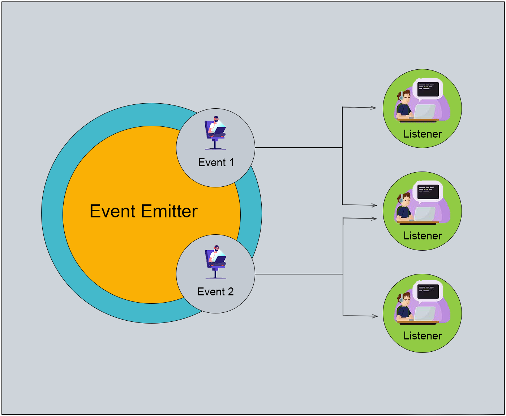
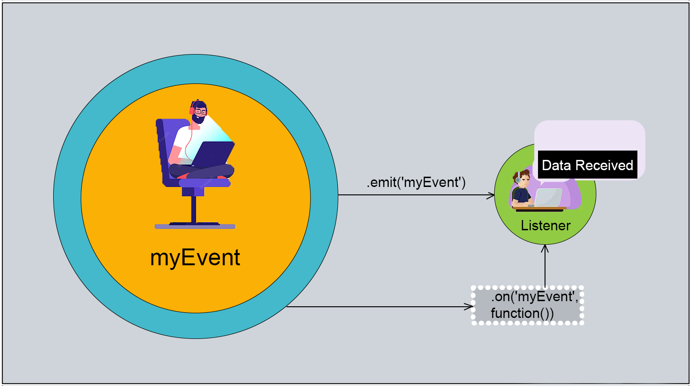
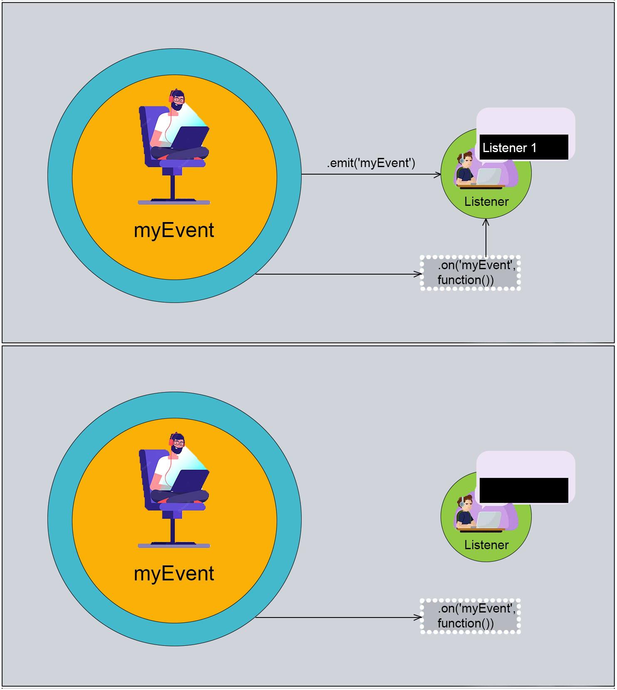
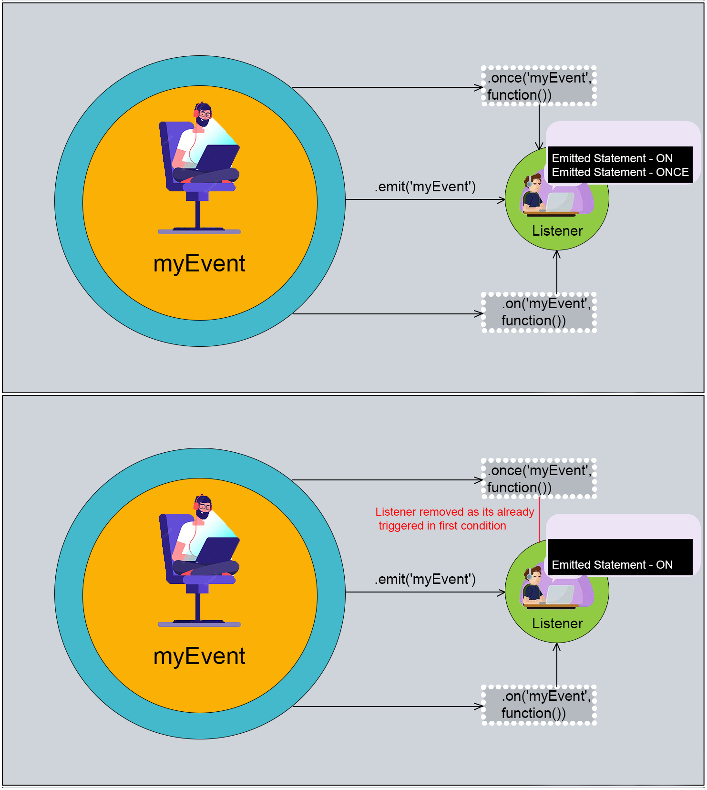

# Event Emitters

## What is event emitter?

The core of NodeJS is event-driven programming. In NodeJS, we achieve event-driven programming with the [event-emitter class](https://nodejs.org/api/events.html#class-eventemitter). Event-driven programming is a great approach for building complex systems. It embodies the divide-and-conquer principle while allowing you to continue using other approaches like synchronous calls. Event-driven programming is a paradigm where entities (objects, services, and so on) communicate indirectly by sending messages to one another through an intermediary. The messages are typically stored in a queue before being handled by the consumers. Unlike in using direct calls, event-driven programming completely decouples the producer from the consumer, leading to some noteworthy benefits. For example, multiple producers and multiple consumers can all collaborate to process incoming requests. Retrying failed operations and maintaining an event history are also simplified. Event-driven programming also makes it easier to scale large systems, adding capacity simply by adding consumers.

EventEmitter is a class that helps us create a publisher-subscriber pattern in NodeJS. With an event emitter, we can simply raise a new event from a different part of an application, and a listener will listen to the raised event and have some action performed for the event.



EventEmitter is an object provided by the events module. It binds a function with an event. This bound function is then used to handle the event and perform actions accordingly. We can emit events in any part of the application and have a function setup that listens to it.

## Creating an Event Emitter

To create an event emitter, we need to create an instance of the event emitter instance from the `events` module in NodeJS.

```js
import { EventEmitter } from 'events';
const eventEmitter = new EventEmitter();
```

This will create an EventEmitter instance.

## Publishing Events and Listening to Them

The `EventEmitter` class comes with a lot of member functions. We’ll be using these member functions to publish events and listen to them.

Below are the member functions in the `EventEmitter` class.

```js
class EventEmitter extends internal {
    /** @deprecated since v4.0.0 **/
    static listenerCount(emitter: EventEmitter, event: string | symbol): number;
    static defaultMaxListeners: number;
    
    addListener(event: string | symbol, listener: (...arg: any[]) => void): this;
    on(event: string | symbol, listener: (...arg: any[]) => void): this;
    once(event: string | symbol, listener: (...arg: any[]) => void): this;
    prependListener(event: string | symbol, listener: (...arg: any[]) => void): this;
    prependOnceListener(event: string | symbol, listener: (...arg: any[]) => void): this;
    off(event: string | symbol, listener: (...arg: any[]) => void): this;
    removeAllListeners(event?: string | symbol): this;
    setMaxListeners(n: number): this;
    getMaxListeners(): number;
    listeners(event: string | symbol): Function[];
    rawListeners(event: string | symbol): Function[];
    emit(event: string | symbol, ...arg: any[]): boolean;
    eventNames(): Array<string | symbol>;
    listenerCount(type: string | symbol): number;
}
```

## .on() and .emit() of the EventEmitter

For now, we’ll only pay attention to these two member functions:`on(eventName, …)` and `emit(eventName, …)`

To publish an event, we use the `emit()` function, and to listen to an event, we use the `on()` function.

In `EventEmitters`, we publish and listen to the events by name.

In the last code snippet, where we created an EventEmitter object, we use the following code to raise events and listen to them.

```js
import { EventEmitter } from 'events';
const eventEmitter = new EventEmitter();

// listen to the event
eventEmitter.on('myEvent', () => {
    console.log('Data Received');
});

// publish an event
eventEmitter.emit('myEvent');
```

Running the above code snippet prints the following output in the console:

```
Data Received
```



In the above code snippet, we raised an event with the name myEvent on the last line, and we had a listener registered to the event just above the line of the publishing event.

At the time of publishing the event, there must be an `EventEmitter` listener existing to listen to the published event.

For example, if we change the above code snippet to …

```js
import { EventEmitter } from 'events';
const eventEmitter = new EventEmitter();

eventEmitter.on('myEvent', () => {
    console.log('Listener 1');
});

eventEmitter.emit('myEvent');

eventEmitter.on("myEvent", () => {
    console.log("Listener 2");
});
```

… the output will be:

```
Listener 1
```



We get only `Listener 1` as output in the console, as the `Listener 2` was registered after emitting the event.

## EventEmitter Instance Should Be Singleton for a Single Event Name

In other words, the `on()` and the `emit()` functions must be called on the same `EventEmitter` instance.

The listeners won’t work if registered on a separate `EventEmitter` instance.

```js
import { EventEmitter } from 'events';

const eventEmitter1 = new EventEmitter();
eventEmitter1.on('myEvent', () => {
    console.log('Listener');
});

const eventEmitter2 = new EventEmitter();
eventEmitter2.emit('myEvent');
```

This won’t print anything in the console, as there were two separate instances used in this code: one instance for registering the publisher and the other instance for listening to the event.

## Maintaining a Single Event-Emitter Instance Applicationwide

A node application is generally 100s of files. This gets challenging to maintain by a single copy of the `EventEmitter` instance throughout the application.

There is a simple strategy to create and maintain a singleton copy for an `EventEmitter` instance.

When creating the `EventEmitter` instance, we can simply store it as an application-level setting using `app.set(<key>, <value>`).

```js
import { EventEmitter } from "events";
import express from 'express';

const eventEmitter = new EventEmitter();

const app = express();
app.set('eventEmitter', eventEmitter);

// access it from any module of the application
console.log(app.get('eventEmitter'));
```

## Is an Event Emitter Synchronous or Asynchronous?

Consider the following code snippet:

```js
import { EventEmitter } from 'events';
const eventEmitter = new EventEmitter();

eventEmitter.on('myEvent', (data) => {
    console.log(data);
});

console.log('Statement A');
eventEmitter.emit('myEvent', 'Statement B');
console.log("Statement C");
```

When we execute this code snippet, we get the following output in the console:

```
Statement A
Statement B
Statement C
```

The events raised by event emitters are synchronously executed by the listeners in the current event loop’s iteration.

## Order of Execution of the Listeners

The listeners are executed in the order the listeners are created for an event emitter.

Consider the following code snippet to understand this statement:

```js
import { EventEmitter } from 'events';
const eventEmitter = new EventEmitter();

eventEmitter.on('myEvent', (data) => {
    console.log(data, '- FIRST');
});

console.log('Statement A');

eventEmitter.on("myEvent", data => {
    console.log(data, '- SECOND');
});

eventEmitter.emit('myEvent', 'Emitted Statement');

console.log("Statement B");
```

When executed, the above code gives the output:

```
Statement A
Emitted Statement - FIRST
Emitted Statement - SECOND
Statement B 
```

The listener that’s registered earlier is executed earlier.

## How and Where NodeJS Internally uses Event Emitters

NodeJs internally uses event emitters widely across its environment. The first example we can think of is streams.

Streams extend event emitters. Streams are built on top of event emitters that raise predefined events like `open`, `end`, `data`, etc.

The following code snippet is a simple example of a stream — explaining the resemblance with event emitters.

```js
import { createReadStream } from "fs";

let chunkIndex = 0;
const readStream = createReadStream("./data.txt");

readStream.on("open", () => {
    console.log("Started Reading...");
});

readStream.on("end", () => {
    console.log("Completed Reading...");
});

readStream.on("data", chunk => {
    console.log("Chunk: " + ++chunkIndex);
    console.log("|-----------------------------------------|");
    console.log(chunk);
    console.log("\n");
});
```

When executed, the code will give the following output:
```
Started Reading... 

Chunk: 1
|-----------------------------------------|
<Buffer 4c 6f 72 65 6d 20 69 70 73 75 6d 20 64 6f 6c 6f 72 20 73 69 74
20 61 6d 65 74 2c 20 63 6f 6e 73 65 63 74 65 74 75 72 20 61 64 69 70
69 73 63 69 6e 67 ... >

Chunk: 2
|-----------------------------------------|
<Buffer 74 20 6e 75 6e 63 20 76 69 74 61 65 20 66 65 72 6d 65 6e 74 75
6d 2e 20 49 6e 20 75 74 20 672 63 75 20 74 65 6d 70 6f 72 2c 20 66
61 75 63 69 62 75 ... >

Chunk: 3
|-----------------------------------------|
<Buffer 20 76 69 74 61 65 2c 20 65 67 65 73 74 61 73 20 69 64 20 73 65
6d 2e 20 44 6f 6e 65 63 20 75 74 20 75 6c 74 72 69 63 69 65 73 20 6c
6f 72 65 6d 2c 20 ... >

Completed Reading...
```
`data.txt` is a large text file containing some random lorem-ipsum text

Notice here the listeners are called internally by NodeJS. We don’t need to call the listeners explicitly as NodeJS internally extends event emitters, exposes custom predefined events (`data`, `open`, `end`), and raises these events automatically when required for the streams.

In the data listener, the buffer gets printed instead of the string since NodeJS, instead of reading the text content of the file, actually reads the file as a buffer.

Another example of NodeJS using event emitters is the global process variable.

The `process` object exposes some variables we can listen to and respond to accordingly. These events are:

```
process.on(‘exit’)
process.on(‘uncaughtException’)
```

The following is an example showing their usage:

```js
process.on("exit", () => console.log("Exit"));
process.on("beforeExit", () => console.log("Before Exit"));
process.on('uncaughtException', () => {
    console.log('Exception');
    process.exit();
});
throw new Error('Test Error');
```

Running the above code will print the following output in the console:

```
Exception
Exit
```

## Some Useful Member Functions of the EventEmitter Class

In the EventEmitter class, we have only looked at the .on() and the .emit() function. But there are other member functions available in the EventEmitter class.

We’ll cover some of the useful member functions among them.

### once()

With `once()`, the listener will be discarded after listening for an event. Events listened with `once()` will be triggered only once.

```js
import { EventEmitter } from "events";
const eventEmitter = new EventEmitter();

eventEmitter.on("myEvent", data => {
    console.log(data, "- ON");
});

eventEmitter.once("myEvent", data => {
    console.log(data, "- ONCE");
});

eventEmitter.emit("myEvent", "Emitted Statement");
eventEmitter.emit("myEvent", "Emitted Statement");
eventEmitter.emit("myEvent", "Emitted Statement");
```

Running the above code will give the output:

```
Emitted Statement - ON
Emitted Statement - ONCE
Emitted Statement - ON
Emitted Statement - ON
```



Notice here the once listener was only called once. After getting called for the first time, it’ll be discarded for further use.

### prependListener()

By default, event listeners are invoked in the order they are added. The `prependListener()` method can be used as an alternative to adding the event listener to the beginning of the listener array.

```js
import { EventEmitter } from "events";
const eventEmitter = new EventEmitter();

eventEmitter.on("myEvent", (arg) => console.log(arg, "- ON"));
eventEmitter.prependListener("myEvent", (arg) => console.log(arg, "- PREPENDLISTENER"));

eventEmitter.emit("myEvent", "Emitted Statement");
console.log(eventEmitter.eventNames());
```

Running the following code will give the output:

```
Emitted Statement - PREPENDLISTENER
Emitted Statement - ON
[ 'myEvent' ]
```

### eventNames()

Get all the active event names.

```js
import { EventEmitter } from "events";
const eventEmitter = new EventEmitter();

eventEmitter.on("myEvent", data => console.log(data, "- ON"));
eventEmitter.on("myEvent2", data => console.log(data, "- ON"));
eventEmitter.once("myEvent3", data => console.log(data, "- ONCE"));

console.log(eventEmitter.eventNames());
eventEmitter.emit("myEvent3", 'EVENT');
console.log(eventEmitter.eventNames());
```

Running the following code will give the output:

```
[ 'myEvent', 'myEvent2', 'myEvent3' ]
EVENT - ONCE
[ 'myEvent', 'myEvent2' ]
```

Notice after the once event gets triggered, calling eventNames() doesn’t give its event name.

### addListener()

It’s exactly the same as `on()`. It’s just an alias for `event.on()`.

### removeListener()

This is used to remove a listener.

```js
import { EventEmitter } from "events";
const eventEmitter = new EventEmitter();

function func1(): void {
    console.log("EVENT TRIGGERED");
}

eventEmitter.on("myEvent", func1);
eventEmitter.on("myEvent2", func1);

console.log(eventEmitter.eventNames());
eventEmitter.removeListener("myEvent", func1);
console.log(eventEmitter.eventNames());
```

Running the above code will give the output as:

```
[ 'myEvent', 'myEvent2' ]
[ 'myEvent2' ]
```

To remove a listener, we need to pass the same function reference in the second parameter that was used to create a listener.

### removeAllListeners()

This is used to remove all active event listeners from an EventEmitter instance.

```js
import { EventEmitter } from "events";
const eventEmitter = new EventEmitter();

function func1(): void {
    console.log("EVENT TRIGGERED");
}

eventEmitter.on("myEvent", func1);
eventEmitter.on("myEvent2",func1);

eventEmitter.removeAllListeners();
console.log(eventEmitter.eventNames());
```

Running the following code will give the output as an empty array:

```
[]
```

## Conclusion

Event-driven architecture allows us to create systems which are decoupled but highly cohesive. Events represent the result of a certain action, and `1..n` listeners can be defined to listen and react to them. We have tried to cover all the important topics of events. You learned how to use Node.js event emitters to trigger events. You emitted events with the `emit()` function of an EventEmitter object, then listened to events with the `on()` and `once()` functions to execute code every time the event is triggered. Also, we've covered some notable functions of the class.
