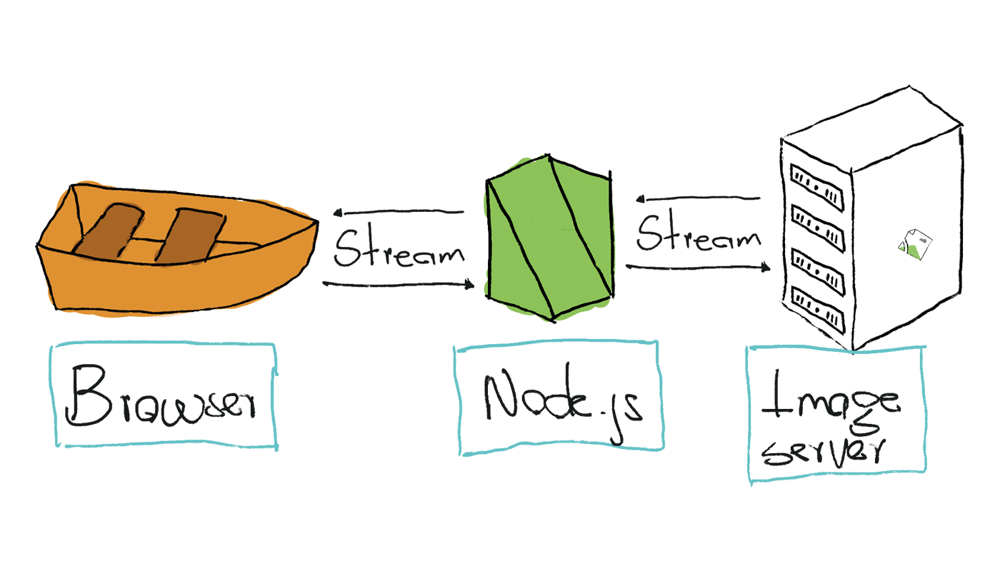
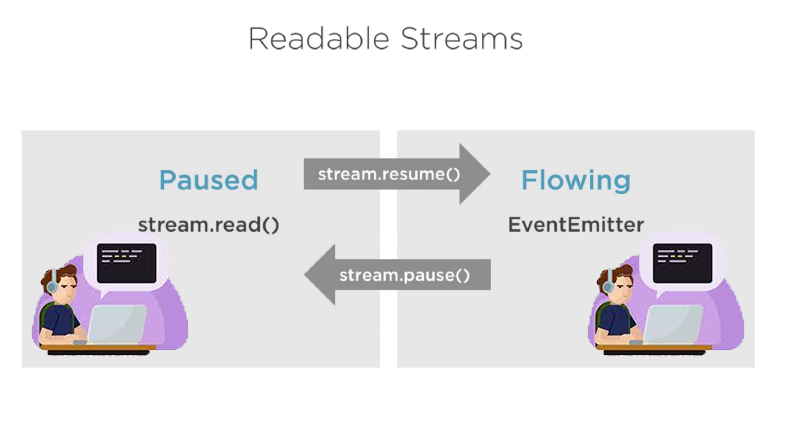
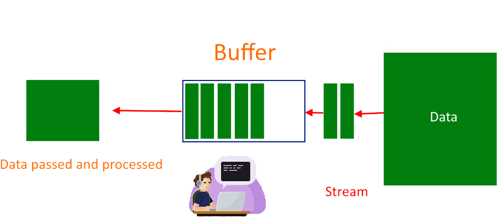
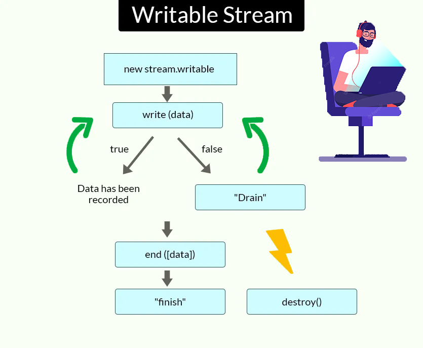

# Streams

## What are streams?

The moment you type something on a keyboard, read a file from a disk or download a file over the internet, a stream of information (bits) flows through different devices and applications.



If you learn to work with these streams of bits, you'll be able to build performant and valuable applications. For example, think of when you watch a video on YouTube. You don't have to wait until the full video downloads. Once a small amount buffers, it starts to play, and the rest keeps on downloading as you watch. Node.js includes a built-in module called `stream` which lets us work with streaming data. For example, in a Node.js based [HTTPs](/docs/standard-library/https) server, `request` is a readable stream and `response` is a writable stream. But while an HTTPs response is a writable stream on the server, it’s a readable stream on the client. This is because in the HTTPs case, we basically read from one object `http.IncomingMessage` as the request and write to the other `http.ServerResponse`. Or read from `http.ServerRequest` and write to `http.OutGoingMessage` as the response. When HTTPs request is a readable stream on the server, and it’s a writable stream on the client.

Streams of data serve as a bridge between where data is stored and where it will be processed. Node.js streams are used to read and continuously write data. Streams work differently from traditional techniques that read or write data, which require the data to be read and stored in memory before being processed. For instance, to read a file, the entire file needs to be copied into memory before it can be processed adding to application latency. On the other hand, applications that use streams will read a file sequentially in chunks, where each of these chunks is processed one at a time.

Streams provide memory efficiency and performance benefits. For example, the performance of a website that leverages streaming is better than websites that load whole files before enabling users to use them. With streams, data can be loaded on demand depending on what users need.

Streams are a fundamental component of some of the most important Node.js applications. Using streams, large data sets are divided up into smaller chunks, which are then processed one at a time, one by one. This eliminates the need to read data from storage into memory before processing it. Many libraries used in Node.js support non-blocking execution, where chunks of data are streamed as they are received.
In Node.js, four streams are typically used: `Readable streams`, `Writable streams`, `Duplex streams`, `Transform streams`.

### Readable streams 
A readable stream can read data from a particular data source, most commonly, from a file system. Other common uses of readable streams in Node.js applications are:

* `process.stdin` - To read user input via `stdin` in a terminal application.
* `http.IncomingMessag`e - To read an incoming request's content in an HTTP server or to read the server HTTP response in an HTTP client.

### Writable streams 
You use writable streams to write data from an application to a specific destination, for example, a file.

`process.stdout` can be used to write data to standard output and is used internally by console.log.

### Duplex streams 
A duplex stream is a combination of both readable and writable streams. It provides the capability to write data to a particular destination and read data from a source. The most common example of a duplex stream is `net.Socket`, used to read and write data to and from a socket.

It's important to know that readable and writable sides operate independently from one another in a duplex stream. The data does not flow from one side to the other.

### Transform streams 
A transform stream is slightly similar to a duplex stream, but the readable side is connected to the writable side in a transform stream.

A good example would be the `crypto.Cipher` class which implements an encryption stream. Using a `crypto.Cipher` stream, an application can write plain text data into the writable side of a stream and read encrypted ciphertext out of the readable side of the stream. The transformative nature of this type of stream is why they are called 'transform streams'.

Side-note: Another transform stream is `stream.PassThrough`, which passes data from the writable side to the readable side without any transformation. Though this might sound trivial, Passthrough streams are very useful for building custom stream implementations and pipelines (e.g., creating multiple copies of one stream's data).

### Advantages working with streams

Streams offer the following advantages over working with entire sets of data:

* Efficient memory usage - With streams, large amounts of data do not need to be loaded into memory, reducing the number of reads and write cycles required to perform operations.
* Better performance - With streams, there is higher data processing throughput since data is processed as soon as it becomes available rather than waiting for all the data to arrive and then process it.
* Increased composability - With streams, developers can compose complex applications that interconnect data between multiple pieces of code or even across applications. This benefit allows developers to build microservices with Node.js.
* Real-time applications - Streams are essential for creating real-time applications such as video streaming or chat applications.

## The Stream Module

The [Node.js stream module](https://nodejs.org/api/stream.html) provides the foundation upon which all streaming APIs are build.

The Stream module is a native module that shipped by default in Node.js. The Stream is an instance of the EventEmitter class which handles events asynchronously in Node. Because of this, streams are inherently event-based.

To access the stream module:

```js
const stream = require('stream');
```

The `stream` module is useful for creating new types of stream instances. It is usually not necessary to use the `stream` module to consume streams.

## Readable stream

We first require the Readable stream, and we initialize it.

```js
const Stream = require('stream')
const readableStream = new Stream.Readable()
```

Now that the stream is initialized, we can send data to it:

```js
readableStream.push('ping!')
readableStream.push('pong!')
```

### async iterator

It’s highly recommended to use async iterator when working with streams. Asynchronous iteration is a protocol for retrieving the contents of a data container asynchronously (meaning the current “task” may be paused before retrieving an item). Also, it’s important to mention that the stream async iterator implementation use the ‘readable’ event inside.

You can use async iterator when reading from readable streams:

```js
import * as fs from 'fs';

async function logChunks(readable) {
    for await (const chunk of readable) {
        console.log(chunk);
    }
}

const readable = fs.createReadStream(
    'tmp/test.txt', {encoding: 'utf8'});
logChunks(readable);

// Output:
// 'This is a test!\n'
```

It’s also possible to collect the contents of a readable stream in a string:

```js
import {Readable} from 'stream';

async function readableToString2(readable) {
    let result = '';
    for await (const chunk of readable) {
        result += chunk;
    }
    return result;
}

const readable = Readable.from('Good morning!', {encoding: 'utf8'});
assert.equal(await readableToString2(readable), 'Good morning!');
```

Note that, in this case, we had to use an async function because we wanted to return a Promise.

It’s important to keep in mind to not mix async functions with `EventEmitter` because currently, there is no way to catch a rejection when it is emitted within an event handler, causing hard to track bugs and memory leaks. The best current practice is to always wrap the content of an async function in a try/catch block and handle errors, but this is error prone. This pull request aims to solve this issue once it lands on Node core.


### Readable.from(): Creating readable streams from iterables

`stream.Readable.from(iterable, [options])` it’s a utility method for creating Readable Streams out of iterators, which holds the data contained in iterable. Iterable can be a synchronous iterable or an asynchronous iterable. The parameter options is optional and can, among other things, be used to specify a text encoding.

```js
const { Readable } = require('stream');

async function * generate() {
    yield 'hello';
    yield 'streams';
}

const readable = Readable.from(generate());

readable.on('data', (chunk) => {
    console.log(chunk);
});
```

### Two Reading Modes

According to Streams API, readable streams effectively operate in one of two modes: flowing and paused. A Readable stream can be in object mode or not, regardless of whether it is in flowing mode or paused mode.



In flowing mode, data is read continuously and provided to the application using events from the `EventEmitter`. These events include

* Data event - This event is raised whenever data is available to be read by a stream.
* End event - This event is raised when the stream reaches the end of the file, and no more data is available to read.
* Error event - This event is raised when an error occurs during the read stream process. This event is also raised when using writable streams.
* Finish event - This event is raised when all data has been flushed to the underlying system.

In a flowing mode, to read data from a stream, it’s possible to listen to data event and attach a callback. When a chunk of data is available, the readable stream emits a data event and your callback executes. Take a look at the following snippet:

```js
const fs = require("fs");
let data = '';

let readerStream = fs.createReadStream('file.txt'); //Create a readable stream

readerStream.setEncoding('UTF8'); // Set the encoding to be utf8. 

// Handle stream events --> data, end, and error
readerStream.on('data', function(chunk) {
    data += chunk;
});

readerStream.on('end',function() {
    console.log(data);
});

readerStream.on('error', function(err) {
    console.log(err.stack);
});

console.log("Program Ended");
```

The function call `fs.createReadStream()` gives you a readable stream. Initially, the stream is in a static state. As soon as you listen to data event and attach a callback it starts flowing. After that, chunks of data are read and passed to your callback. The stream implementor decides how often a data event is emitted. For example, an HTTP request may emit a data event once every few KBs of data are read. When you are reading data from a file you may decide you emit a data event once a line is read.

When there is no more data to read (end is reached), the stream emits an end event. In the above snippet, we listen to this event to get notified when the end is reached.

Also, if there is an error, the stream will emit and notify the error.


In paused mode, you just need to call read() on the stream instance repeatedly until every chunk of data has been read, like in the following example:

```js
const fs = require('fs');
let readableStream = fs.createReadStream('file.txt');
let data = '';
let chunk;

readableStream.on('readable', function() {
    while ((chunk=readableStream.read()) != null) {
        data += chunk;
    }
});

readableStream.on('end', function() {
    console.log(data)
});
```

The read() function reads some data from the internal buffer and returns it. When there is nothing to read, it returns null. So, in the while loop, we check for null and terminate the loop. Note that the readable event is emitted when a chunk of data can be read from the stream.



All `Readable` streams begin in paused mode but can be switched to flowing mode in one of the following ways:

* By adding a ‘data’ event handler to the stream.
* By calling the `stream.resume()` method.
* By calling the `stream.pipe()` method, which sends data to writable streams.

The Readable can switch back to paused mode using one of the following:

* If there are no pipe destinations, by calling the `stream.pause()` method.

* If there are pipe destinations, by removing all pipe destinations. Multiple pipe destinations may be removed by calling the `stream.unpipe()` method.

The important concept to remember is that a `Readable` will not generate data until a mechanism for either consuming or ignoring that data is provided. If the consuming mechanism is disabled or taken away, the `Readable` will attempt to stop generating the data. Adding a `readable` event handler automatically make the stream to stop flowing, and the data to be consumed via `readable.read()`. If the 'readable' event handler is removed, then the stream will start flowing again if there is a 'data' event handler.

## Writable stream

To write data to a writable stream you need to call `write()` on the stream instance. Like in the following example:


```js
const fs = require('fs');
const readableStream = fs.createReadStream('file1.txt');
const writableStream = fs.createWriteStream('file2.txt');

readableStream.setEncoding('utf8');

readableStream.on('data', function(chunk) {
    writableStream.write(chunk);
});
```

The above code is straightforward. It simply reads chunks of data from an input stream and writes to the destination using `write()`. This function returns a boolean value indicating if the operation was successful. If true, then the write was successful and you can keep writing more data. If false is returned, it means something went wrong and you can’t write anything at the moment. The writable stream will let you know when you can start writing more data by emitting a drain event.

Calling the `writable.end()` method signals that no more data will be written to the Writable. If provided, the optional callback function is attached as a listener for the 'finish' event.

```js
// Write 'hello, ' and then end with 'world!'.
const fs = require('fs');
const file = fs.createWriteStream('example.txt');
file.write('hello, ');
file.end('world!');
// Writing more now is not allowed!
```

Using a writable stream you can read data from a readable stream:

```js
const Stream = require('stream')

const readableStream = new Stream.Readable()
const writableStream = new Stream.Writable()

writableStream._write = (chunk, encoding, next) => {
    console.log(chunk.toString())
    next()
}

readableStream.pipe(writableStream)

readableStream.push('ping!')
readableStream.push('pong!')

writableStream.end()
```

You can also use async iterators to write to a writable stream, which is recommended

```js
import * as util from 'util';
import * as stream from 'stream';
import * as fs from 'fs';
import {once} from 'events';

const finished = util.promisify(stream.finished); // (A)

async function writeIterableToFile(iterable, filePath) {
    const writable = fs.createWriteStream(filePath, {encoding: 'utf8'});
    for await (const chunk of iterable) {
        if (!writable.write(chunk)) { // (B)
            // Handle backpressure
            await once(writable, 'drain');
        }
    }
    writable.end(); // (C)
    // Wait until done. Throws if there are errors.
    await finished(writable);
}

await writeIterableToFile(
    ['One', ' line of text.\n'], 'tmp/log.txt');
assert.equal(
    fs.readFileSync('tmp/log.txt', {encoding: 'utf8'}),
    'One line of text.\n');
```

The default version of stream.finished() is callback-based but can be turned into a Promise-based version via util.promisify() (line A).

In this example, it is used the following two patterns:

Writing to a writable stream while handling backpressure (line B):

```js
if (!writable.write(chunk)) {
  await once(writable, 'drain');
}
```

Closing a writable stream and waiting until writing is done (line C):

```js
writable.end();
await finished(writable);
```



## pipeline()

Piping is a mechanism where we provide the output of one stream as the input to another stream. It is normally used to get data from one stream and to pass the output of that stream to another stream. There is no limit on piping operations. In other words, piping is used to process streamed data in multiple steps.

In Node 10.x was introduced `stream.pipeline()`. This is a module method to pipe between streams forwarding errors and properly cleaning up and provide a callback when the pipeline is complete.

Here is an example of using pipeline:

```js
const { pipeline } = require('stream');
const fs = require('fs');
const zlib = require('zlib');

// Use the pipeline API to easily pipe a series of streams
// together and get notified when the pipeline is fully done.
// A pipeline to gzip a potentially huge video file efficiently:

pipeline(
  fs.createReadStream('The.Matrix.1080p.mkv'),
  zlib.createGzip(),
  fs.createWriteStream('The.Matrix.1080p.mkv.gz'),
  (err) => {
    if (err) {
      console.error('Pipeline failed', err);
    } else {
      console.log('Pipeline succeeded');
    }
  }
);
```

`pipeline` should be used instead of `pipe`, as pipe is unsafe. For example let's take a look at the following code:

```js
const { createReadStream } = require('fs');
const { createServer } = require('http');
const server = createServer(
    (req, res) => {
        createReadStream(__filename).pipe(res);
    }
);

server.listen(3000);
```

If the response will quit or the client closes the connection - then the read stream is not closed or destroy which leads to a memory leak. So if you use pipeline, it would close all other streams and make sure that there are no memory leaks.

```js
const { createReadStream } = require('fs');
const { createServer } = require('http');
const { pipeline } = require('stream');

const server = createServer(
    (req, res) => {
        pipeline(
            createReadStream(__filename),
            res,
            err => {
                if (err)
                    console.error('Pipeline failed.', err);
                else
                    console.log('Pipeline succeeded.');
            }
        );
    }
);

server.listen(3000);
```
You can read more information about [Pipeline Pattern](https://www.informit.com/articles/article.aspx?p=366887&seqNum=8).


## Streams-powered Node APIs

Due to their advantages, many Node.js core modules provide native stream handling capabilities, most notably:

* `net.Socket` is the main node api that is stream are based on, which underlies most of the following APIs
* `process.stdin` returns a stream connected to stdin
* `process.stdout` returns a stream connected to stdout
* `process.stderr` returns a stream connected to stderr
* `fs.createReadStream()` creates a readable stream to a file
* `fs.createWriteStream()` creates a writable stream to a file
* `net.connect()` initiates a stream-based connection
* `http.request()` returns an instance of the http.ClientRequest class, which is a writable stream
* `zlib.createGzip()` compress data using gzip (a compression algorithm) into a stream
* `zlib.createGunzip()` decompress a gzip stream.
* `zlib.createDeflate()` compress data using deflate (a compression algorithm) into a stream
* `zlib.createInflate()` decompress a deflate stream


## Conclusion

This was all about the basics of streams. Streams, pipes, and chaining are the core and most powerful features in Node.js. Streams can indeed help you write neat and performant code to perform I/O. Streams are an integral part of Node.js. Streams are often more efficient than traditional methods of managing data. They also enable developers to build real-time, performant applications. At times, streams can be confusing to understand, but learning more about them and using them in your apps will help you master them.
