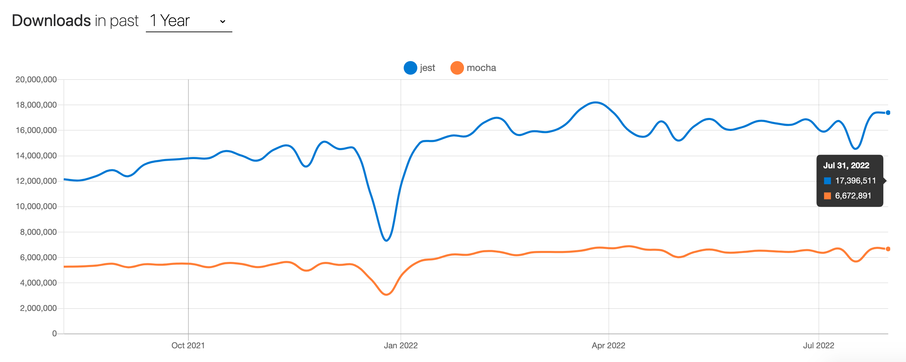
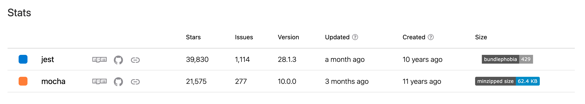

# Testing libraries in Node.js

According to [The State of JavaScript 2021](https://2021.stateofjs.com/en-US/libraries/testing/), the most popular JavaScript testing libraries that can be used for Node.js testing in 2021 were [Jest](https://www.npmjs.com/package/jest) and [Mocha](https://www.npmjs.com/package/mocha). While both of these libraries were created quite a long time ago, they are still top 2 across community. They are well-supported and commonly used on projects. 

Based on [npm trends](https://npmtrends.com/jest-vs-mocha) Jest is playing a leading role. As you can see on the charts below, Jest downloads for the past 1 year is almost 3 times bigger than Mocha.

Mocha is a little more complicated than Jest when it comes to ease of use. Jest is designed to be simple and straightforward, while Mocha has more options and can be more difficult to learn. 

For learning purposes we will use Jest. So in the next sections we will dive deep into the tool and learn some basics.