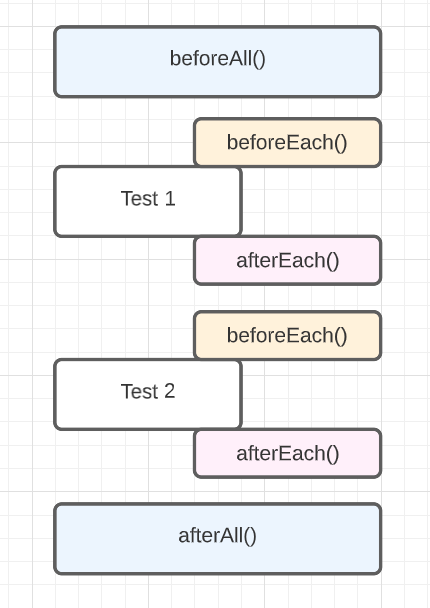

# Jest core concepts

In the previous section you implemented your first Jest test. Let's review some core Jest concepts before we actually start writing unit / integration / e2e tests.

## Grouping tests

In the previous section you learnt that tests can be defined with function `test()`. It is not the only way to do it. You can also use `it()` that will produce the same output.

```js
// example with test()
test('adds 5 + 2 to equal 7', () => {
  expect(sum(5, 2)).toBe(7);
});

// example with it()
it('adds 5 + 2 to equal 7', () => {
  expect(sum(5, 2)).toBe(7);
});
```

Several tests can be grouped using `describe()`. It is a good practice keep your tests small, but group them under the same describe statement. In the example below we have separate test cases for success and error test suites.

```js
describe('Create user', () => {
  // test for success
  it('should create valid user object', () => { ... })
  // test for error
  it('should throw error if username & password are not provided', () => { ... })
})
```

## Test lifecycle

There are use cases when you need to do some setup jobs before the actual tests or do some cleanup when they finish execution. Jest provides several global methods that can be executed before or after tests.

`beforeAll()` - runs before all tests.

`afterAll()` - runs after all tests.

`beforeEach()` - runs before each test.

`afterEach()` - runs after each test.



## Mocks

Let's imagine a situation when you want to write some tests for `function A` that calls another `function B`. In this specific case you want to concentrate on testing the behavior of `function A`. `function B` is quite slow because it makes request to another API. So instead of calling it, you just want to "hardcode" the returned value.

**Mocks** allow you to replace the actual implementation of a function. You can track if mock function was called, how many times and with what arguments.
### jest.mock()

The most basic strategy for mocking is to reassign a function to the mock function. Then, anywhere the reassigned functions are used, the mock will be called instead of the original function.

Suppose we have a function `getGenderByName()` that calls external API. It uses `axios` to make the actual request.

```js title="/src/jest-core-concepts/example-1/get-gender-by-name.ts"
import axios from 'axios';

const API_URL = 'https://api.genderize.io';

type GenderResponse = {
  name: string;
  gender: string;
  probability: number;
  count: number;
};

const getGenderByName = async (name: string): Promise<GenderResponse | Error> => {
  const { data: gender } = await axios.get<GenderResponse>(`${API_URL}?name=${name}`);
  return gender;
};

export default getGenderByName;
```

In our test scenarios we do not want to make the actual call to API. Instead, we want to hardcode or mock the returned value. Let’s use `jest.mock()` to do that.

```js title="/src/jest-core-concepts/example-1/get-gender-by-name-mocks.test.ts"
// highlight-next-line
import axios from 'axios';
import getGenderByName from './get-gender-by-name';

const GENDER_JOHN = {
  name: 'john',
  gender: 'male',
  probability: 0.999,
  count: 1,
};

// mock axios module. pay attention name is passed as string
// highlight-next-line
jest.mock('axios');
// some magic around types
// highlight-next-line
const mockedAxios = axios as jest.Mocked<typeof axios>;

describe('[Mocks] Get gender by name', () => {
  test('should return gender', async () => {
    // mock response from API
    // highlight-next-line
    mockedAxios.get.mockResolvedValue({ data: GENDER_JOHN });

    const genderResponse = await getGenderByName(GENDER_JOHN.name);
    // expect that getGenderByName() func returns what API returns
    expect(genderResponse).toEqual(GENDER_JOHN);
  });

  afterEach(() => {
    // clear all mocks to make sure that they won't be passed to any tests out of this file
    jest.clearAllMocks();
  });
});
```

### jest.spyOn()

Sometimes you only want to watch a method being called, but keep the original implementation or you may want to mock the implementation, but restore the original later in the suite. **Spies** allow you to do that.

Let’s use `getGenderByName()` function from the previous example and set up spies for it instead of mocks. 

```js title="/src/jest-core-concepts/example-1/get-gender-by-name-spies.test.ts"
// highlight-next-line
import axios from 'axios';
import getGenderByName from './get-gender-by-name';

const GENDER_JOHN = {
  name: 'john',
  gender: 'male',
  probability: 0.999,
  count: 1,
};

describe('[Spies] Get gender by name', () => {
  test('should return gender', async () => {
    // mock response from API
    // highlight-next-line
    jest.spyOn(axios, 'get').mockImplementation(() => Promise.resolve({ data: GENDER_JOHN }));

    const genderResponse = await getGenderByName(GENDER_JOHN.name);
    // expect that getGenderByName() func returns what API returns
    expect(genderResponse).toEqual(GENDER_JOHN);
  });

  afterEach(() => {
    // clear all mocks to make sure that they won't be passed to any tests out of this file
    jest.clearAllMocks();
  });
});
```

In most cases it's better to use `jest.spyOn()` instead of `jest.mock()` since mocking the whole module is not needed. The examples above show some typical mocks and spies cases. No worries if it seems hard for you at first glance. It’s quite a complicated topic, but once you get more practice - things become much easier. Don’t be afraid to google particular mock cases.

## Useful links

- [Jest Mock functions](https://jestjs.io/docs/mock-functions)
- [Understanding Jest mocks](https://medium.com/@rickhanlonii/understanding-jest-mocks-f0046c68e53c)