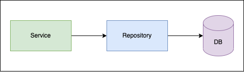

# Integration tests

In the previous section we’ve learnt how to write unit tests. The key difference between unit and integration testing is that in integration tests when testing interaction between two modules, none of them is mocked. 

**For example:** if we go back to `getGenderByName()` function from the previous section, in unit tests we set up spies for external calls. When writing integration tests for that function, no spies would be there. We would make real calls to Genderize API to check the behavior, rather than have “fake” implementation. 

**Core things to keep in mind when writing integration tests:**
- No mocks when testing interaction between modules. Integration tests make real requests to external or other services, that’s why they are slower than unit tests.
- The amount of integration tests in the project should be less than unit tests. Do integration testing only for parts that really matter for your project.
- Do not forget to clean up everything that you’ve done during integration testing. For example: when testing integration between your code and database, you will likely create new entities. Do not forget to drop them once integration tests are finished.
- Make sure that you have covered error scenarios in integration tests. But pay attention only to errors that are thrown by external or other services and if you handle them properly. Integration testing is not about testing incorrect input arguments and validation.

And now let’s have a look at how integration tests can be written using Jest.

## Implementation

We will consider a typical case when testing interaction between code and database. So we have:
- database (`Users`) that contains users
- repository (`UserRepository`) that is a single entry point to database and contains methods to querying database
- service (`UserSerivice`) that calls repository for any data needed from database

The interaction between all of them is shown in the picture below.



### Interfaces

Before we dive into the code, let’s have a look at interfaces that we would use. They are `IUser` and  `IUserExtended`. As you can see, we have the simplest user model possible with typical attributes.

```js title="/src/integration-tests/example-1/interfaces/IUser.ts"
export interface IUser {
  name: string;
  surname: string;
  email: string;
  password: string;
}

export interface IUserExtended extends IUser {
  id: string;
  password: string;
}
```

### Database

For simplicity, we will have a database as an array stored in memory. That’s how our database looks like:

```js title="/src/integration-tests/example-1/db/user.repository.ts"
export default [
  {
    id: 'd0311f4f-2fa9-462b-8b56-8fed02924d2d',
    name: 'Emmanuel',
    surname: 'Mccormack',
    email: 'emmanuel.mccormack@epam.com',
    password: '623bQwo4qag2zUx9UMO8dQ==',
  },
  {
    id: '5e5577d2-d7f4-48a3-9e69-cd7ad1cb334b',
    name: 'Lorena',
    surname: 'Cortes',
    email: 'lorena.cortes@epam.com',
    password: 'yUuMxsx4bY7sK5mzTVIFGw==',
  },
  {
    id: 'db98132e-7484-4766-8a91-f4f74e46c286',
    name: 'Jemima',
    surname: 'Cain',
    email: 'jemima.cain@epam.com',
    password: 'UNHg1jhOtygWjQYGMxJY0g==',
  },
  {
    id: '60c1add6-e13f-4a03-95ad-6f5a8b90c028',
    name: 'Pauline',
    surname: 'Hale',
    email: 'pauline.hale@epam.com',
    password: 'hijrYYcoiJkQOZdV5n2Ypg==',
  },
];
```

### Repository

Repository is just a wrapper over database queries. It contains `create()`, `getOneByEmail()`, `getOneById()`, `getAll()` and `delete()` methods. Since we have an in-memory database, we are just operating with `users` array using array methods. 

```js title="/src/integration-tests/example-1/db/user.repository.ts"
import { v4 as uuidv4 } from 'uuid';
import { IUser, IUserExtended } from '../interfaces/IUser';
import usersDb from './users-db';

let users = usersDb;

const userRepository = {
  create: (user: IUser): IUserExtended => {
    const newUser = { id: uuidv4(), ...user };
    users.push(newUser);
    return newUser;
  },

  getOneByEmail: (email: string) => {
    return users.find((u) => u.email === email);
  },

  getOneById: (id: string) => {
    return users.find((u) => u.id === id);
  },

  getAll: () => {
    return users;
  },

  delete: (id: string) => {
    users = users.filter((u) => u.id !== id);
  },
};

export default userRepository;
```

### Service

And now let’s have a look at our `UserService` which we will cover with integration tests. We will expose 3 methods externally - `create()`, `getAll()` and `delete()`.

```js title="/src/integration-tests/example-1/user.service.ts"
import omit from 'lodash.omit';
import userRepository from './db/user.repository';
import { IUser, IUserExtended } from './interfaces/IUser';

const OMIT_USER_FIELDS = ['password'];

type ICreateUserResponse = Omit<IUserExtended, 'password'>;

const userService = {
  create: (user: IUser) => {
    const existingUser = userRepository.getOneByEmail(user.email);

    if (existingUser) {
      throw new Error(`User with email ${user.email} already exists`);
    }

    const newUser = userRepository.create({ ...user, password: Buffer.from(user.password).toString('base64') });
    return omit(newUser, OMIT_USER_FIELDS) as ICreateUserResponse;
  },

  getAll: () => {
    return userRepository.getAll().map((u) => omit(u, OMIT_USER_FIELDS) as ICreateUserResponse);
  },

  delete: (id: string) => {
    const user = userRepository.getOneById(id);
    if (!user) {
      throw new Error(`No user with such id ${id}`);
    }
    return userRepository.delete(id);
  },
};

export default userService;
```

## Testing

So what integration tests should we have for our `UserService`? First of all, it exposes 3 methods that we should test. Secondly, some methods like `create()` and `delete()` have some error handling logic, which should be tested as well.

:::note
Once again, no mocks or spies should be there. We are testing real interaction between modules.
:::

### Create user - success path

Let’s start with integration tests for creating users. First of all we check if a user with such email exists in our database. If not, we create that user. Otherwise, we throw an error.

For a success scenario the flow would be: create a user and then get all users to check if a new user that we’ve just inserted was really added.

```js title="/src/integration-tests/example-1/user.service.test.ts"
import { IUser } from './interfaces/IUser';
import userService from './user.service';

const USER_HELEN: IUser = {
  name: 'Helen',
  surname: 'Castro',
  email: 'helen.castro@epam.com',
  password: '12345',
};

const userIdsToDelete: (string | undefined)[] = [];

describe('User service', () => {
  describe('create user', () => {
    test('should create user if it does not exist', () => {
      userService.create(USER_HELEN);
      const users = userService.getAll();

      const newUser = users.find((u) => u.email === USER_HELEN.email);
      expect(newUser).not.toEqual(undefined);

      // to clean up db in afterAll()
      userIdsToDelete.push(newUser?.id);
    });
  });
});
```

Pay attention that at the end of the test scenario we are pushing user ids that we've created to `userIdsToDelete` array. That is what was previously mentioned: we collect those ids to do cleanup later.

### Create user - error path

And now let’s look at how error scenarios testing would look like. We simply try to create the same user twice. The second call throws an error that user with such email already exists. 

```js title="/src/integration-tests/example-1/user.service.test.ts"
const USER_ALICE: IUser = {
  name: 'Alice',
  surname: 'Watkins',
  email: 'alice.watkins@epam.com',
  password: '==password==',
};

test('should throw error if user exists', () => {
  const newUser = userService.create(USER_ALICE);
  expect(() => userService.create(USER_ALICE)).toThrow(`User with email ${USER_ALICE.email} already exists`);

  // to clean up db in afterAll()
  userIdsToDelete.push(newUser.id);
});
```

### Get all users

Tests for getting all users are quite simple and straightforward: we get all users, create new one, then get all users again and expect that the number of users after creation would be +1.

```js title="/src/integration-tests/example-1/user.service.test.ts"
describe('get all users', () => {
  test('should get all users', () => {
    const usersBefore = userService.getAll();

    const newUser = userService.create({ ...USER_ALICE, email: 'test@email.com' });
    const usersAfter = userService.getAll();

    expect(usersAfter.length).toEqual(usersBefore.length + 1);

    // to clean up db in afterAll()
    userIdsToDelete.push(newUser.id);
  });
});
```

### Delete user

Delete user integration tests are very similar to creating user ones. We would not stop much at them. So just have a look.

```js title="/src/integration-tests/example-1/user.service.test.ts"
describe('delete user', () => {
  test('should delete user if it exists', () => {
    const newUser = userService.create({ ...USER_HELEN, email: 'test1@email.com' });
    userService.delete(newUser.id);

    const newUserAfter = userService.getAll().find((u) => u.id === newUser.id);
    expect(newUserAfter).toBe(undefined);
  });

  test('should throw error if user does not exist', () => {
    const userId = 'random-id';
    expect(() => userService.delete(userId)).toThrow(`No user with such id ${userId}`);
  });
});
```

### Clean up

And the last important bit is to do cleanup. So every time we created a new user, we pushed their id to `userIdsToDelete` array. Now let’s remove all those users so as not to mess up the database with test data.

```js title="/src/integration-tests/example-1/user.service.test.ts"
afterAll(() => {
  userIdsToDelete.forEach((id) => id && userService.delete(id));
});
```

### Final test

That’s how our final integration tests for `UserService` would look like.

```js title="/src/integration-tests/example-1/user.service.test.ts"
import { IUser } from './interfaces/IUser';
import userService from './user.service';

const USER_HELEN: IUser = {
  name: 'Helen',
  surname: 'Castro',
  email: 'helen.castro@epam.com',
  password: '12345',
};

const USER_ALICE: IUser = {
  name: 'Alice',
  surname: 'Watkins',
  email: 'alice.watkins@epam.com',
  password: '==password==',
};

const userIdsToDelete: (string | undefined)[] = [];

describe('User service', () => {
  describe('create user', () => {
    test('should create user if it does not exist', () => {
      userService.create(USER_HELEN);
      const users = userService.getAll();

      const newUser = users.find((u) => u.email === USER_HELEN.email);
      expect(newUser).not.toEqual(undefined);

      // to clean up db in afterAll()
      userIdsToDelete.push(newUser?.id);
    });

    test('should throw error if user exists', () => {
      const newUser = userService.create(USER_ALICE);
      expect(() => userService.create(USER_ALICE)).toThrow(`User with email ${USER_ALICE.email} already exists`);

      // to clean up db in afterAll()
      userIdsToDelete.push(newUser.id);
    });
  });

  describe('get all users', () => {
    test('should get all users', () => {
      const usersBefore = userService.getAll();

      const newUser = userService.create({ ...USER_ALICE, email: 'test@email.com' });
      const usersAfter = userService.getAll();

      expect(usersAfter.length).toEqual(usersBefore.length + 1);

      // to clean up db in afterAll()
      userIdsToDelete.push(newUser.id);
    });
  });

  describe('delete user', () => {
    test('should delete user if it exists', () => {
      const newUser = userService.create({ ...USER_HELEN, email: 'test1@email.com' });
      userService.delete(newUser.id);

      const newUserAfter = userService.getAll().find((u) => u.id === newUser.id);
      expect(newUserAfter).toBe(undefined);
    });

    test('should throw error if user does not exist', () => {
      const userId = 'random-id';
      expect(() => userService.delete(userId)).toThrow(`No user with such id ${userId}`);
    });
  });

  afterAll(() => {
    userIdsToDelete.forEach((id) => id && userService.delete(id));
  });
});
```