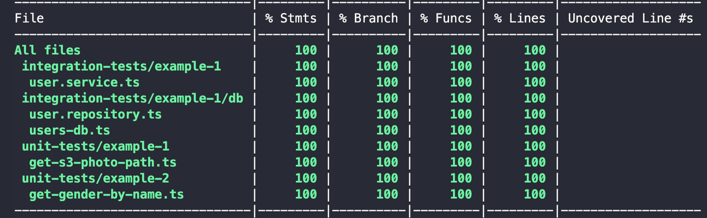

# Code coverage

We’ve almost reached the finish line of the module. The last topic that should definitely be touched is code coverage. 

Code coverage is an important metric that allows you to understand the percentage of code that is covered with tests. It is quite useful since it can be used to spot untested paths in your application.

Jest allows you to collect code coverage in [different formats](https://jestjs.io/docs/28.x/configuration#coveragereporters-arraystring--string-options), e.g `json`, `clover`, `lcov`, `text`, ` text-summary`, `html`.

### Collecting code coverage

First of all, to make Jest generate code coverage for us, we need to pass an extra `--coverage` option to jest command. Let’s add a new script to `package.json` - `test:coverage`. 

```js
"scripts": {
  "test": "jest",
  "test:coverage": "jest --coverage"
}
```

Secondly, we need to specify a directory that contains files to collect coverage from. Let’s add `collectCoverageFrom` option to `jest.config.js`. In our case all source files are in `/src` directory, so we specify it. 

```js
collectCoverageFrom: ['src/**'],
```

And the last thing to do is to decide on the format of the report we want to receive. Let’s start with a simple one which is `text`. Code coverage report will be printed to stdout. So the final `jest.config.js` with code coverage options looks the following way:

```js
module.exports = {
  preset: 'ts-jest',
  testEnvironment: 'node',
  roots: ['./src'],
  silent: false,
  verbose: true,
  collectCoverageFrom: ['src/**'],
  coverageReporters: ['text']
};
```

Now it’s time to run `test:coverage` command and check what our report looks like. The screen below is the output we received. My congratulations! Coverage for code prepared for this module is 100%. 



Let’s comment one test in `get-gender-by-name.test.ts`  and see how coverage changes. As you can see on the screenshot below, coverage for that file has changed from 100% to 92.3%. The general coverage decreased to 97.95%.


### Configuring a coverage threshold

Coverage reports provide quite useful information, but most of the time we are interested in **good** code coverage. While “good” might be treated differently and vary from project to project, it’s still good to strive for around 80-90% of code coverage. My personal advice is not to try to achieve 100%. The effort and amount of time you spend on making your tests cover 100% of code might be nothing compared to the value it actually brings.

So let’s say we want to have at least 98% of code coverage (for testing purposes only). If it’s less, then our tests will be treated as failed. Additionally, we want to use this threshold in our CI pipeline. 

To meet this objective, let’s add `coverageThreshold` to our `jest.config.js`. 

```js
module.exports = {
  preset: 'ts-jest',
  testEnvironment: 'node',
  roots: ['./src'],
  silent: false,
  verbose: true,
  collectCoverageFrom: ['src/**'],
  coverageReporters: ['text'],
  coverageThreshold: {
    global: {
      lines: 98
    }
  }
};
```

When running `test:coverage` command, you will see the following output (pay attention to the last line):


As you can see, we didn’t meet the goal. Code coverage is 95.91% while 98% is expected. As a result, coverage command failed. 

So that’s it for Node.js testing. Hope you enjoyed the module and writing tests will bring you and your projects a lot of benefits starting from now.