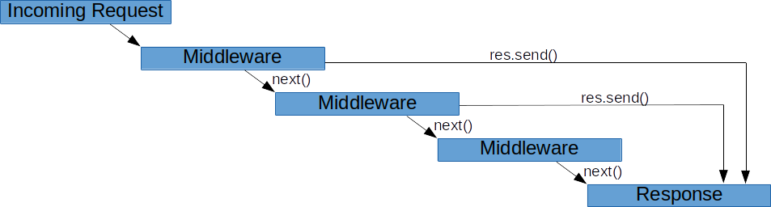

# Overview of Express
The code snippet below creates a simple [Express](https://expressjs.com/en/guide/using-middleware.html) server:

```ts
const express = require('express');

const app = express();

app.listen(3000, () => {
    console.log('Server is started');
})
```

`app` is an instance of our server and will be used for adding routers, middleware, and error handlers.

Expressjs provides us with **three major features:**

- routing
- middleware
- error handling

In this section, we will go over all three parts.

### Routing

As you might have noticed from our previous example of using HTTP, it doesn’t have any routing features. If you want to add a new endpoint you need manually check the HTTP method and URL of a request. Express provides quite a handy routing feature. For adding an endpoint you can just use `app.<method>(url, handler)`

- *method -* is any HTTP request method, you can add an endpoint for. Or `all` it for all methods.
- *url* - is a string that represents URL of your endpoint
- *handler* - is a callback that will be called when a request with provided *method* and URL was made

For example:

```ts
app.get('/users/:userId', () => {});
app.put('/users/:userId/groups', () => {});
app.post('/comments', () => {});
app.get('/comments', () => {});
app.delete('/comments/:commentId', () => {});
```

You might have noticed column`:` symbol in the path, that’s route **param**. `/users/:userId` will match any route that starts with `/users/` and then has anything specified (except `/` , because it will be another route). It’s useful when we want to send some id in the URL. In the handler you don’t need to parse the URL to get this param, the value will be accessible in `req.params.usersId` . It’s possible to have several such params in one endpoint, but they must be named differently. You can also use limited `regexp` functionality inside the path. More details are [here](https://expressjs.com/en/guide/routing.html).

In big applications there can be a big number of endpoints. For example, a lot of endpoints might start with `/users/`. Express provides **routers** to separate such logic. We can improve our previous example by using routers:

```ts
const app = express();
const usersRouter = express.Router();
const commentsRouter = express.Router();

usersRouter.get('/:userId', () => {});
usersRouter.put('/:userId/groups', () => {});
commentsRouter.post('/', () => {});
commentsRouter.get('/', () => {});
commentsRouter.delete('/:commentId', () => {});

app.use('/users', usersRouter);
app.use('/comments', commentsRouter);
```

In this example, two routers were created. After adding endpoints to routers, we added them automatically to our app by using `app.use('/users', usersRouter)` and `app.use('/comments', commentsRouter)`. Those routers can be located in different modules which helps you to separate logic related to different entities (users and comments in our example).

### Middlewares

Middleware - is a function that has 3 arguments: `request`, `response`, and `next`.
Middlewares can be used for some logic that should be executed for several or even all endpoints. For example, if you need to log information about every request, you can add a logger invocation in every handler, but it's much better to implement it only once. Another use case is user authentication. You can create auth middleware that will reject all requests that don’t have correct tokens in their headers. Example of logger middleware:

```ts
const logger = (req: Request, res: Response, next: NextFunction) => {
    console.log(`New request: ${req.method}, ${req.url}`);
    next();
}
```

To add middleware to all routes you can use `use` method of express instance:

```ts
app.use(logger);
```

You can also specify paths when a middleware should be executed:

```ts
app.use('/api', logger);
```

In the example above `logger` will be executed for all routes starting with `/api` . Even if the route has more slashes. It means that both `/api` and `/api/users/31` routes will be logged.

> It’s the main difference between `use` and `all` methods of Express. The first one is for middleware, and they will be executed for all routes that start with provided path, unlike `all` method that will work for the exact path that you provide and will ignore paths that have more slashes.


Middlewares also can be added to specific routes. To add middleware to some routes, you can just add it after the route path, and before the handler.  Actually, your handler it’s a middleware, but in most cases, we do not need the next function in our handlers, because it’s the last stop for our request and the response will be sent in it.

```ts
app.get('/api/users/:userId', logger, (req: Request, res: Response) => {
    res.send();
})
```
Below you can take a look at visualization of how middleware in Express work:



Express provides some built-in middlewares:

- [express.static](https://expressjs.com/en/4x/api.html#express.static)
- [express.json](https://expressjs.com/en/4x/api.html#express.json)
- [express.urlencoded](https://expressjs.com/en/4x/api.html#express.urlencoded)

Still there are plenty of open-source ones that you can use. Here is a small list of middlewares that Express team developed:

- [body-parser](https://github.com/expressjs/body-parser)
- [cookie-parser](https://github.com/expressjs/cookie-parser)
- [cors](https://github.com/expressjs/cors)
- [multer](https://github.com/expressjs/multer)
- [server-static](https://github.com/expressjs/serve-static)

### Error handling

Express has its own error handling out of the box. If any of your middleware throws an exception, it will be caught by a built-in error handler and return an HTML string with a message and stack trace from an error object.

You can create error handler middleware that will be invocated only when there is an exception in middleware (or handlers) that were declared before the error handler. To convert a middleware into an error handler middleware, you need just to add one more argument at the beginning of the arguments list - error. Express distinguishes regular middleware from error handlers by the number of arguments that they have. For example:

```ts
app.get('/api/users/:userId', () => {
    throw new Error('User was not found');
});

app.use((err, req, res, next) => {
    console.log(err);
    res.status(500);
    res.send({ message: err.message });
});
```

The error from the handler will be caught in the error handler. It’s still middleware, we have access to the request and the response and we are able to send a response back or to do any other useful things.

Because an error handler is a middleware, the order matters. If the error handler declared before middleware that throws an exception, this exception will not be caught by the error handler:

```ts
app.use((err: Error, req: Request, res: Response, next: NextFunction) => {
    console.log(err);
    res.status(500);
    res.send({ message: err.message });
});

app.get('/api/users/:userId', () => {
    throw new Error('User was not found'); // Will be caught by built-in error handler
});
```

It’s possible to have several error handlers that you can declare in the same way as regular middleware:

```ts
const errorHandler = (err: Error, req: Request, res: Response, next: NextFunction) => {
    console.log(err);
    res.status(500);
    res.send({ message: err.message });
};

app.get('/api/users/:userId', handler, errorHandler);
app.use('/api', errorHandler);
app.use('/api', usersRouter, errorHandler);
```

> It’s important to specify the `next` argument in error handlers even if it’s not used. If the `next` is omitted, then the function will have only 3 arguments (err, req, res) and it will be considered as a regular middleware.
>

Moreover, you can declare an error handler after another error handler, to catch an error that was thrown in another error handler:


For example:

```ts
app.use((err: Error, req: Request, res: Response, next: NextFunction) => {
   throw new Error('Error from error handler');
});
app.use((err: Error, req: Request, res: Response, next: NextFunction) => {
    console.log(err);
    res.status(500);
    res.send({ message: err.message });
});
```

The error from the first error handler will be caught in the second one. In most cases, it’s enough to have one error handler and this example just shows the mechanism of how it works, it’s not recommended to have a complex error-handling flow.

### Useful examples

#### Query parameters

Query parameters are automatically parsed, and you can find them in `req.query`. For example, if we make a request `/users/search?firstName=John&age=27` we will have an object with `firstName` and `age` fields.
```ts
app.use('/users/search', (req: Request<{}, any, any, { age: number[] }>, res: Response, next: NextFunction) => {
  console.log(req.query); // { firstName: 'John', age: 27 }
  // ...  
});
```

Arrays are also supported in query parameters. If you want to send an array, you can simply provide several query params with the same name and express will combine them to an array. Let's try to find users that are 27 and 28 years old: `/users/search?age=27&age=28` or `/users/search?age[]=27&age[]=28` 
```ts
app.use('/users/search', (req: Request<{}, any, any, { firstName: string, age: number }>, res: Response, next: NextFunction) => {
  console.log(req.query); // { age: [27, 28] }
  // ...  
});
```

#### Typescript

Express was written in JS, probably, because when Express 1.0.0 was introduced TS didn't exist at all. It doesn't mean that you cannot use TS in your Express application. There is typing for it and you can add them to your project by installing `@types/express` package.
```shell
npm install --save-dev @types/express
```

It might be challenging to use proper types in your Express application. Let's take a look at simple middleware:
```ts
app.use((req: Request, res: Response, next: NextFunction) => {
  // ...  
});
```

Express typings provide types for each argument: `Request`, `Response`, and `NextFunction`. Now, you can use `req.url` or `res.send` because your TS compiler understands their types.  
But, what if we have a param? Or do we want to use some query parameters? Actually, the answer was shown in Query parameters examples: `Request<{}, any, any, { firstName: string, age: number }>`. `Request` and `Response` types have generics, which can help you to specify params, body, or query parameters. `Request` has 4 generic types:
```ts
interface Request<
        P = core.ParamsDictionary,
        ResBody = any,
        ReqBody = any,
        ReqQuery = core.Query,
        Locals extends Record<string, any> = Record<string, any>
    > extends core.Request<P, ResBody, ReqBody, ReqQuery, Locals> {}
```

_P_ - is a params object (`req.params`)  
_ResBody_ - is a type of response body we are going to send in `req.res.send`, `req.res.json`, or `req.res.jsonp` methods. Since we have a separate object for response, it's rarely used  
_ReqBody_ - is a type for body (`req.body`)  
_ReqQuery_ - is a type for query parameters (`req.query`)  
_Locals_ - is a type for [locals](https://expressjs.com/en/api.html#res.locals) object of res (`req.res.locals`)  

`Respons` type has fewer generic types, and they are presented in `Request` as well:
```ts
interface Response<
  ResBody = any,
  Locals extends Record<string, any> = Record<string, any>
  > extends core.Response<ResBody, Locals> {}
```

Here is an example of using such types:
```ts
interface User {
  firsName: string;
  lastName: string;
  age: number;
}

app.put('users/:userId', async (
  req: Request<{ userId: string }, any, Partial<User>, { notify: string }>,
  res: Response<{ message: string }>
) => {
  const { userId } = req.params;
  const notify = req.query.notify === 'true';
  
  const user = await updateUserById(userId, req.body);
  if (notify) {
    await sendNotificationByUserId(userId, 'User was updated');
  }
  
  res.send({ message: 'Users successfully updated' })
});
```
