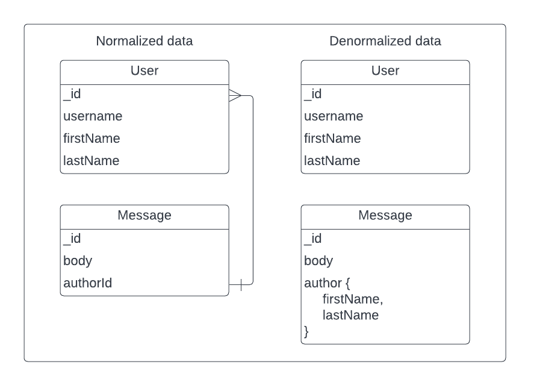
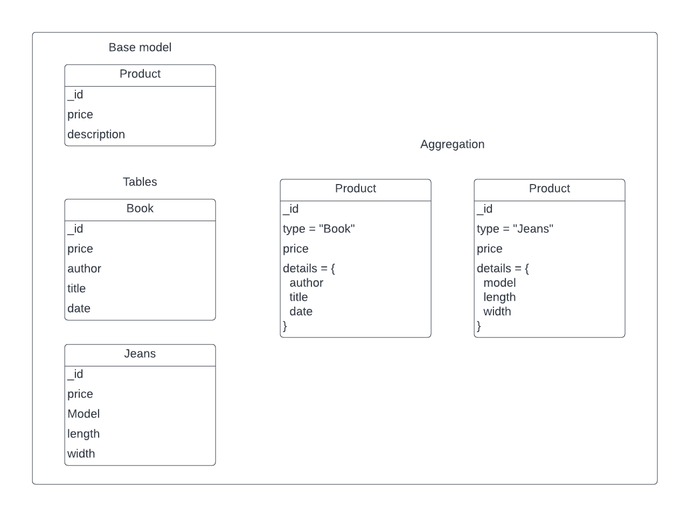
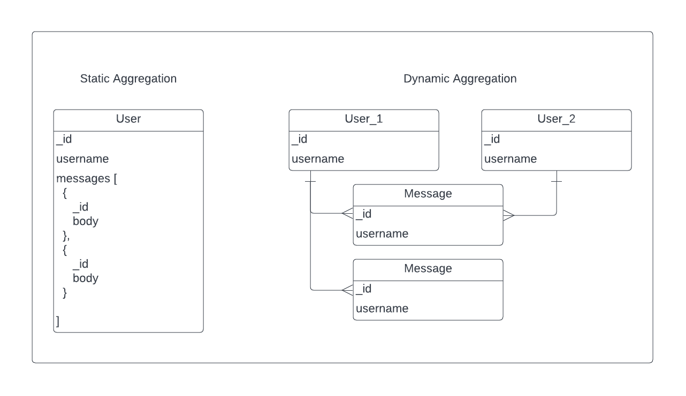

# Conceptual techniques

- ```Denormalization``` :
could be used to simplify and optimize query processing by grouping all the data to query in one place.
Can be defined as the coping of the same data into multiple tables or documents.
Drawback is the data volume increases for various parameters, considerably increasing the data volume.
  - Databases:
    - Key-Value Stores
    - Document Databases

# <div style={{textAlign: "center", height: "100%"}}>  </div>

- ```Aggregates``` :
could be used to create nested entities with complex internal structures thanks to the soft schema.
It helps to reduce joins by minimizing one-to-one relationships.
  - Databases:
    - Key-Value Stores
    - Document Databases

# <div style={{textAlign: "center", height: "100%"}}>  </div>

- ```Application Side Joins``` :
could be used during designing and developing the application.
Compared to relational databases - queries are performed at query execution time.
This tends to increase a performance penalty.
  - Databases:
    - Key-Value Stores
    - Document Databases
    - Graph Databases

# <div style={{textAlign: "center", height: "100%"}}>  </div>
