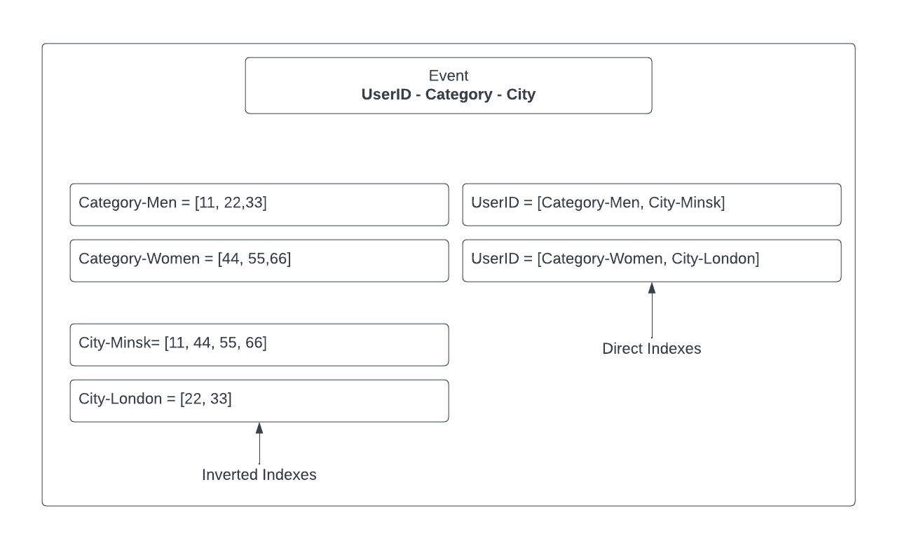

# General modeling techniques

- ```Atomic Aggregates```.
Because ```Aggregates``` allow to store a single entity as one document, row or key-value pair, it is possible to update this entity atomically.<br />

# <div style={{textAlign: "center", height: "100%"}}>  </div>

- ```Enumerable keys```.
Because entity can be distributed across multiple servers, it is possible to use one hashed key.
Drawback is sorting such keys may add a bit of complexity and a performance hit. <br />

# <div style={{textAlign: "center", height: "100%"}}>  </div>

- ```Index table```.
This technique requires to create an additional table.
The keys in this table follow the access pattern and simplify query execution.
Working with this technique could result an additional performance penalty and become a consistency issue. <br />

# <div style={{textAlign: "center", height: "100%"}}>  </div>

- ```Composite key index```.
This technique allows to create composite key to simplify query execution and aggregate data by a partial key.
Composite keys are great when using ordered keys. <br />

# <div style={{textAlign: "center", height: "100%"}}>  </div>

- ```Inverted Lookup```.
This technique allows to use an index to find data that meets a criteria, but aggregate data using original representation or full scans.
Using such indexes it is possible to intersect or unify corresponding data. <br />

# <div style={{textAlign: "center", height: "100%"}}>  </div>