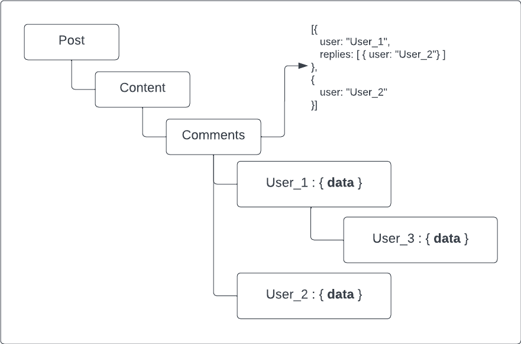
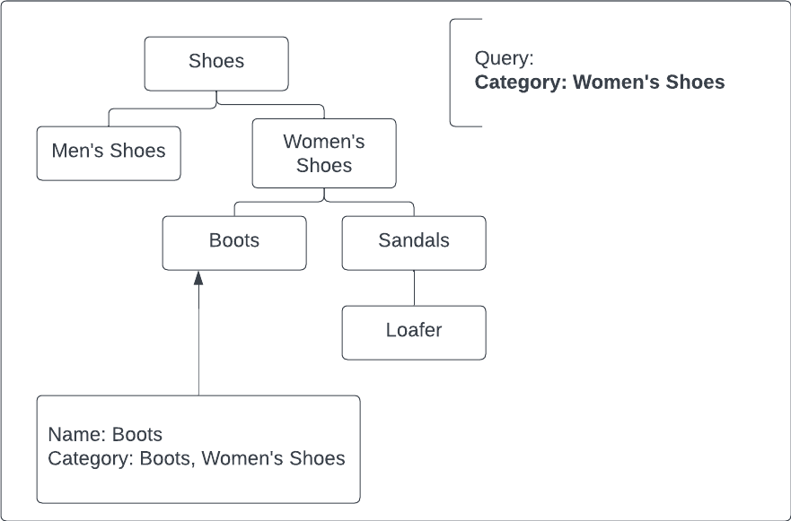

# Hierarchy modeling techniques

- ```Tree aggregation```.
Could be effective for record that is accessible at once with all data.
The problem is that access to a single record data is inefficient.

# <div style={{textAlign: "center", height: "100%"}}>  </div>

- ```Materialized paths```.
Could be used to avoid recursive traversal in tree structures.
Need to attribute each node by identifiers of all its parents or children.
This technique is especially helpful for Full Text Search Engines.

# <div style={{textAlign: "center", height: "100%"}}>  </div>

- ```Nested sets```.
Could be used for modeling tree-like structures and accessing immutable data without using traversal.
Need to store the tree leaves as an array and then map each non-leaf node to a range of leaves.
Tree updates are expensive because they need index updates.

# <div style={{textAlign: "center", height: "100%"}}>  </div>

- ```Batch processing of graphs```.
Could be used for for exploring the neighborhood of a given node or exploring relationships between two or a few nodes.
This is an expensive process and doesn’t necessarily scale well.