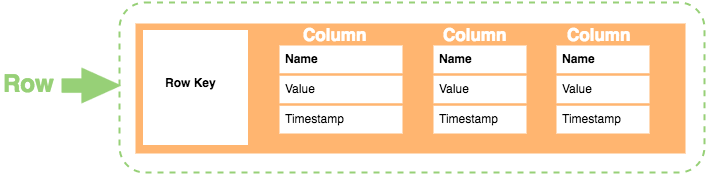

# Column-oriented Graph

# <div style={{textAlign: "center"}}>  </div>

The last type of NoSQL databases is ```Column-oriented``` DB. <br/>
These databases are designed to speed up workloads that operate on column data across all records/rows.
They organize data by field and keeping all of the data associated with a field next to each other in memory storage. <br/>
```Column-oriented``` DBs are faster and more efficient than a traditional relational databases because the data storage is by columns rather than by rows.
Also, the are very flexible and scalable compared to an SQL databases.
Since data is typically read from storage and written in storage in blocks, a column-oriented approach means that each block which holds data for the table holds data for one of the columns only.

```Column-oriented``` DBs provide a way to work with data and have basic CRUD operations, but they would be expensive:
- Read - Retrieve data row by provided ID
- Create - Insert new dat row
- Update - Update data set by provided ID
- Delete - Delete data set by provided ID

Non-expensive operations for columns are ```SUM```, ```AVG```, ```COUNT``` and such types of operations get a good performance benefit.
In short, row operations are slower, but column operations are faster.

## Specifics

- ```Consistency``` - offers eventual consistency with a period of inconsistency
- ```Query``` - can use traditional SQL to perform queries
- ```Scaling``` - databases are distribute and can be sharded or partitioned across multiple servers
- ```Compression``` - databases are highly compressed compared to relatinal databases. Easy to optimize storage size.

## Use cases

Best choice for:
- Analytics systems

## Most popular databases

### [Amazon Redshift](https://docs.aws.amazon.com/redshift/index.html)

Amazon Redshift is a fast, fully managed, petabyte-scale data warehouse service
that makes it simple and cost-effective to efficiently analyze all your data using your existing business intelligence tools.
Amazon Redshift has excellent integration with other AWS products. Provides dynamic scaling and handles all the system work.
  - NodeJs npm package to work is [@aws-sdk/client-redshift](https://www.npmjs.com/package/@aws-sdk/client-redshift).<br/>
  - Developers guid for NodeJS you can find [here](https://docs.aws.amazon.com/AWSJavaScriptSDK/v3/latest/clients/client-redshift/index.html)