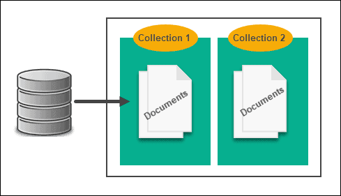

# Document-oriented

# <div style={{textAlign: "center"}}>  </div>

Second type of NoSQL databases is ```Document-oriented``` DB. <br/>
This database is designed to store and query data in the form of documents, usually JSON, but also XML or YAML.
Objects within a database are stored completely within one document.
Document objects could have flexible, semi-structured or hierarchical data. As an example:

```json
  {
    "ID": "001",
    "Book": "NodeJS Cookbook",
    "Genre": "Work and Education",
    "Author": "Bethany Griggs"
  }
```

```Document-oriented``` DBs provide a way to work with data and have basic CRUD operations:

- Read - Retrieve data by provided key/index or field value
- Create - Insert new row data
- Update - Update entire data row or individual piece of data
- Delete - Delete data row by provided key/index

## Specifics

- ```Consistency``` - some databases offers eventual consistency with a period of inconsistency
- ```Query``` - can use query based on unique identifiers or field values
- ```Scaling``` - databases are distributed and resilient. They allow for horizontal scaling

## Use cases

Best choice for:

- Storing user profiles
- Using it in content management systems
- Storing product information or catalogs in e-commere applications
- Real-time big data analytics
- Denormalized data from the SQL sources

## Most popular databases

### [MongoDB](https://www.mongodb.com/)

MongoDB is a document database that allows to store data using flexible document data model that is similar to JSON.
Document contain one or more fields, including arrays, binary data and sub-documents.<br/>
  - How to install MongoDB on your operating system you can find [here](https://www.mongodb.com/try/download/community2).<br/>
  - NodeJs npm package to work is [mongodb](https://www.npmjs.com/package/mongodb).<br/>

---

Bellow you can see a simple example of using this package:

```js
  // Importing module.
  import { MongoClient } from 'mongodb';

  // Connection URL
  const url = 'mongodb://localhost:27017';
  const dbName = 'MY_DB_NAME';
  // Creating DB client.
  const client = new MongoClient(url);
  await client.connect();

  const db = client.db(dbName);
  const collection = db.collection('documents');
  // Retrieve all dat in DB
  const retrievedData = await collection.find({}).toArray();
  // Insert row into DB
  const insertedResult = await collection.insertOne({ a: 1 });
```

More information about API you can find [here](https://www.mongodb.com/docs/drivers/node/current/quick-start/)