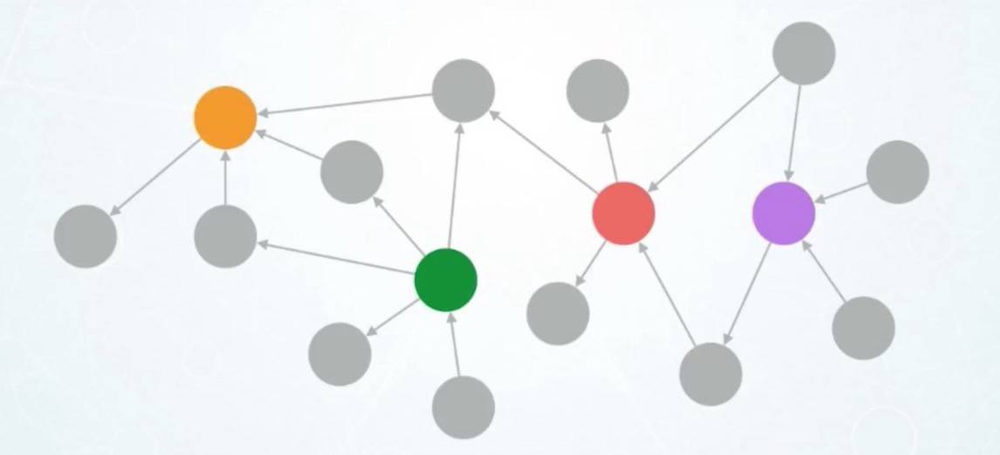

# Graphs

# <div style={{textAlign: "center"}}>  </div>

Third type of NoSQL databases is ```Graphs``` DB. <br/>
A graph database is a database designed for storing and querying data that is connected via defined relationships.
Graphs contain nodes, edges, and properties.
Data points in a graph database are nodes and these nodes are connected to related data via edges.
The data attached to each node are known as properties.
Graph databases aren’t restricted by predefined schema.
There are two types of graphs: property graphs and RDF graphs.
The property graph focuses on analytics and querying, while the RDF graph emphasizes data integration.
Both types of graph consist of a collection of points (vertices) and the connections between those points (edges).

```Graphs``` DBs provide a way to work with data and have basic CRUD operations:

- Read - Retrieve data
- Create - Insert new data
- Update - Update  data
- Delete - Delete data

## Specifics

- ```Consistency``` - offers eventual consistency with a period of inconsistency
- ```Query``` - can use specially defined query language like
[Cypher](https://neo4j.com/developer/cypher/),
[SPARQL](https://www.w3.org/TR/2013/REC-sparql11-overview-20130321/)
- ```Scaling``` - databases are distributed and resilient. They allow for horizontal scaling

## Use cases

Best choice for:

- Fraud detection and analytics
- Network and database infrastructure monitoring
- Recommendation engines
- Social networks
- Knowledge graph
- Identity and access management

## Most popular databases

### [Neo4j](https://neo4j.com/product/neo4j-graph-database/)

At the core of the Neo4j Graph Data Platform is the Neo4j Graph Database, a native graph data store built from the ground up to leverage not only data but also data relationships.
Unlike other types of databases, Neo4j connects data as it’s stored, enabling queries never before imagined, at speeds never thought possible.
  - How to install Neo4j on your operating system you can find [here](https://neo4j.com/product/#neo4j-desktop).<br/>
  - NodeJs npm package to work is [neo4j-driver](https://www.npmjs.com/package/neo4j-driver).<br/>
  - Developers guid for Javascript you can find [here](https://neo4j.com/developer/javascript/)

### [DataStax Astra](https://www.datastax.com/products/datastax-astra)

DataStax Astra DB simplifies cloud-native application development, and reduces time to install, deploy and scale from weeks to minutes.
Astra DB eliminates operational overhead, the biggest obstacle to using Apache Cassandra, the open-source NoSQL database behind the largest applications in the world.
  - NodeJs npm package to work is [cassandra-driver](https://www.npmjs.com/package/cassandra-driver).<br/>
  - Developers guid for NodeJS you can find [here](https://www.datastax.com/examples/astra-nodejs-starter)