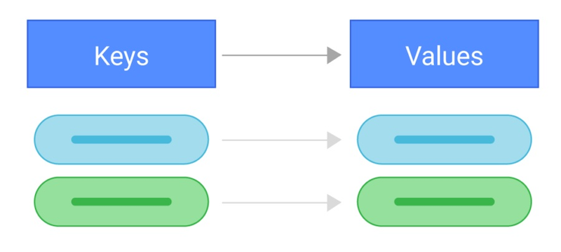

# Key-value Pair Based

# <div style={{textAlign: "center"}}>  </div>

First type of NoSQL databases is ```Key-value``` DB. <br/>
It is the least complicated type of NoSQL databases that using dictionary-like storing method and does't require a predefined schema. <br/>
The key should be a unique identifier that points to its associated value.
There is no connection between values and they are unrelated.
The values can be simple or complex data types like ```JSON, BLOBs, XML, strings, etc```.

```Key-Value``` DBs provide a way to store and access data using simple operations:

- Get (key) - Retrieve value by provided key
- Put (key, value) - Add new key-value pair
- Update (key, value) - Update value by provided key
- Delete (key) - delete key-value pair

## Specifics

- ```Consistency``` - applicable for operations on a single key in a key-value store
- ```Query``` - can use query by the key only
- ```Scaling``` - scale by a process called sharding

## Use cases

- Application is designed on simple key-based queries
- Web applications to store user session details
- Data caching to increase application performance
- Data cache for the data that is not updated regularly

## Most popular databases

### [REDIS](https://redis.io/)

Redis is an open source, in-memory data structure store used as a database, cache, message broker, and streaming engine.
Redis is a data structure server.
At it provides a collection of native data types that help you solve a wide variety of problems, from caching to queuing to event processing.<br/>
  - How to install Redis on your operating system you can find [here](https://redis.io/docs/getting-started/).<br/>
  - NodeJs npm package to work is [redis](https://www.npmjs.com/package/redis).<br/>

---
Bellow you can see a simple example of using this package:

```js
      // Importing module.
      import { createClient } from 'redis';

      // Creating redis client.
      const client = createClient();
      client.on('error', (err) => console.log('Redis Client Error', err));
      // Connecting to client. Could be set custom connection string.
      await client.connect();

      // Set value
      await client.set('key', 'value');
      // Get value
      const value = await client.get('key');
```

### [AWS DynamoDB](https://aws.amazon.com/dynamodb/)

Amazon DynamoDB is a fully managed, serverless, key-value NoSQL database designed to run high-performance applications at any scale.
DynamoDB offers built-in security, continuous backups, automated multi-Region replication, in-memory caching, and data import and export tools.
  - NodeJs npm package to work is [aws-sdk](https://www.npmjs.com/package/aws-sdk).<br/>

Bellow you can see a simple example of ```GetItemCommand``` and ```PutItemCommand``` using this package:

```js
  // Importing module.
  import { DynamoDBClient, GetItemCommand, PutItemCommand } from "@aws-sdk/client-dynamodb";

  const REGION = "YOUR_AWS_REGION";
  const TABLE = "YOUR_AWS_DB_TABLE_NAME";
  // Creating DB client.
  const ddbClient = new DynamoDBClient({ region: REGION });
  // Insert new row item.
  const putData = await ddbClient.send(new PutItemCommand({
    TableName: TABLE,
    Item: {
      YOUR_DATA_ID: { S: "1" },
      YOUR_DATA_NAME: { S: "KEY_VALUE" },
    }
  }));
  // Get row value by provided key value.
  const getData = await ddbClient.send(new GetItemCommand({
    TableName: TABLE,
    Key: {
      KEY_NAME: { N: "KEY_VALUE" }
    },
    ProjectionExpression: "ATTRIBUTE_NAME"
  }));
```

Also, you could use such commands as ```DeleteItemCommand``` and ```UpdateItemCommand```
