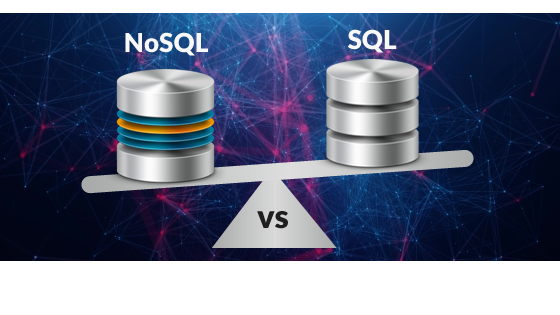

# 
  

<table>
  <thead>
    <th></th>
    <th>SQL</th>
    <th>NoSQL</th>
  </thead>
  <tbody>
    <tr>
      <td>Definition</td>
      <td>SQL databases are primarily called RDBMS or Relational Databases</td>
      <td>NoSQL databases are primarily called as Non-relational or distributed database</td>
    </tr>
    <tr>
      <td>Query Language</td>
      <td>Structured query language (SQL)</td>
      <td>No query language</td>
    </tr>
    <tr>
      <td>Type</td>
      <td>SQL databases are table based databases</td>
      <td>NoSQL databases can be document based, key-value pairs, graph databases</td>
    </tr>
    <tr>
      <td>Schema</td>
      <td>SQL databases have a predefined schema	</td>
      <td>NoSQL databases use dynamic schema for unstructured data</td>
    </tr>
    <tr>
      <td>Scalability</td>
      <td>SQL databases are vertically scalable</td>
      <td>NoSQL databases are horizontally scalable</td>
    </tr>
    <tr>
      <td>Performance</td>
      <td>Need a larger server to accommodate the increasing amount of data</td>
      <td>Can add new servers to what you already have</td>
    </tr>
  </tbody>
</table>

The decision between SQL and NoSQL will depend largely on the workloads you plan to support and the structure and amount of data.
SQL databases are established with fixed schema design and a set structure.
They are ideal for applications that require multi-row transactions or for legacy systems that were built for a relational structure.
NoSQL databases are easily scalable, flexible and simple to use as they have no rigid schema and are ideal for applications with no specific schema definitions.
In additional, many applications have implemented both SQL and NoSQL database systems to meet their different requirements, making it possible to get the best of both worlds.
