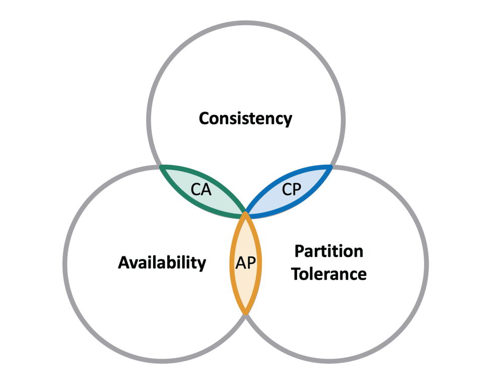

### Overview

Relational databases guarantee ACID properties, which are desirable, but in the era of Big Data comes the need to adopt technologies that scale better.
NoSQL databases handle big and complex data in a more efficient way and ACID is not guaranteed.
If ACID properties belong to RDBMSs, BASE properties belong to NoSQL databases.

### BASE

- ```B```asically ```A```vailable: <br/>
Writing and reading operations are available as much as possible even if it’s a failure.
Will ensure availability of data by spreading and replicating it across the nodes of the database cluster.
- ```S```oft State: <br/>
No guarantees that the data eventually becomes consistent.
- ```E```ventual Consistency <br/>
The components in the system may not reflect the same value/state of a record at a given point in time.
They will settle it eventually.

### CAP

# <div style={{textAlign: "center", width: "400px", height: "100%", margin: "auto"}}>  </div>

Most NoSQL databases relax ACID constraints found in relational databases.
NoSQL solutions were developed around the purpose of providing high availability and scalability in a distributed environment.
To do this, either consistency or durability has to be sacrificed according to CAP theorem.

The CAP theorem states that it's impossible for a database system to achieve Consistency, Availability, and Partition Tolerance at the same time.

- ```C```onsistency: <br/>
Data should be sequential consistent.
Refers to linearizability across all nodes of a distributed system.
All nodes in a system return same data after a successful write operation.
Consistency is definitely an important characteristic of any distributed NoSQL database.
However, not all of them can provide it.
- ```A```vailability: <br/>
Every request served by a non-failing (```Fault Tolerance```) node must result in a response in a reasonable amount of time.
- ```P```artition tolerance: <br/>
In the case of partition failure, system will continue to work and provide consistent data.

It's theoretically impossible to have all 3 requirements met, so a combination of 2 must be chosen and this is usually the deciding factor in what technology is used.

 - ``` AP systems ```. Highly available and partitioning tolerant databases that will always respond to your requests, no matter what happens.
 - ``` CP systems ```. Consistent and partitioning tolerant databases that will care for the data no matter what.
 - ``` AC systems ```. Highly available and consistent databases will always respond to all your requests from any node with the latest version of the data.

<div  style={{margin: "0 auto", width: "100%", display: "flex", justifyContent: "center"}}>
<table>
    <thead>
    <th width={200}>CAP Category</th>
    <th width={200}>DB Types</th>
    <th width={200}>DB</th>
    </thead>
    <tbody>
    <tr>
        <td>AP</td>
        <td>Key-Value Pair</td>
        <td>Riak</td>
    </tr>
    <tr>
        <td>CP</td>
        <td>Key-Value Pair</td>
        <td>Redis</td>
    </tr>
    <tr>
        <td>AP</td>
        <td>Document-oriented</td>
        <td>CouchBase</td>
    </tr>
    <tr>
        <td>CP</td>
        <td>Document-oriented</td>
        <td>MongoDB</td>
    </tr>
    <tr>
        <td>AP</td>
        <td>Column-oriented</td>
        <td>Cassandra</td>
    </tr>
    <tr>
        <td>CP</td>
        <td>Column-oriented</td>
        <td>HBase</td>
    </tr>
    <tr>
        <td>CA</td>
        <td>Graph</td>
        <td>Neo4J</td>
    </tr>
    </tbody>
</table>
</div>