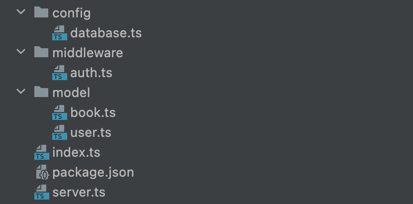

 
# Setup project
## Description
We will create rest api server that allow authors to upload books. This server will provide authentication and authorization to secure author data to be modified by unauthorized user.
## Create project folder
Let's create project folder and init npm
```shell
mkdir books-api

cd books-api

npm init -y
```
## Create basic structure

We will create basic project structure such as `model`, `middleware`, `config` directories:
```shell
mkdir model middleware config

touch config/database.ts middleware/auth.ts model/user.ts
```

Now we can create `index.ts` and `server.ts` files in the root directory the project:
```shell
touch server.ts index.ts
```

After that you should see the following structure:



## Install dependencies
During this project we will use `mongoose`, `jsonwebtoken`, `express`, `dotenv`, `bcryptjs` dependencies. Let's install them: 

```shell
npm install mongoose express jsonwebtoken dotenv bcryptjs
npm install -D typescript @types/mongoose @types/express @types/jsonwebtoken @types/node @types/bcryptjs
```

Also, we need to init typescript

```shell
npx tsc --init
```

We will also `nodemon` to serve our server for development:

```shell
npm install -D ts-node nodemon
```

## Connect DB
First we will run mongo db server using docker:

```shell
docker run -d -p 27017:27017 --name books-api-mongo mongo:latest
```
Now we can configure our db connector to communicate with mongo server that we've already started. For this we will modify `config/database.ts` file:

```typescript
import mongoose from 'mongoose';

export async function connect(): Promise<void> {
    const { MONGO_URI } = process.env;

    if (!MONGO_URI) {
        console.log("Please provide DataBase URI to connect. exiting now...");
        process.exit(1);
    }

    try {
        await mongoose.connect(MONGO_URI);
        console.log("Successfully connected to database");
    } catch (e) {
        console.log("DataBase connection failed. exiting now...");
        console.error(e);
        process.exit(1);
    }
}
```

Now let's configure our `server.ts` file:
```typescript
import dotenv from "dotenv";
import * as database from "./config/database";
import express, { Express } from "express";

export async function bootstrap(): Promise<Express> {
    // use .env file to configure environment variables
    dotenv.config();
    // connect to database
    await database.connect();

    const app = express();

    app.use(express.json());

    return app;
}
```

In our `index.ts` let's add logic to start server:
```typescript
import http from "http";
import { bootstrap } from "./server";
import { Express } from "express";

bootstrap().then((app: Express) => {
    const server = http.createServer(app);

    const { API_PORT } = process.env;
    const port = API_PORT || 8080;

    // server listening
    server.listen(port, () => {
        console.log(`Server running on port ${port}`);
    });
});
```
Now when base code finished we can configure our environment. Create `.env` file and add the following:

```shell
export API_PORT=8080

export MONGO_URI=mongodb://localhost:27017/books
```

After we configured environment variables, we can extend `package.json` with new scripts to simplify running of our server:

```json
...
"scripts": {
   "start": "ts-node index.ts",
   "dev": "nodemon index.ts",
}
...
```

Now run `npm run dev` command. Our server is started and connected to the mongodb.

